# Deprecation Notice

This document is deprecated and no longer maintained. Please refer to the [new documentation](https://startit.bot/docs) for the latest information.

If you want to contribute to the new documentation, please **go to ["en"](https://github.com/StartITBot/docs/tree/main/en) directory in this repository** and create a pull request.

# StartIT Economy Overview

The Economy Plugin is a comprehensive feature of StartIT that brings virtual currency and various interactive
elements to your server. With this plugin, users can engage in a virtual economy, earn money through different
activities, purchase items, and participate in fun games and challenges. This documentation provides an in-depth
explanation of the economy plugin, its functionalities, and how to configure and use its features.

## Table of Contents

<!-- TOC -->
* [StartIT Economy Overview](#startit-economy-overview)
  * [Table of Contents](#table-of-contents)
  * [Why do you need economy?](#why-do-you-need-economy)
  * [Basics of currency](#basics-of-currency)
    * [/balance Command](#balance-command)
      * [Wallet cash – used for payments, but vulnerable to theft](#wallet-cash--used-for-payments-but-vulnerable-to-theft)
      * [Bank storage – protected place to keep funds](#bank-storage--protected-place-to-keep-funds)
    * [/pay – Transferring currency](#pay--transferring-currency)
    * [/topmoney – Currency leaderboard](#topmoney--currency-leaderboard)
  * [Obtaining currency](#obtaining-currency)
    * [/work – Main source of income. Gives a random amount of money.](#work--main-source-of-income-gives-a-random-amount-of-money)
    * [/slut – Casual work. There is a chance of failure that results in loss of money.](#slut--casual-work-there-is-a-chance-of-failure-that-results-in-loss-of-money)
    * [/crime – Illegal work. Big payout, but also big chance of losing money.](#crime--illegal-work-big-payout-but-also-big-chance-of-losing-money)
    * [/collect-income – Passive income from owning a specific role/item.](#collect-income--passive-income-from-owning-a-specific-roleitem)
  * [Admin: Configuring currency](#admin-configuring-currency)
    * [/economy add \<user\> \<money\> [location]](#economy-add-user-money-location)
    * [/economy remove \<user\> \<money\> [location]](#economy-remove-user-money-location)
    * [/economy set \<user\> \<money\> [location]](#economy-set-user-money-location)
    * [Server settings](#server-settings)
      * [Currency symbol](#currency-symbol)
      * [Initial amount of money](#initial-amount-of-money)
      * [Reset user's money after they leave the server](#reset-users-money-after-they-leave-the-server)
      * [Digit group separator](#digit-group-separator)
      * [Currency position](#currency-position)
  * [Obtaining items](#obtaining-items)
    * [/shop Command](#shop-command)
    * [/buy-item Command](#buy-item-command)
    * [/backpack Command](#backpack-command)
    * [/use-item Command](#use-item-command)
    * [/give-item Command](#give-item-command)
    * [Conclusion](#conclusion)
  * [Admin: Concept of items, why they are important](#admin-concept-of-items-why-they-are-important)
    * [Using items for customizing user roles and permissions](#using-items-for-customizing-user-roles-and-permissions)
    * [Using items for simulating businesses or activities](#using-items-for-simulating-businesses-or-activities)
    * [Using items for offering discounts and benefits in the shop](#using-items-for-offering-discounts-and-benefits-in-the-shop)
    * [Using items for increasing earnings from the /work command](#using-items-for-increasing-earnings-from-the-work-command)
    * [Using items for increasing points from leveling and chatting](#using-items-for-increasing-points-from-leveling-and-chatting)
    * [Using items for extending bank limit](#using-items-for-extending-bank-limit)
    * [Using items as a one-time pass for manual action](#using-items-as-a-one-time-pass-for-manual-action)
    * [Using items as a way to take taxes](#using-items-as-a-way-to-take-taxes)
    * [Using items as crafting ingredients](#using-items-as-crafting-ingredients)
    * [Using items as decorative and collectible items](#using-items-as-decorative-and-collectible-items)
    * [Cases - special type of items with element of surprise](#cases---special-type-of-items-with-element-of-surprise)
    * [Conclusion](#conclusion-1)
  * [Admin: Configuring items](#admin-configuring-items)
    * [/economy backpack add Command](#economy-backpack-add-command)
    * [/economy backpack remove Command](#economy-backpack-remove-command)
    * [/economy backpack clear Command](#economy-backpack-clear-command)
    * [Create item](#create-item)
    * [Item display configuration](#item-display-configuration)
      * [Item Name](#item-name)
      * [Item Type](#item-type)
      * [Sticky](#sticky)
      * [Automatically destroy this item:](#automatically-destroy-this-item)
      * [Limit the number of items in the backpack:](#limit-the-number-of-items-in-the-backpack)
    * [Shop configuration](#shop-configuration)
      * [Item Description](#item-description)
      * [Item Price](#item-price)
      * [Item Price for Individual Roles](#item-price-for-individual-roles)
      * [Limit the number of items in the stock](#limit-the-number-of-items-in-the-stock)
      * [Item Category](#item-category)
      * [Item Owner](#item-owner)
      * [Requirements to Purchase an Item](#requirements-to-purchase-an-item)
      * [Fraud Chance](#fraud-chance)
    * [Configure /use-item behavior](#configure-use-item-behavior)
      * [Destroy the item after using it](#destroy-the-item-after-using-it)
      * [Add Temporary Roles](#add-temporary-roles)
      * [Add Roles](#add-roles)
      * [Remove Roles](#remove-roles)
      * [Add Money](#add-money)
      * [Add XP](#add-xp)
      * [Remove All User Warnings](#remove-all-user-warnings)
      * [Custom Message After Using This Item](#custom-message-after-using-this-item)
  * [Stock-market – place for investing money](#stock-market--place-for-investing-money)
    * [/stockmarket info Command](#stockmarket-info-command)
    * [/stockmarket buy Command](#stockmarket-buy-command)
    * [/stockmarket sell Command](#stockmarket-sell-command)
    * [/stockmarket list Command](#stockmarket-list-command)
    * [/stockmarket backpack Command](#stockmarket-backpack-command)
    * [/stockmarket sell-all Command](#stockmarket-sell-all-command)
    * [Admin: Configuring the Stock Market](#admin-configuring-the-stock-market)
  * [User-market – a place for trading items](#user-market--a-place-for-trading-items)
    * [/market sell Command](#market-sell-command)
    * [/market list Command](#market-list-command)
    * [/market buy Command](#market-buy-command)
    * [Admin: User-market and crafting as perfect combination for your server](#admin-user-market-and-crafting-as-perfect-combination-for-your-server)
  * [Crafting – Do it yourself](#crafting--do-it-yourself)
    * [Listing Crafting Recipes](#listing-crafting-recipes)
    * [Obtaining resources](#obtaining-resources)
    * [Crafting process](#crafting-process)
  * [Admin: Configuring crafting recipes](#admin-configuring-crafting-recipes)
    * [Create a new recipe](#create-a-new-recipe)
    * [Command Settings](#command-settings)
      * [Recipe name](#recipe-name)
      * [Recipe content](#recipe-content)
    * [Recipe Requirements](#recipe-requirements)
    * [Product](#product)
  * [Blackjack – Hit or stand, luck in your hand](#blackjack--hit-or-stand-luck-in-your-hand)
    * [Game interface](#game-interface)
    * [Understanding the gameplay](#understanding-the-gameplay)
    * [Tactical considerations](#tactical-considerations)
  * [Cock-fight – Unleash the feathers of competition](#cock-fight--unleash-the-feathers-of-competition)
    * [Participation in chicken fight](#participation-in-chicken-fight)
    * [Admin: Configuring chicken fights](#admin-configuring-chicken-fights)
      * [Default Win Chance](#default-win-chance)
      * [Max Win Chance](#max-win-chance)
      * [Cooldown](#cooldown)
      * [Bet Limit](#bet-limit)
  * [Change user nickname item - A monetized identity makeover](#change-user-nickname-item---a-monetized-identity-makeover)
    * [Using the item](#using-the-item)
    * [Admin: Enabling the Item](#admin-enabling-the-item)
    * [Admin: Customizing Self-Breaking Behavior](#admin-customizing-self-breaking-behavior)
  * [Discounts](#discounts)
    * [Promotion section configuration](#promotion-section-configuration)
      * [Promo settings](#promo-settings)
      * [Items excluded from promotion](#items-excluded-from-promotion)
      * [Duration of the promotion](#duration-of-the-promotion)
      * [Promotion conditions](#promotion-conditions)
    * [Item-specific price adjustments](#item-specific-price-adjustments)
  * [Tic-tac-toe –](#tic-tac-toe-)
  * [Roulette –](#roulette-)
  * [Russian-roulette –](#russian-roulette-)
  * [Additional settings](#additional-settings)
    * ["Exceptions" configuration](#exceptions-configuration)
    * [Logging configuration](#logging-configuration)
<!-- TOC -->

## Why do you need economy?

The economy plugin of StartIT provides a fun and interactive way for users to engage with the server and earn
virtual currency. Here are a few reasons why you might want to use the economy plugin:

1. **Boost server activity:** The economy plugin motivates users to actively participate in the server by providing
   various ways to earn virtual money. This encourages more interactions and conversations among members, leading to a
   livelier and more engaging community.

2. **Gamify the server experience:** By integrating an economy system, you can introduce a sense of gamification to your
   server. Users can work, chat, play games, and engage in various activities to earn virtual money. This adds an
   element of fun and competition, keeping users entertained and invested in the server.

3. **Encourage user interaction:** With the economy plugin, users can gain virtual currency by chatting on text channels
   or talking on voice channels. This feature promotes active participation and helps foster a sense of community among
   members.

4. **Enable virtual transactions:** The economy plugin allows users to store their virtual currency in different places,
   such as their wallet or the bank. They can use the currency to purchase items from the shop or trade them with other
   users. This creates a virtual economy within the server, enabling users to engage in virtual transactions and
   interactions.

5. **Customizable item system:** The economy plugin includes a comprehensive item system. Users can buy items from the
   shop, trade them with others, and use them in various ways. Items can have different effects, such as granting roles,
   providing bonuses, or mimicking real-world businesses. The flexibility of the item system allows you to create unique
   and interactive experiences for your server members.

By implementing the economy plugin and leveraging its features, you can enhance user engagement, create a dynamic server
environment, and provide an enjoyable and interactive experience for your community members.

## Basics of currency

In the economy plugin, virtual currency plays a central role. Users can earn currency by performing actions such as
working, chatting, and participating in voice channels. This section will provide an overview of the currency system and
its functionalities.

### /balance Command

The `/balance [user]` command allows you to check your own or someone else's bank account and wallet balance. If a
user's mention or ID is provided as an argument, the command will display the bank account and wallet balance of
that specific user, otherwise it will display the balance of the user who invoked the command.

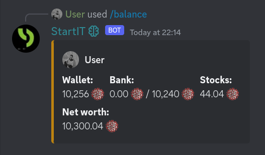

The currency is stored in two different locations: the wallet and the bank.

#### Wallet cash – used for payments, but vulnerable to theft

Wallet is the primary storage for currency and can be used for payments.

The `/rob <user>` command allows you attempting in steal money from another user's wallet. By mentioning or providing
the ID of the target user, you can rob others from cash stored in wallet. However, there is a chance of failure
[**your networth / (their cash + your networth)**] with a minimum and maximum of 20% and 80%. Amount stolen is
calculated as: success probability times their cash.

#### Bank storage – protected place to keep funds

Bank provides a secure place to store funds. Money stored in the bank cannot be directly used in commands and must be
withdrawn to the wallet using the /withdraw command.

The `/deposit <amount>` command allows you to deposit a specified amount of money from your wallet into your bank
account. This provides a secure way to store funds and protect them from potential losses through other commands.
You can decide how much money you want to deposit by specifying the desired amount as an argument.

The `/withdraw <amount>` command enables you to withdraw a specified amount of money from your bank account to your
wallet. This allows you to access your funds for various commands and transactions. You can decide how much money you
want to withdraw by specifying the desired amount as an argument.

### /pay – Transferring currency

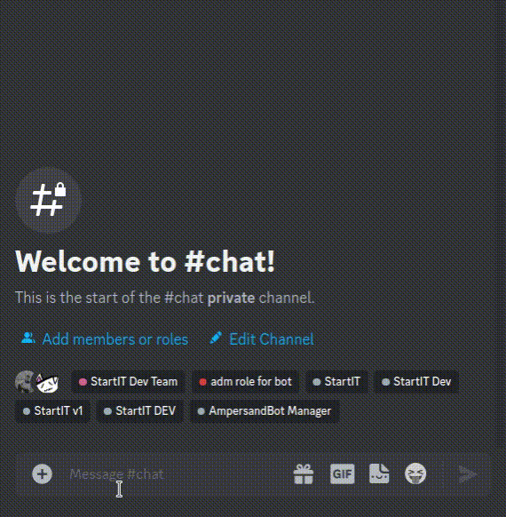

The `/pay <user> <money>` command allows you to transfer virtual money to another user within the server. By
mentioning or providing the ID of the recipient user and specifying the desired amount, you can initiate a transaction
and send virtual money to someone else.

### /topmoney – Currency leaderboard

The `/topmoney` command lists the top 10 users with the highest amount of virtual money in their bank account.
This command provides an overview of the wealthiest members of the community and can serve as a leaderboard for users to
compare their progress.

## Obtaining currency

### /work – Main source of income. Gives a random amount of money.

The `/work` command is the main source of income in the bot's economy system. When you execute this command, you will
receive a random amount of virtual money as a reward. If you are server admin, you can encourage your members to use
this command regularly to earn funds and actively participate in the server's economy.

### /slut – Casual work. There is a chance of failure that results in loss of money.

The `/slut` command provides users with an opportunity for casual work. Users can execute this command to earn money,
but keep in mind that there is a chance of failure, which may result in the loss of virtual money.

### /crime – Illegal work. Big payout, but also big chance of losing money.

The `/crime` command provides an opportunity for you to engage in illegal work, which offers a higher payout but also
carries a greater risk of losing money. You can try own luck by executing this command, and the outcome will determine
whether you've gained or lost virtual money. As server admin encourage users to approach this command with caution,
as the results here are not guaranteed.

### /collect-income – Passive income from owning a specific role/item.

The `/collect-income` command enables you to collect money from roles and items you currently own. Some items or roles
may generate passive income, and executing this command will add the accumulated income to the wallet. It's important
for users to regularly collect their income to maximize earnings.

## Admin: Configuring currency

You can manage each user individually by using the commands listed below. These commands allow you to adjust the
currency balance of a specific user, which can be useful for administrative purposes or to reward users for their
contributions to the server.

### /economy add \<user\> \<money\> [location]

The `/economy add` command is an administrative command that allows authorized users to add virtual money to a specific
user's account. By mentioning or providing the ID of the target user and specifying the amount to be added,
administrators can adjust user balances accordingly. An optional `location` argument can be provided to specify whether
the money should be added to the bank or wallet. Defaults to bank.

### /economy remove \<user\> \<money\> [location]

The `/economy remove` command enables authorized users to deduct virtual money from a specific user's account. By
mentioning or providing the ID of the target user and specifying the amount to be removed, administrators can adjust
user balances accordingly. An optional `location` argument can be provided to specify whether the money should be
deducted from the bank or wallet. Defaults to bank.

### /economy set \<user\> \<money\> [location]

The `/economy set` command allows authorized users to set a specific amount of virtual money for a user's account. By
mentioning or providing the ID of the target user and specifying the desired balance, administrators can directly modify
user balances. An optional `location` argument can be provided to specify whether the money should be set in the bank or
wallet. Defaults to bank.

### Server settings

#### Currency symbol

The currency symbol is a visual representation of the virtual currency used in the bot's economy system. It is displayed
in various commands and messages to provide users with a clear indication of the currency being used. The default
currency symbol is `$`, but you can change it to any emoji of your choice.

#### Initial amount of money

The initial amount of money is the amount of virtual currency that users will receive when they first join the server.
This provides users with a starting point to engage in the economy system and earn more money through various commands
and activities.

Note that this setting only applies to new users who join the <server after the setting has been changed. Existing users
will not receive the initial amount of money. However, you can use the `/economy add` command to manually add money to
existing users' accounts.

#### Reset user's money after they leave the server

This setting determines whether users' virtual money will be reset when they leave the server. If this setting is
enabled, users will lose all their virtual money when they leave the server. This can be useful for discouraging users
from leaving the server, as they will lose all their progress in the economy system.

#### Digit group separator

The digit group separator is a visual separator that is used to separate digits into groups of three. This provides a
clearer representation of large numbers and makes it easier for users to read and understand the amount of money they
have.

#### Currency position

The currency position determines where the currency symbol is displayed in messages. The default setting is `on the
right`, which means that the currency symbol will be displayed after the amount of money. You can also change the
setting to `on the left`, which will display the currency symbol before the amount of money.

## Obtaining items

Items play a crucial role in the economy system of StartIT. They can be obtained through various means, such as
purchasing them from the shop, trading with other players, or receiving them as gifts. Each item has its unique
properties and can be utilized in different ways. In this section, we will discuss how to manage items and perform
related actions.

### /shop Command

The `/shop` command presents the server's store, showcasing a wide range of items available for purchase. It serves as a
central hub for users to explore and acquire new items using their virtual currency. The shop provides item
descriptions, prices, and potentially limited stock quantities. By using this command, you can browse the available
items and decide which ones to add to your collection.

### /buy-item Command

The `/buy-item <item-name>` command enables you to purchase items listed in the server's shop. You can view all items
available for purchase by using the `/shop` command. Server shop offers a variety of items that users can acquire using
their virtual currency.

### /backpack Command

The `/backpack [user]` command allows you to view the items you have acquired and currently possess. It provides an
overview of your inventory, displaying the items you bought, obtained through trades, or received as gifts. By using
this command, you can keep track of your collection and explore the items at your disposal. You can also use this
command to view another user's backpack by specifying their name or ID.

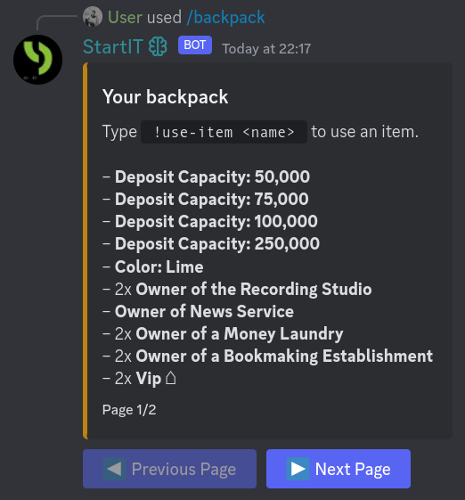

### /use-item Command

The `/use-item <item-name>` command allows you to utilize an item from your backpack. Not all items can be used,
depending on their configuration they can trigger various effects or actions. Some items may grant temporary or
permanent roles, provide special permissions, modify user attributes, or trigger custom messages. By using this command,
you can interact with your items and enjoy the benefits they offer.

### /give-item Command

The `/give-item <user> <item>` command allows you to give away for free one of your items to another user. This command
facilitates item trading and community interaction, allowing players to exchange items with each other. First argument
is the user to whom you want to give the item, and the second argument is the name of an item you want to give.

### Conclusion

This concludes the article on managing items and the associated commands within the economy plugin of StartIT. By
utilizing these commands effectively, you can create an engaging and interactive environment for your server members,
fostering virtual transactions, and enhancing the overall user experience.

## Admin: Concept of items, why they are important

Items are a key aspect of the economy plugin, adding depth and interactivity to the server. Users can obtain items
through various means, such as purchasing them from the `/shop`, buying second-hand items from the `/market`, or
receiving them as gifts from other players using the `/give-item` command. Items are stored in the user's backpack, and
they can be used with the `/use-item` command, provided the item is configured for use.

### Using items for customizing user roles and permissions

Items can be configured to grant users special roles or permissions when used. This allows for personalization and
differentiation among server members, creating a sense of uniqueness and status.

Let's say you have an item called "VIP Pass". When a user purchases and uses this item, it can automatically assign them
a special role that grants access to exclusive channels or features on the server. This not only adds a layer of
customization but also makes users feel valued and recognized. You can also create cheaper items that gives VIP for
3/7/30 days.

### Using items for simulating businesses or activities

Items can simulate businesses or activities within your server, providing users with additional ways to earn virtual
currency or unique benefits.

Consider creating an item called "Bakery." When a user owns this item and uses it with the /collect-income command, they
receive a certain amount of virtual currency every 24 hours as bakery income. This encourages users to collect items and
engage in economic strategies within the server.

### Using items for offering discounts and benefits in the shop

Items can be configured to provide discounts or special benefits in the server's shop. This incentivizes users to
acquire and use specific items, creating a dynamic economy within the server.

Let's say you have an item called "Discount Card". When a user owns this item, it reduces the prices of items in the
shop by a certain percentage. This encourages users to collect the item and actively participate in the server's
economy, as they can save virtual currency on their purchases.

### Using items for increasing earnings from the /work command

Items can be utilized to enhance the earnings obtained through the server's /work command, providing users with a way to
boost their income and progress.

For instance, you can introduce an item called the "Work Efficiency Booster". When a user owns and equips this item, it
increases the amount of virtual currency or experience points they receive from performing the /work command. This
encourages users to acquire and use the item to maximize their earnings within the server's economy.

### Using items for increasing points from leveling and chatting

Items can be employed to augment the points users earn through leveling systems or engaging in chat interactions. This
introduces a sense of progression and rewards active participation.

For instance, you can create an item called the "Experience Amplifier". When a user possesses this item, it increases
the amount of experience points they earn for each level gained. This enables users to level up faster and unlock
additional perks or abilities within the server.

### Using items for extending bank limit

Some items can be configured to extend the maximum amount of money a user can keep in their bank. This creates a
progression system where users strive to obtain these items to increase their financial capabilities.

For example, an item called "Banker's Charm" can be configured to increase the bank limit by a certain amount when used.
Users who possess this item can store more virtual currency in their bank, providing them with a strategic advantage and
sense of progression within the server.

### Using items as a one-time pass for manual action

Items can serve as one-time passes for manual actions or special privileges within the server. This allows you to grant
users unique abilities or access to exclusive features.

For example, you can create an item called "Global Announcement Pass". When a user purchases and uses this item, the
server owner gets notified and lets the user send a global server announcement. Additionally, if you run for example a
Minecraft server, you can create items that users can exchange for in-game additions or perks.

Or if you're a YouTuber, you can create an item called "Video Pass". Users who purchase can be included at the end of
your videos as a personalized shout-out or thank you. This adds a special touch to your content and allows you to engage
directly with your audience. Or, you can create item called "Call Pass" that allows users to join a private voice call
with you.

### Using items as a way to take taxes

All items have a configuration option called "Item Owner" that can be set to a specific role or item. This allows you to
distribute earnings from the shop among the owners of those roles/items. You can use it to allow users send a quick
donation to all your server vips, or you can create an item called the "Shop Manager" that revises all the money from
the shop.

Also, you can create "Tax Office" item in their backpack, they receive a portion of the taxes collected
from commands like /work, /pay, or /collect-income. This encourages users to acquire the item and participate in
economic activities within the server. It also provides a way for server owners to manage and distribute income
effectively.

### Using items as crafting ingredients

Items can be used as crafting ingredients to create more advanced items or unlock unique features. This adds depth and
complexity to the server's economy and gameplay.

For example, you can create items such as "Wood", "String". Then, with the /crafting command, users can combine these
items to craft a "Hammer" item. The Hammer item can have different uses, such as breaking down other
items, unlocking special channels, or providing additional benefits. By making the Hammer item unobtainable in the shop,
you encourage users to engage in crafting and trading on the user market (/market command).

You can also design more intricate crafting systems that require multiple items and time investment, creating
opportunities for users to specialize in item production and generate income solely from crafting and selling items on
/market.

### Using items as decorative and collectible items

Not all items need to have functional or gameplay-related purposes. Some items can serve as decorative or collectible
assets, allowing users to express themselves or showcase their achievements within the server.

For instance, you can create cosmetic items such as "Golden Crown" or "Rare Pet." These items do not have any functional
effects but can be visually displayed in a user's profile or inventory. Users can trade or showcase these collectible
items, fostering a sense of ownership and personalization.

### Cases - special type of items with element of surprise

Items can also be used to enhance gameplay or interactions among users. They can introduce new mechanics, mini-games, or
challenges that make the server more entertaining and engaging. There is a **special type of item** called "Case" that,
when used, randomly drop other items, cases, roles, or sometimes just nothing.

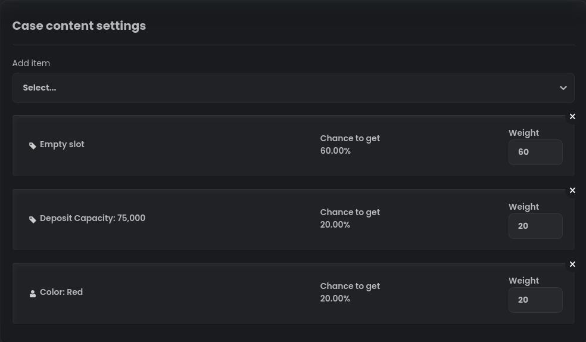

When using a case (with /use-item command), the outcome is determined by chance. This adds an element of excitement and
surprise to the server experience. For instance, you can create a case called "Mystery Box". When a user uses this case,
it grants them a surprise reward, such as additional virtual currency, special roles, or unique items, but there is 60%
chance that the user will get nothing. You can't imagine how much fun it is to get rare item from cheap case!

### Conclusion

These are just a few examples of the various use cases for items within StartIT's economy plugin. By
strategically configuring and utilizing items, you can create an immersive and dynamic economy that enhances the overall
user experience in your server. The possibilities are virtually limitless, and you can tailor the items to suit the
theme, interests, and dynamics of your community.

## Admin: Configuring items

After reading the previous section, you surely already have ideas about what items you want to create. But before you
start creating items, it is important to understand the various configuration options available to you. With some
creativity and imagination, you can create items that are unique and tailored to your server's theme and dynamics.
The following sections will guide you through the process of configuring items and using them to enhance your
server's economy.

### /economy backpack add Command

The `/economy backpack add <user> <item>` command is an administrative tool that allows authorized users to add items
directly to a user's backpack. This command is useful for troubleshooting, rewarding users, or managing special events.
By using this command, you can provide items to users without going through the regular acquisition process.

### /economy backpack remove Command

The `/economy backpack remove <user> <item>` command enables authorized users to remove items directly from a
user's backpack. This command can be helpful in case of item duplication, removal requests, or resolving issues related
to specific items. By using this command, you can remove items from a user's inventory when necessary.

### /economy backpack clear Command

The `/economy backpack clear <user>` command allows authorized users to clear a user's entire backpack, removing all
items at once. This command can be utilized to punish users or in situations that require a user's inventory to be
reset. By using this command, you can ensure a clean slate for a user's item collection. This command is irreversible,
so use it with caution. It is recommended to use the `/economy backpack remove` command to remove specific items instead
of clearing the entire backpack. This will prevent accidental removal of items and allow you to resolve issues without
affecting the user's entire inventory.

### Create item

Items can be created directly from the dashboard. To create a new item, navigate to the "Items" page and click the
plus button. You will be prompted to enter the item's name, type, and other configuration options described below.

### Item display configuration

#### Item Name

The item's name. This will be displayed in the shop and user inventory.

#### Item Type

The item's type. This determines the item's behavior and effects.

- **Use item instantly:** This is the default item type and the simplest type of item,
  whose only purpose is to perform some action (usually it is to give a server role).
  You can't set it to do interesting things like give money with /collect-income because it is used instantly
  and not saved in the backpack.

- **Save item in backpack:** This item type is saved in the user's backpack and can be used with the /use-item
  command. This allows you to create items that can be used multiple times and have more complex effects.

#### Sticky

If enabled, user won't be able to return this item via /give-item or /market commands.

#### Automatically destroy this item:

Sometimes you want to create items gives some boost for a limited time. This option allows you to automatically destroy
this item after the specified time. For example, you can create an item that gives +10% to leveling for 24 hours.

#### Limit the number of items in the backpack:

A useful feature that allows you to limit how many items one user can have.

### Shop configuration

When creating an item, you have the option to add it to the shop. The shop is where users can browse and purchase items
using virtual currency. Below are the configuration options for items in the shop.

- **Display item in store:** Enable this checkbox to make the item available for purchase in the shop.

If the item is displayed in the shop, the following options will be shown:

#### Item Description

Enter a description for the item that will be displayed in the shop. Provide information about its effects or any
special features.

#### Item Price

Set the price of the item in the shop.

#### Item Price for Individual Roles

If you want to offer different prices for specific roles, you can set the price for each role using this option. This
allows you to create role-specific discounts or promotions.

#### Limit the number of items in the stock

If you want to restrict the availability of the item, you can set a limit on the number of items that can be purchased
from the shop.

#### Item Category

Assign a category to the item to help organize your store. Users can browse items by category, making it easier to find
what they are looking for.

#### Item Owner

If you want the income from this item to be distributed among multiple owners, you can select the roles or individual
users who will be considered as owners. The income will be evenly distributed among the selected owners.

#### Requirements to Purchase an Item

If you want to set specific requirements for users to be able to purchase the item, you can select the roles or
individual users who must meet those requirements. Users who do not meet the requirements will not be able to buy the
item.

#### Fraud Chance

Specify a percentage chance that the item will not be delivered to the user after purchase. This adds an element of risk
to the purchase and can create an element of surprise for users.

### Configure /use-item behavior

This part of configuration lets you set up bot behavior after using an item with the `/use-item` command.

#### Destroy the item after using it

If enabled, the item will be removed from the user's backpack after it is used.

#### Add Temporary Roles

You can select roles to be added temporarily to the user after using the item. These roles will be automatically removed
after a certain period of time.

#### Add Roles

Select roles to be added to the user after using the item. These roles will persist until manually removed.

#### Remove Roles

Select roles to be removed from the user after using the item. These roles will no longer be associated
with the user.

#### Add Money

Specify an amount of virtual currency to be added to the user's balance after using the item.

#### Add XP

If you are using XP system from our bot, you can specify an amount of XP to be added to the user's experience
points after using the item.

#### Remove All User Warnings

Enable this option to remove all warnings associated with the user. This can be useful for
providing a clean slate or resetting certain user attributes.

#### Custom Message After Using This Item

Enter a custom message that will be displayed to the user after they use the
item. You can provide additional instructions or information related to the item's effects.

## Stock-market – place for investing money

The Stock Market is a virtual marketplace where users can trade stocks of various companies using the bot's virtual
currency. It simulates the real-world stock market and allows users to experience the thrill of investing and trading
stocks without any real financial risk.

Here is a list of commands that you can use within the Stock Market:

- `/stockmarket backpack [user]`: Displays the stocks you currently own in your backpack.
- `/stockmarket info <name>`: Provides detailed information about a specific stock.
- `/stockmarket sell <quantity> <name>`: Allows you to sell a specific quantity of a stock.
- `/stockmarket sell-all`: Sells all the stocks you currently own.
- `/stockmarket buy <quantity> <name>`: Enables you to buy a specific quantity of a stock.
- `/stockmarket list`: Lists all available stocks for trading.

### /stockmarket info Command

You can use the `/stockmarket info <name>` command to retrieve detailed information about a specific stock. The `<name>`
parameter refers to the symbol of the stock you want to know more about. The information provided includes the
stock's name, symbol, current price, market cap, trading volume, and price change percentage.

We are trying to be as accurate as possible. To archive that we are constantly connected to our 3rd party provider that
sends us live stock data. However, we are not responsible for any inaccuracies. Please don't invest real money based on
our bot :c

### /stockmarket buy Command

To buy stocks, you can use the `/stockmarket buy <quantity> <name>` command. Specify the `<quantity>` parameter to
indicate the number of stocks you want to purchase, and provide the `<name>` parameter as the symbol of the
stock you wish to buy. The bot will add the corresponding stocks to your backpack.

### /stockmarket sell Command

When you want to sell stocks, use the `/stockmarket sell <quantity> <name>` command. Specify the `<quantity>` parameter
to indicate the number of stocks you want to sell, and provide the `<name>` parameter as the symbol of the stock
you wish to sell. The bot will remove the specified quantity of stocks from your backpack and credit the virtual
currency equivalent to your balance.

### /stockmarket list Command

You can view all available stocks for trading using the `/stockmarket list` command. The bot will display a list of
stocks, including their names, symbols, and current prices. This information helps you make informed decisions when
choosing stocks to invest in.

We are supporting the following stocks:

- [Most popular cryptocurrencies](https://www.tradingview.com/markets/cryptocurrencies/prices-all/)
- US Stock
  Market: [AMEX, NASDAQ, NYSE stock exchanges](https://www.tradingview.com/markets/stocks-usa/market-movers-all-stocks/)

View full list on supported cryptocurrencies and stocks on [www.startit.bot/stocks](https://startit.bot/stocks).

### /stockmarket backpack Command

To check the stocks you currently own, use the `/stockmarket backpack [user]` command. If you provide the `[user]`
parameter, it will display the backpack of the specified user. Otherwise, it will show your own backpack. The backpack
displays the stocks you own, along with quantities.

### /stockmarket sell-all Command

If you want to sell all the stocks you own, simply use the `/stockmarket sell-all` command. The bot will remove all
stocks from your backpack and credit the virtual currency equivalent to your balance.

### Admin: Configuring the Stock Market

To start playing around with stock market on your server go to the dashboard and set conversion rate between your
virtual currency and dollars.

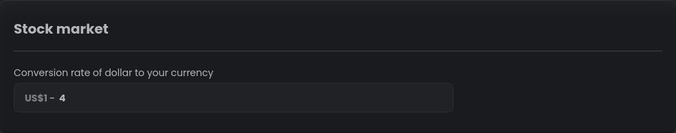

Conversion rate `US$1 - 4` means that 1 real dollar is worth 4 virtual currency units. For example if you want to buy a
stock of Apple Inc. witch costs 150 real dollars you need to spent **600 virtual currency**.

## User-market – a place for trading items

The user-market feature in the StartIT bot allows users to buy and sell items among themselves, creating a thriving
economy and fostering a sense of community interaction. It provides an opportunity for players to engage in trade,
discover unique items, and build their wealth.

### /market sell Command

The `/market sell <quantity> <name> <price>` command enables you to sell your items on the market, making them available
for other users to purchase. By specifying the item, quantity, and price, you can list your items for sale. This command
facilitates player-to-player transactions and promotes a dynamic marketplace within your server.

### /market list Command

The `/market list` command displays the items that users have put up for sale on the market. It provides an opportunity
for players to trade items directly with each other. By using this command, you can explore the market and discover
unique items that are available for purchase.

### /market buy Command

The `/market buy <serial>` command allows you to purchase an item listed on the market. When you find an item that
interests you, you can use this command to buy it from the seller. The serial is a sequence number of the item you want
to buy. It is displayed in the `/market list` command. Upon successful purchase, the item will be added to your
inventory, allowing you to use or trade it as desired.

### Admin: User-market and crafting as perfect combination for your server

The user-market and crafting systems are closely related, creating an interconnected economy within StartIT bot.
While the user-market allows users to trade existing items, the crafting system enables the creation of new and advanced
items by combining multiple ingredients.

By integrating the user-market and crafting, you can encourage users to participate in both aspects of the economy. For
example, you can design recipes that require specific items obtained from the user-market to craft unique and valuable
items. This encourages players to engage in trade, seek out rare ingredients, and experiment with crafting.

Additionally, you can create a dynamic economy where users specialize in either item production through crafting or item
trading through the user-market. This diversification of roles and activities enriches the overall gameplay experience
and provides opportunities for users to generate income and collaborate with others.

Remember to configure the item properties, such as availability in the shop and limitations on the number of items in
stock, to maintain balance and ensure a fair trading environment.

The combination of the user-market and crafting systems opens up new possibilities for users to explore, interact, and
shape the economy within your Discord community. Users are unlikely to leave your server if they have a real job on it
producing items that others need.

## Crafting – Do it yourself

Crafting in StartIT allows users to combine various ingredients to create new items or products. This guide will provide
an overview of how crafting works and explain how to configure crafting recipes in the bot.

### Listing Crafting Recipes

Crafting recipes are created and managed by administrators. These recipes define the required ingredients and the
resulting product. Users can view the available recipes through the `/craft list` command. This command displays a list
of all available recipes, along with their names and descriptions.

### Obtaining resources

To craft a recipe, you need to gather all the necessary ingredients. These ingredients can include items, roles,
cases, or even a certain amount of money. The recipe description will provide details about the required ingredients.
You can acquire the ingredients through various means such as purchasing them from the shop, receiving them from other
users, or completing specific tasks. Administrators sometimes don't say all the ingredients in the recipe description,
so you need to figure out yourself what items you need to craft the recipe.

Sometimes the ingredients are rare and difficult to obtain, making the resulting product more valuable.
This encourages you to engage in trade and collaborate with others to obtain the ingredients you need. It also
creates a sense of accomplishment when you successfully craft a recipe. The resulting product can be used by you
or sold on the user-market. This creates a dynamic economy where you can specialize in either item production through
crafting or item trading through the user-market.

Once you have gathered all the required ingredients, you can initiate the crafting process. The bot will check if
you meet all the requirements and probably consume the ingredients in the process. If successful, you will receive
the resulting product.

### Crafting process

To start crafting, use the command `/craft recipe <name>`, where `<name>` represents the name of the recipe you want to
create. It's worth noting that `<name>` is recipe name from `/craft list` command, not the name of the resulting
product. Once you initiate the crafting process, the bot checks if they meet all the requirements for
the recipe. If the requirements are met, the ingredients are consumed, and you will receive the crafted product.
If the requirements are not met, the crafting attempt fails without consuming ingredients. Bot won't tell you what
ingredient you are missing, so you need to figure it out yourself.

## Admin: Configuring crafting recipes

When configuring a crafting recipe, administrators have several options to define its behavior. Let's go through the
available settings step by step:

### Create a new recipe

To create a new recipe, go to the dashboard and scroll to "Crafting recipes" section. Then click the plus button to add
a new recipe.

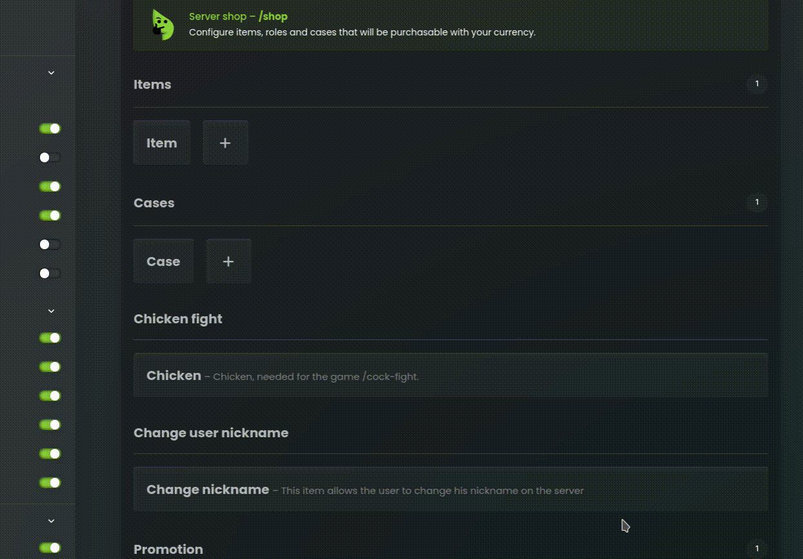

### Command Settings

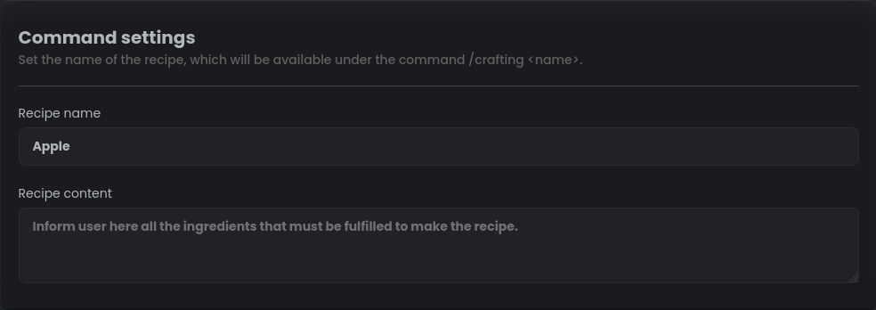

#### Recipe name

Set the name of the recipe, which will be used in the command for crafting. For example, if you set the recipe name to
"Apple", users will be able to craft the recipe by using the `/craft recipe Apple` command.

#### Recipe content

Provide a detailed description of the recipe's requirements. This should include all the ingredients and criteria that
users must meet to craft the recipe successfully. This information will be displayed when users view the recipe through
the `/craft list` command. It is also recommended to include the resulting product in the description.

### Recipe Requirements

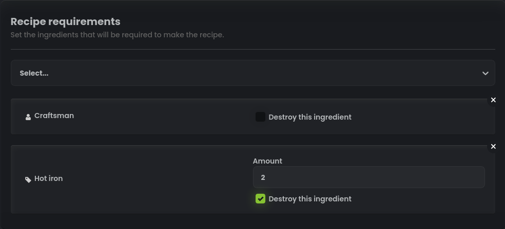

In this section, administrators can define the ingredients required for crafting the recipe. The available options are:

- **Money**: Specify the amount of virtual currency required as an ingredient for the recipe.

- **List of roles**: Select specific server roles that users must possess to meet the recipe's requirements.

- **List of items**: Choose the items that users need to have in their possession to fulfill the recipe's requirements.

- **List of cases**: Include specific cases that users must possess in order to proceed with crafting the recipe.

By default, all ingredients selected in this section will be marked with the option "Destroy this ingredient." This
means that the respective roles, money, or cases will be taken away from the user upon successfully crafting the recipe.

### Product

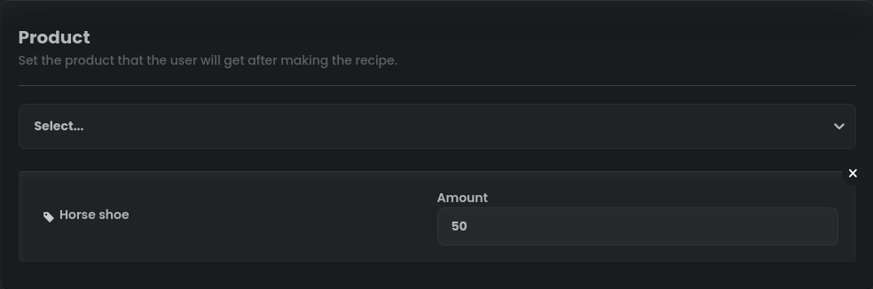

Finally, administrators can specify the product that users will receive upon successfully crafting the recipe. The
product is typically an item, but administrators can get creative and make the recipe give additional rewards such as
money, roles, items, or cases.

## Blackjack – Hit or stand, luck in your hand

Welcome to the world of Blackjack on StartIT bot! This guide will provide you with an overview of how the Blackjack
game works, both visually and strategically. We will help you understand the mechanics of the game and provide examples
of tactics you can use to improve your chances of winning.

### Game interface

To start a game of Blackjack, use the command `/blackjack <bet>` to place your bet. The bot will then shuffle the card
deck and deal two cards each to the player (you) and the dealer (bot). One of the dealer's cards will be hidden from
you.

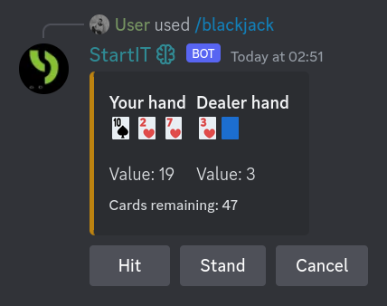

During the game, you have several options that you can choose either by clicking the corresponding buttons or by typing
the commands in the chat. The available options are:

- **Stand**: This means you are satisfied with your current hand and don't want any additional cards.
- **Hit**: By choosing this option, you request an additional card from the deck to increase your hand value.
- **Double**: If you believe that a single card will significantly improve your hand, you can double your initial bet
  and receive additional card.
- **Pass**: This option is available when the dealer's face-up card is an Ace ('A'). It allows you to place an insurance
  bet, which will protect you in case the dealer has a Blackjack. If the dealer has a Blackjack, you will receive 50% of
  your initial bet as insurance.
- **Cancel**: If you change your mind or want to exit the game, you can choose this option to cancel your current
  action. Your bet won't be refunded, so rather than canceling, you can simply choose to stand and wait for the round to
  end.

The game continues until either you or the dealer exceeds a total hand value of 21 points. If the dealer's hand exceeds
21 points, you win the round. If both you and the dealer have the same hand value, it's a draw. However, if the dealer's
hand value is closer to 21 than yours, you lose the round.

### Understanding the gameplay

Now let's dive into the mechanics of Blackjack. Each card in the deck has a specific value. Number cards (2-10) are
worth their face value, face cards (Jack, Queen, King) are worth 10 points each, and the Ace can be worth either 1 or 11
points, depending on which value benefits your hand the most.

To calculate the value of your hand, you need to add up the point values of all the cards. For example, if you have a 7
and a Jack, your hand value would be 17 (7 + 10). If you have an Ace and a 5, your hand value would be either
6 (Ace = 1) or 16 (Ace = 11).

The goal of Blackjack is to have a hand value as close to 21 as possible without exceeding it. If you achieve a hand
value of exactly 21 with your initial two cards (an Ace and a card worth 10 points), you have a "Blackjack". A Blackjack
is the strongest hand and results in an automatic win, unless the dealer also has a Blackjack, in which case it's a
draw.

During the game, you can choose to "hit" to receive additional cards or "stand" to keep your current hand. It's
important to consider the total value of your hand and assess the risk of going over 21 points. If your initial hand has
a value between 9 and 11, you may also have the option to "double" your bet and receive one additional card.

### Tactical considerations

Now that you understand the basics, let's explore some tactics that can help improve your chances of winning in
Blackjack:

1. **Learn and Utilize Basic Strategy**: Familiarize yourself with basic Blackjack strategy, which involves making
   optimal decisions based on your hand and the dealer's face-up card. Basic strategy helps maximize your chances of
   winning by following mathematically proven guidelines.

2. **Manage Your Bankroll**: Set a budget for your Blackjack sessions and stick to it. Determine the amount of money
   you're willing to spend and avoid exceeding that limit. This helps ensure responsible gambling and prevents excessive
   losses.

3. **Practice Proper Bet Sizing**: Adjust your bet sizes based on your bankroll. It's generally recommended to wager a
   small percentage of your total bankroll on each hand. This approach helps manage your risk and prevents substantial
   losses in a short period.

4. **Avoid the Insurance Bet**: In our Blackjack, when the dealer's face-up card is an Ace, you will be offered an
   insurance bet (Pass button). However, statistically, insurance bets are not profitable in the long run. It's
   generally recommended to avoid taking insurance bets.

5. **Stay Focused and Avoid Emotional Decisions**: Keep a clear mind while playing our Blackjack. Avoid making
   impulsive decisions based on emotions or past outcomes. Stick to your strategy and make rational choices based on the
   probabilities of the game.

Remember, Blackjack is a game of chance, deck is randomly sorted each game and there are no patterns in our algorithms.
While these tactics can improve your chances of winning, there is no guaranteed strategy for success.
Play responsibly, have fun, and enjoy gaming with our bot!

[//]: # (### Admin: Configuring the Blackjack)

## Cock-fight – Unleash the feathers of competition

The Cock-fight feature allows users to engage in virtual cock-fights using chickens that can be purchased from the
server shop. In the default configuration, each chicken has a standard chance of winning set at 50%. This section will
guide you through how cock-fights work and how to configure them on your bot.

### Participation in chicken fight

Before participating in fight, be sure that you have living chicken in your `/backpack`. If not, purchase one in server
shop (In default configuration: `/buy chicken` command).

To participate in a chicken fight, invoke the `/cock-fight <bet>` command, where `<bet>` represents the amount of
virtual money they want to wager on their chicken. The user's chicken will then enter the battle against another (bot)
chicken.

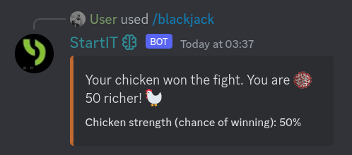

- If the user's chicken wins the fight, its strength increases, and its winning rate is adjusted by one percentage
  point.
- If the user's chicken loses the fight, it dies, and the user will need to purchase a new chicken from the server shop.

### Admin: Configuring chicken fights

To set up and configure chicken fights in your server, follow the steps below:

1. Open your bot's dashboard and navigate to the chicken fight section.
2. Enable the "Display item in shop" option to make chickens available for purchase in the server shop.
3. Optionally, you can customize the name of the chicken to better fit your server's theme or language.

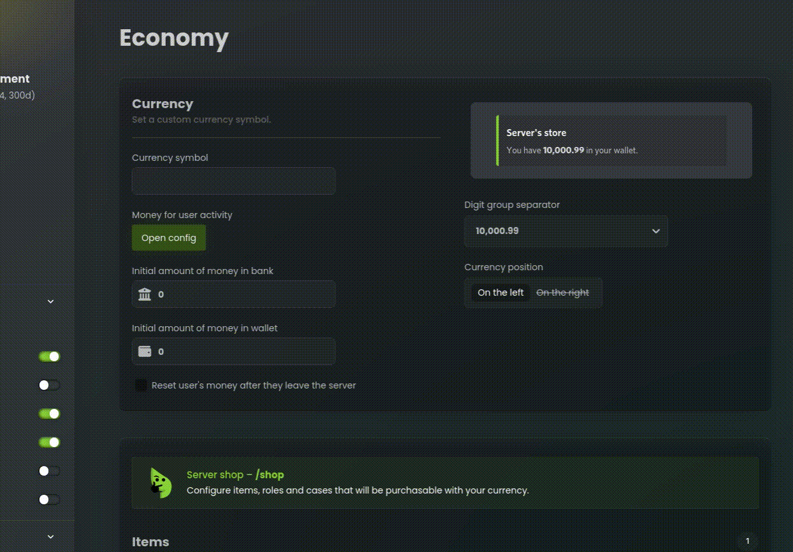

Once you have completed these steps, the `/cock-fight` command will be ready to use with the default configuration.

While the default configuration works fine, you can further customize the chicken fight feature by adjusting the
following
options:

#### Default Win Chance

You can specify the default win chance for each chicken. This represents the initial winning rate when a chicken is
purchased. (Default: 50%)

#### Max Win Chance

You can set the maximum win chance that a chicken can achieve. As chickens win fights, their winning rate can increase
up to this maximum value. (Default: 70%)

#### Cooldown

You can set a cooldown to limit how often the chicken fight command can be used. Specify the maximum number of uses
within the cooldown duration.

- **Maximum Number of Uses:** Set the maximum number of cock-fight uses within the cooldown period.
- **Cooldown Duration:** Define the duration of the cooldown period using a specific time format.

#### Bet Limit

If desired, you can impose limits on the amount that users can bet in a single chicken fight.

- **Minimal Bet:** Specify the minimum bet amount allowed.
- **Maximal Bet:** Set the maximum bet amount permitted.

With these configuration options, you can fine-tune the chicken fight feature according to your server's preferences and
requirements. Remember to save your changes after configuring the chicken fight settings to apply them to StartIT bot.

Now that you have an understanding of how chicken fights work and how to configure them, you can provide your users with
an
exciting and interactive experience in your Discord server.

## Change user nickname item - A monetized identity makeover

The "Change User Nickname" item is a special tool that allows users to modify their nickname within the server. It
provides a fun and interactive way for users to personalize their identity and add a touch of creativity to their
presence. With this item, users can easily update their nickname without the need for manual intervention from server
administrators.

### Using the item

You can acquire this item from the server's shop and use it to change your nickname. Upon using the item, a dialog
prompt will appear, asking you to input your desired new nickname. After typing the new nickname, the bot will
automatically update it and reflect the change in the server.

It's important to note that the "Change User Nickname" item is designed for one-time use and will be destroyed after it
has been utilized unless you configure it otherwise.

### Admin: Enabling the Item

To enable the "Change User Nickname" item, follow these steps in the server dashboard:

1. Locate the item configuration section.
2. Enable the "Display Item in Shop" option to make the item available for purchase in the server's shop.

### Admin: Customizing Self-Breaking Behavior

By default, the "Change User Nickname" item is configured to be self-breaking, meaning it will be consumed and removed
from the user's inventory after usage. However, if you prefer to modify this behavior, you can make use of the
"Cooldown" option in the item configuration.

1. Enable the "Cooldown" switch in the item configuration.
2. Specify the desired cooldown duration in the provided input field. This duration determines how often users can
   change their nickname using this item.

Adjusting the cooldown duration allows you to control the frequency at which users can utilize the "Change User
Nickname" item.

With the "Change User Nickname" item, your server members can add a personal touch to their presence, express their
individuality, and have fun interacting with others in a unique way.

## Discounts

Discounts play a vital role in attracting users and boosting engagement on your Discord server. With the economy plugin
of StartIT, you have the flexibility to apply discounts and special offers to items in your server's shop. Discounts
are a powerful tool that can entice users to make purchases, increase user activity, and create a sense of exclusivity
within your community.

In this guide, we will explore different methods of applying discounts to items in the shop. Our bot offers few forms
of price reduction, each with its own advantages and use cases. You can choose the method that best suits your needs and
effectively manage discounts on your server.

### Promotion section configuration

Our users have often complained that if they have a lot of items in shops and reducing prices of all of them is very
tedious. We have heard you and introduced a new Promotion section which allows you to configure discounts for
multiple items at once. To leverage that, navigate to the StartIT dashboard and locate the "Promotion" section.
By using this feature you can apply discounts to all items in the shop (except for those you choose to exclude). Also,
this configuration allows you to schedule discounts for specific time periods, such as weekends or specific hours of
the day. It's great for recurring discounts and time-limited offers. You can for example create a promo that reduces
prices by 10% during the holiday season.

Here, you will find various inputs and options that allow you to customize the discount settings according to your
needs. Let's take a look at each of these options and how they can be used to create discounts:

#### Promo settings

Select whether you want to reduce or increase the price of items in the Promotion. You can choose to apply a percentage
discount or a fixed value reduction/increase. 

In the input field below, enter the percentage or value that will be applied to the items during the Promotion.

#### Items excluded from promotion

Select the items that should be excluded from this discount offer. These items will retain their original prices.

#### Duration of the promotion

Choose the duration of the Promotion using one of the following options:
  - **No time limitation**: The Promotion will be active indefinitely.
  - **One-time activation**: Set a specific start and end date for the Promotion.
  - **Activate daily**: Specify the start and end time for the Promotion to be active each day.
  - **Activate weekly**: Select a continuous start and end time along with the days of the week; the promotion will run 
    from the start time on the initial day to the end time on the concluding day every week.

#### Promotion conditions

Optionally, you can set specific roles that will be allowed or excluded from the Promotion. This enables you to offer
discounts exclusively to certain roles or restrict them from participating in the Promotion.

- **Banned roles**: Select the roles that will be excluded from the Promotion. Users with these roles will not benefit
   from the discount and will see the regular prices.

- **Allowed roles**: Select the roles that will be eligible for the discount offer. Users with these roles will enjoy
   the discounted prices during the Promotion.

### Item-specific price adjustments

While the Promotion section provides a comprehensive and automated way to set up discounts, there may be cases where you
prefer to modify item prices directly. For example, if you want to offer a discount on only one or a few items, it may
be easier to manually edit their prices. Additionally, the "Item price for individual roles" configuration within item
settings allows you to set up permanent discounts for specific roles.

To apply a discount to a specific item, follow these steps:

1. Locate the item for which you want to apply a discount in the server shop.

2. Edit the item configuration and adjust the price according to the desired discount. This change will directly affect
   the item's price without the need for additional Promotion settings.

3. Alternatively, if you want to set up a permanent discount for specific roles, utilize the "Item price for individual
   roles" option within the item configuration. Here, you can assign different prices to specific roles, effectively
   creating ongoing discounts for those roles.

By utilizing direct price editing and the "Item price for individual roles" configuration, you can easily implement
discounts on specific roles or individual items without relying on the Promotion section. This gives you more
flexibility and control over the discounts you want to offer.

## Tic-tac-toe –

## Roulette –

## Russian-roulette –

## Additional settings

### "Exceptions" configuration

### Logging configuration
