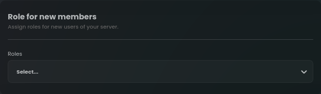
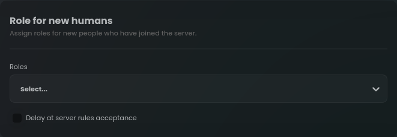
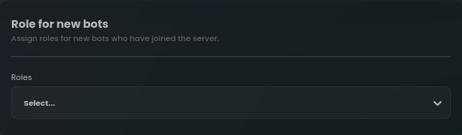
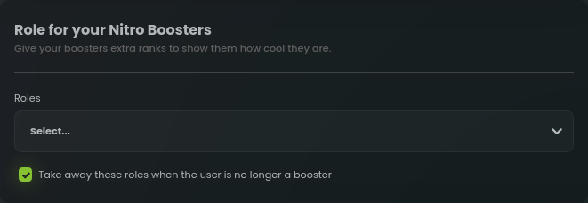
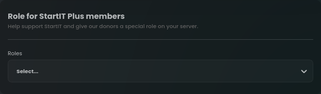

# Auto Role Plugin 

The Auto Role plugin is designed with utmost simplicity in mind, providing an effortless way to automatically assign 
roles to users based on specific events or conditions within your Discord server. This guide aims to walk you through 
the configuration process step-by-step, enabling you to leverage the full potential of this feature to enhance your 
server's user management and community engagement.

## Role for all members (users and bots)

In this section, you can specify the roles that the bot should assign to new members and bots upon joining the server.

## Role for only human members (not bots)

StartIT allows you to differentiate between regular users and bots, providing you with the flexibility to customize role
assignments for each group.

In "Role for new humans" section you can define roles specifically for new human members joining the server. If you have
member verification enabled, you can also configure a delay in accepting the server rules before assigning roles.

## Role for all bots

For bots that join your server, you have the option to designate specific roles that should be automatically assigned.
This capability ensures that bot accounts are readily identified and categorized within your community.

## Role for your Nitro Boosters

Acknowledging the support of Nitro Boosters is crucial for community appreciation. With the Auto Role plugin, you can
offer unique role rewards to users who boost your Discord server.

In this section, you can select roles that will be granted to users who boost the server. Additionally, you have the
option to decide whether the bot should automatically remove these roles if a user decides to stop boosting.

## Role for StartIT Plus subscribers

If you want to support our work, create a "StartIT Plus" role on your server and select it in the box below.

The bot will automatically give this role to users who have supported us monetarily.

Thank you <3

If you have any questions or encounter any difficulties during the configuration process of auto roles plugin, feel free
to reach out to our support team. We wish you success in building a thriving and inclusive community on Discord!
