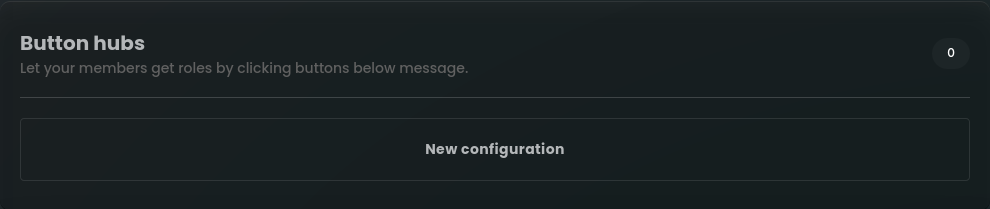
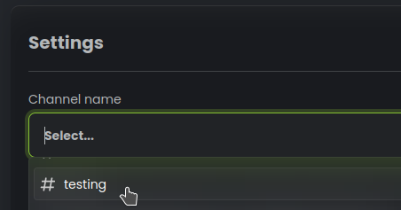
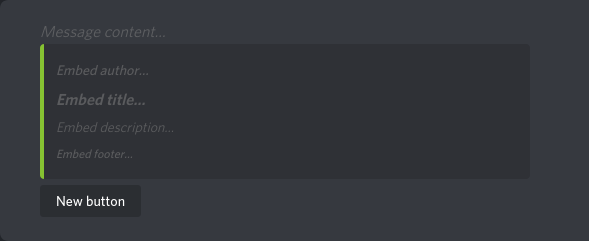
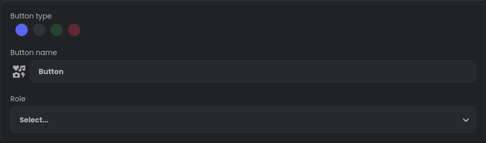

# Button Roles

Welcome to the documentation for Button Roles, one of the exciting features in our Discord bot! With Button Roles, you
can allow your members to get roles by clicking buttons below messages, making it easier for them to personalize their
experience within your server. Let's walk you through the configuration process step by step.

## Getting started

To access the Button Roles feature, you need to go to the StartIT dashboard. Once you're there, select "Moderated
channels" plugin from the left sidebar. Then, find the "Button Roles" card and click on the "New configuration" button.

## Select channel

Select the channel where you want the Button Roles to be active. Members will be able to click buttons and obtain
roles in this specified channel.

## Select panel mode

Choose the panel mode that suits your needs:
  - **Normal**: Clicking a button adds roles, and re-clicking the same button removes the roles.
  - **Drop**: Clicking a button removes roles, and re-clicking the same button does nothing.
  - **Verify**: Clicking a button adds roles, and re-clicking the same button does nothing.

---

## Customize Message

Personalize the message content and embed content to make it more appealing to your members. You can also click on the
green embed bar to change its color.

Click "new button" button to add a new button. You can add as many buttons as you want. Each button consists of the
following settings:

  - **Button Type**: Choose from primary, secondary, success, or danger color for the button.
  - **Button Name**: Assign an emoji and a label for the button.
  - **Role**: Select the role that will be assigned to the member when they click the button.

Remember to save your configurations once you're done customizing everything!

---

## Message Settings

Use the **Message when adding a role** input field to set a custom message that will be sent to the member when they
successfully add a role.

Use the **Message when removing a role** input field to set a custom message that will be sent to the member when they
successfully remove a role.

That's it! Your Button Roles feature is now set up and ready to be used by your community. Now your members can easily
obtain roles by clicking buttons, making it a fun and interactive way to personalize their experience on your Discord
server. Enjoy using the Button Roles feature and have a great time chatting and hanging out with your community and
friends!