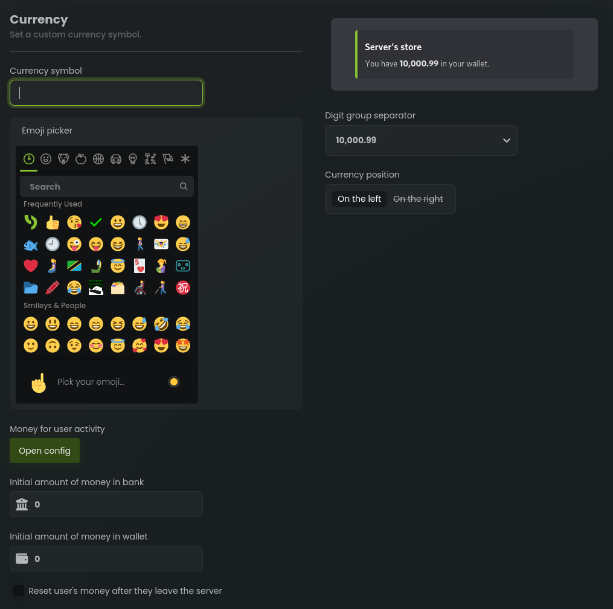

# Configuring currency

You can manage each user individually by using the commands listed below. These commands allow you to adjust the
currency balance of a specific user, which can be useful for administrative purposes or to reward users for their
contributions to the server.

## /economy add <user> <money> [location]

The `/economy add` command is an administrative command that allows authorized users to add virtual money to a specific
user's account. By mentioning or providing the ID of the target user and specifying the amount to be added,
administrators can adjust user balances accordingly. An optional `location` argument can be provided to specify whether
the money should be added to the bank or wallet. Defaults to bank.

## /economy remove <user> <money> [location]

The `/economy remove` command enables authorized users to deduct virtual money from a specific user's account. By
mentioning or providing the ID of the target user and specifying the amount to be removed, administrators can adjust
user balances accordingly. An optional `location` argument can be provided to specify whether the money should be
deducted from the bank or wallet. Defaults to bank.

## /economy set <user> <money> [location]

The `/economy set` command allows authorized users to set a specific amount of virtual money for a user's account. By
mentioning or providing the ID of the target user and specifying the desired balance, administrators can directly modify
user balances. An optional `location` argument can be provided to specify whether the money should be set in the bank or
wallet. Defaults to bank.

## Server settings

### Currency symbol

The currency symbol is a visual representation of the virtual currency used in the bot's economy system. It is displayed
in various commands and messages to provide users with a clear indication of the currency being used. The default
currency symbol is `$`, but you can change it to any emoji of your choice.

### Initial amount of money

The initial amount of money is the amount of virtual currency that users will receive when they first join the server.
This provides users with a starting point to engage in the economy system and earn more money through various commands
and activities.

Note that this setting only applies to new users who join the <server after the setting has been changed. Existing users
will not receive the initial amount of money. However, you can use the `/economy add` command to manually add money to
existing users' accounts.

### Reset user's money after they leave the server

This setting determines whether users' virtual money will be reset when they leave the server. If this setting is
enabled, users will lose all their virtual money when they leave the server. This can be useful for discouraging users
from leaving the server, as they will lose all their progress in the economy system.

### Digit group separator

The digit group separator is a visual separator that is used to separate digits into groups of three. This provides a
clearer representation of large numbers and makes it easier for users to read and understand the amount of money they
have.

### Currency position

The currency position determines where the currency symbol is displayed in messages. The default setting is `on the
right`, which means that the currency symbol will be displayed after the amount of money. You can also change the
setting to `on the left`, which will display the currency symbol before the amount of money.
