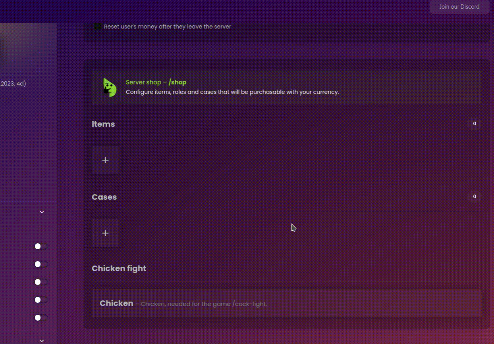
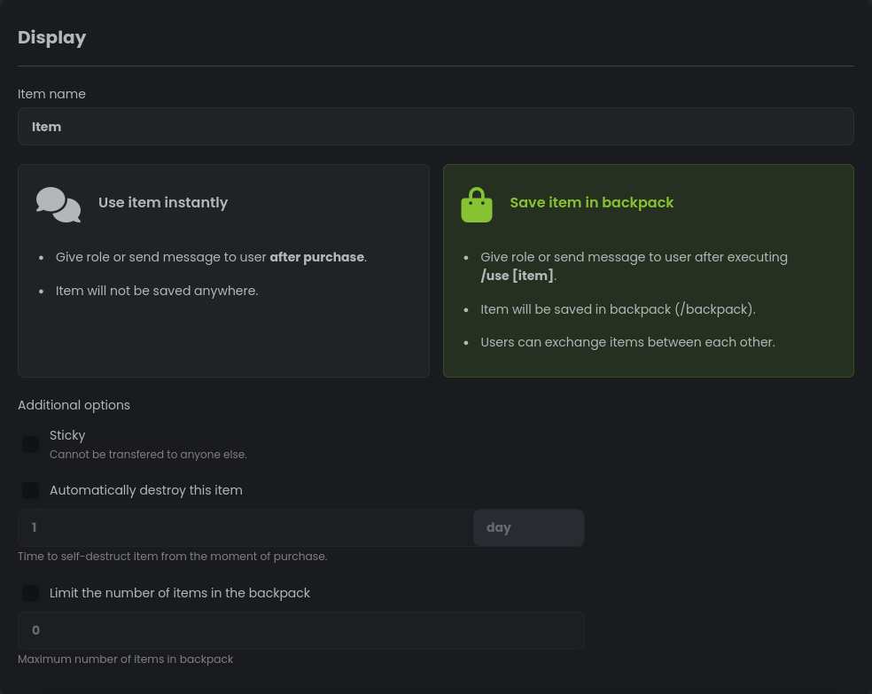
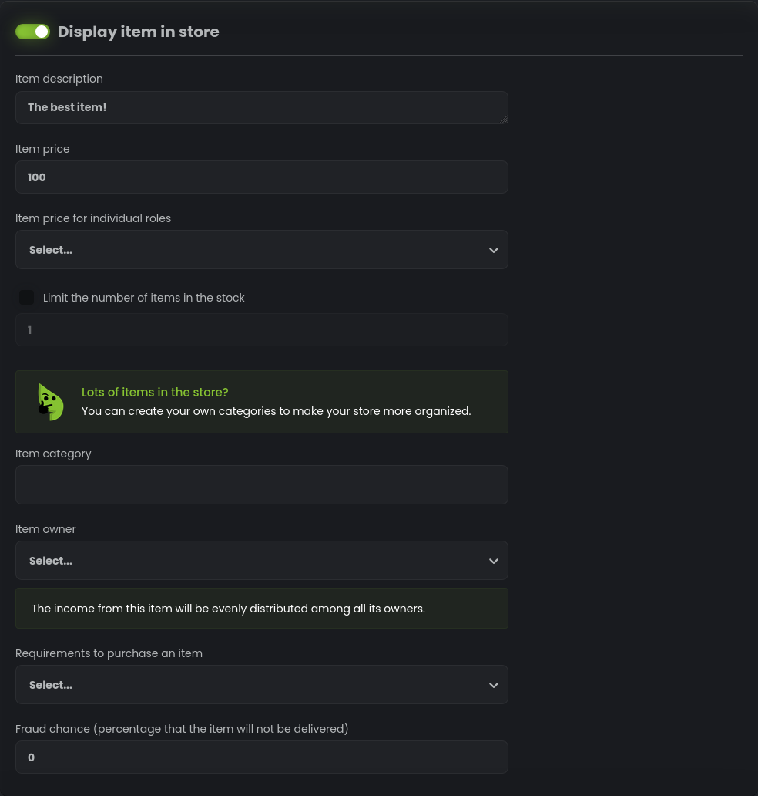
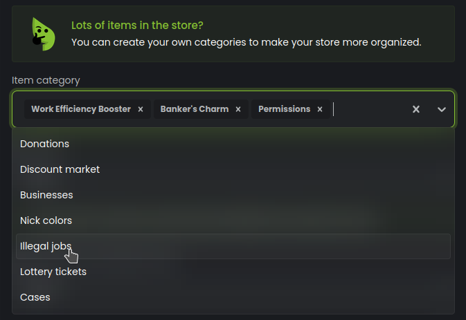
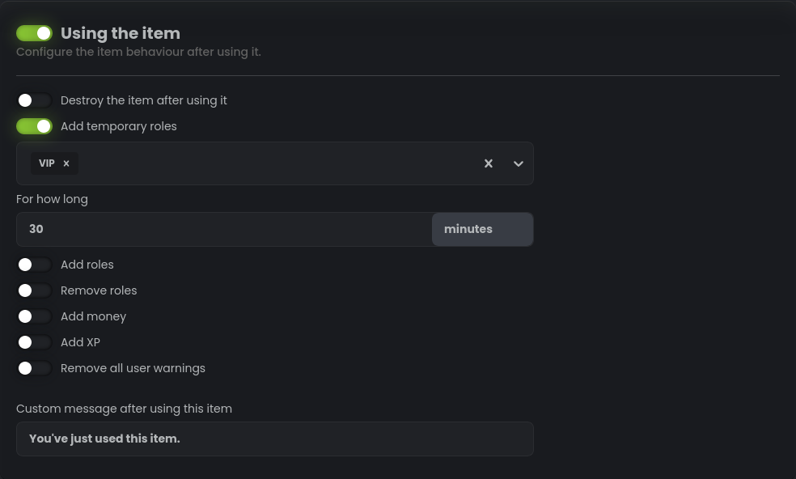

# Admin: Configuring items

After reading the previous section, you surely already have ideas about what items you want to create. But before you
start creating items, it is important to understand the various configuration options available to you. With some
creativity and imagination, you can create items that are unique and tailored to your server's theme and dynamics.
The following sections will guide you through the process of configuring items and using them to enhance your
server's economy.

## /economy backpack add Command

The `/economy backpack add <user> <item>` command is an administrative tool that allows authorized users to add items
directly to a user's backpack. This command is useful for troubleshooting, rewarding users, or managing special events.
By using this command, you can provide items to users without going through the regular acquisition process.

## /economy backpack remove Command

The `/economy backpack remove <user> <item>` command enables authorized users to remove items directly from a
user's backpack. This command can be helpful in case of item duplication, removal requests, or resolving issues related
to specific items. By using this command, you can remove items from a user's inventory when necessary.

## /economy backpack clear Command

The `/economy backpack clear <user>` command allows authorized users to clear a user's entire backpack, removing all
items at once. This command can be utilized to punish users or in situations that require a user's inventory to be
reset. By using this command, you can ensure a clean slate for a user's item collection. This command is irreversible,
so use it with caution. It is recommended to use the `/economy backpack remove` command to remove specific items instead
of clearing the entire backpack. This will prevent accidental removal of items and allow you to resolve issues without
affecting the user's entire inventory.

## Create item

Items can be created directly from the dashboard. To create a new item, navigate to the "Items" page and click the
plus button. You will be prompted to enter the item's name, type, and other configuration options described below.

## Item display configuration

### Item Name

The item's name. This will be displayed in the shop and user inventory.

### Item Type

The item's type. This determines the item's behavior and effects.

- **Use item instantly:** This is the default item type and the simplest type of item,
  whose only purpose is to perform some action (usually it is to give a server role).
  You can't set it to do interesting things like give money with /collect-income because it is used instantly
  and not saved in the backpack.

- **Save item in backpack:** This item type is saved in the user's backpack and can be used with the /use-item
  command. This allows you to create items that can be used multiple times and have more complex effects.

### Sticky

If enabled, user won't be able to return this item via /give-item or /market commands.

### Automatically destroy this item:

Sometimes you want to create items gives some boost for a limited time. This option allows you to automatically destroy
this item after the specified time. For example, you can create an item that gives +10% to leveling for 24 hours.

### Limit the number of items in the backpack:

A useful feature that allows you to limit how many items one user can have.

## Shop configuration

When creating an item, you have the option to add it to the shop. The shop is where users can browse and purchase items
using virtual currency. Below are the configuration options for items in the shop.

- **Display item in store:** Enable this checkbox to make the item available for purchase in the shop.

If the item is displayed in the shop, the following options will be shown:

### Item Description

Enter a description for the item that will be displayed in the shop. Provide information about its effects or any
special features.

### Item Price

Set the price of the item in the shop.

### Item Price for Individual Roles

If you want to offer different prices for specific roles, you can set the price for each role using this option. This
allows you to create role-specific discounts or promotions.

### Limit the number of items in the stock

If you want to restrict the availability of the item, you can set a limit on the number of items that can be purchased
from the shop.

### Item Category

Assign a category to the item to help organize your store. Users can browse items by category, making it easier to find
what they are looking for.

### Item Owner

If you want the income from this item to be distributed among multiple owners, you can select the roles or individual
users who will be considered as owners. The income will be evenly distributed among the selected owners.

### Requirements to Purchase an Item

If you want to set specific requirements for users to be able to purchase the item, you can select the roles or
individual users who must meet those requirements. Users who do not meet the requirements will not be able to buy the
item.

### Fraud Chance

Specify a percentage chance that the item will not be delivered to the user after purchase. This adds an element of risk
to the purchase and can create an element of surprise for users.

## Configure /use-item behavior

This part of configuration lets you set up bot behavior after using an item with the `/use-item` command.

### Destroy the item after using it

If enabled, the item will be removed from the user's backpack after it is used.

### Add Temporary Roles

You can select roles to be added temporarily to the user after using the item. These roles will be automatically removed
after a certain period of time.

### Add Roles

Select roles to be added to the user after using the item. These roles will persist until manually removed.

### Remove Roles

Select roles to be removed from the user after using the item. These roles will no longer be associated
with the user.

### Add Money

Specify an amount of virtual currency to be added to the user's balance after using the item.

### Add XP

If you are using XP system from our bot, you can specify an amount of XP to be added to the user's experience
points after using the item.

### Remove All User Warnings

Enable this option to remove all warnings associated with the user. This can be useful for
providing a clean slate or resetting certain user attributes.

### Custom Message After Using This Item

Enter a custom message that will be displayed to the user after they use the
item. You can provide additional instructions or information related to the item's effects.
