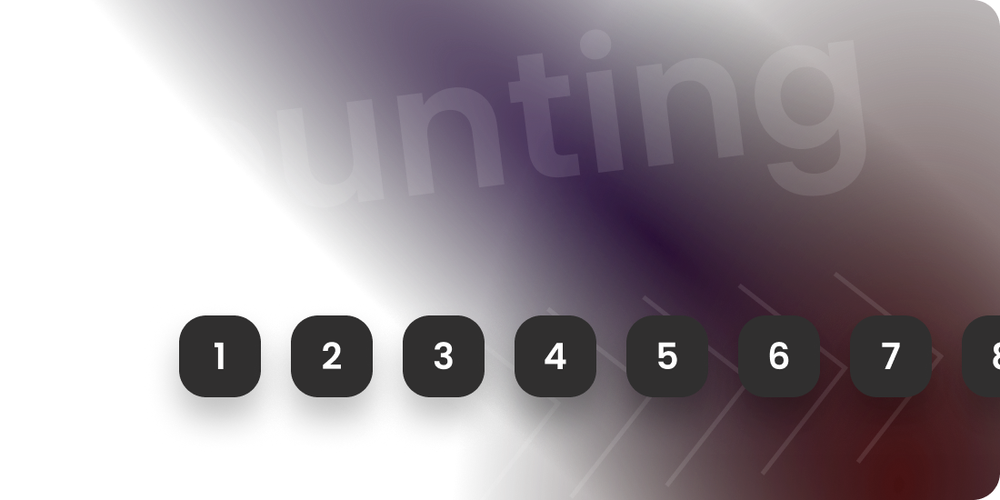
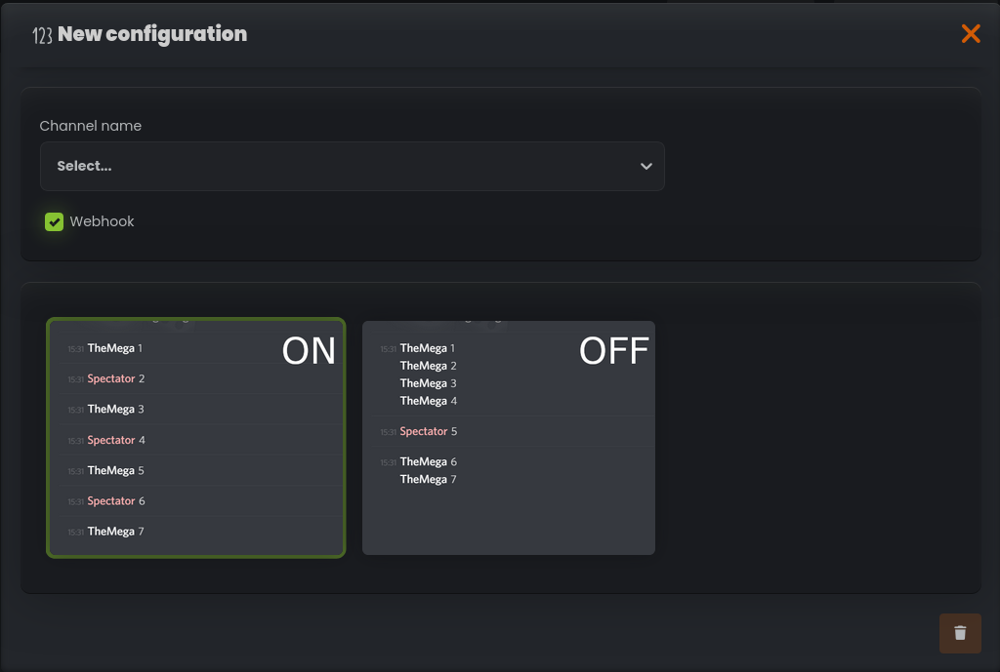

# Counting Channel

## Introduction

The Counting Channel is a delightful and interactive feature of StartIT designed to bring fun and engaging
numerical activities to your server. This unique channel only permits messages with **numbers that must be in sequential
order**. Members can take turns counting, and the bot ensures that the sequence remains unbroken, creating an enjoyable
community activity.



1. **Fun Numerical Activity:** The Counting Channel provides an enjoyable way for your community members to come
   together and participate in a shared
   numerical adventure. Counting together creates a sense of camaraderie and can be a relaxing and entertaining pastime.

2. **Sequential Number Validation:** The bot actively validates messages in the Counting Channel to ensure they contain
   numbers in the correct sequential
   order. This feature adds an element of challenge and encourages users to be attentive while counting.

## Why the Counting Channel Matters

The Counting Channel serves as a lighthearted and engaging feature in your Discord server. Here are some reasons why it
is valuable:

```cards
# Community Bonding
The Counting Channel encourages collaboration and camaraderie among members as they work together to maintain the numerical sequence.

# Entertainment
Counting together can be a fun and relaxing way for users to unwind and enjoy each other's company.

# Attention to Detail
Users need to be mindful and attentive to the counting process, fostering focus and mental acuity.

# Encourages Participation
The interactive nature of the Counting Channel encourages users to actively participate and contribute to the server's activities.
```

The Counting Channel adds a touch of excitement and unity to your Discord server, making it an enjoyable space for
everyone.

## How Users Interact with the Counting Channel

1. Users can access the Counting Channel and participate in the counting activity.

2. To start the counting sequence, a user posts the number "1" as the initial message.

3. Following the initial "1", users continue the sequence by posting the next number in line, e.g., "2", "3", "4", and
   so on.

4. The bot actively validates each message to ensure it contains the correct sequential number and follows the rules set
   by the chosen moderation option.

5. If a message breaks the sequence or violates the chosen moderation settings, the bot will delete the message.

6. Users strive to maintain the counting sequence, and the counting activity continues as long as the community enjoys
   it.

---

## Admin: Setting Up the Counting Channel

To set up the Counting Channel, follow these steps:

1. Open dashboard and navigate to the "Moderated Channels" plugin.

2. Select the "Counting Channel" category.

3. Click on "New Configuration" to create a new setup for your Counting Channel.



You will be presented with various options to customize the channel:

- **Channel Name**: Choose an existing Discord channel or create a new one dedicated to counting. This is where all
  the counting will take place.
  
- **Type of Moderation**:
  
    - **Option 1 - No consecutive messages**: Enabling this mode prevents a user from sending two consecutive
      messages in the Counting Channel. For instance, if User A sends "1", they will not be able to send "2"
      immediately after. This mode ensures that multiple users participate in the counting process.
  
    - **Option 2 - Without restrictions**: This mode allows users to send messages with numbers in sequential order
      without the restriction of consecutive messages by the same user. Users must ensure that they correctly
      continue the numerical sequence.

Save the configuration, and the Counting Channel is ready for your community to enjoy.
