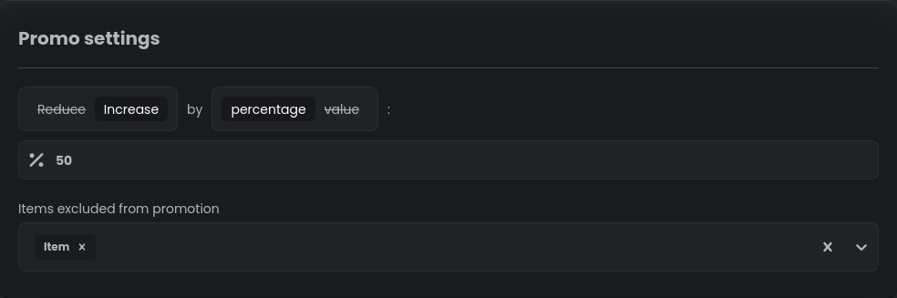
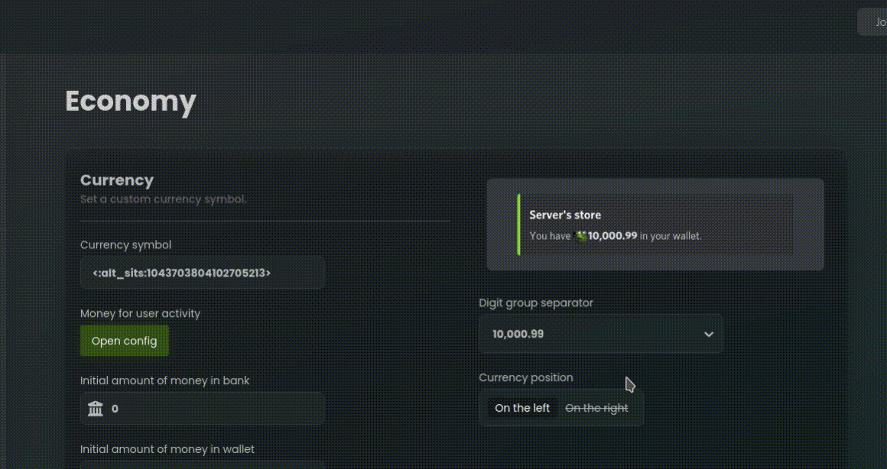

# Discounts

Discounts play a vital role in attracting users and boosting engagement on your Discord server. With the economy plugin
of StartIT, you have the flexibility to apply discounts and special offers to items in your server's shop. Discounts
are a powerful tool that can entice users to make purchases, increase user activity, and create a sense of exclusivity
within your community.

In this guide, we will explore different methods of applying discounts to items in the shop. Our bot offers few forms
of price reduction, each with its own advantages and use cases. You can choose the method that best suits your needs and
effectively manage discounts on your server.

## Promotion section configuration

Our users have often complained that if they have a lot of items in shops and reducing prices of all of them is very
tedious. We have heard you and introduced a new Promotion section which allows you to configure discounts for
multiple items at once. To leverage that, navigate to the StartIT dashboard and locate the "Promotion" section.
By using this feature you can apply discounts to all items in the shop (except for those you choose to exclude). Also,
this configuration allows you to schedule discounts for specific time periods, such as weekends or specific hours of
the day. It's great for recurring discounts and time-limited offers. You can for example create a promo that reduces
prices by 10% during the holiday season.

Here, you will find various inputs and options that allow you to customize the discount settings according to your
needs. Let's take a look at each of these options and how they can be used to create discounts:

### Promo settings

Select whether you want to reduce or increase the price of items in the Promotion. You can choose to apply a percentage
discount or a fixed value reduction/increase. 

In the input field below, enter the percentage or value that will be applied to the items during the Promotion.

### Items excluded from promotion

Select the items that should be excluded from this discount offer. These items will retain their original prices.

### Duration of the promotion

Choose the duration of the Promotion using one of the following options:
  - **No time limitation**: The Promotion will be active indefinitely.
  - **One-time activation**: Set a specific start and end date for the Promotion.
  - **Activate daily**: Specify the start and end time for the Promotion to be active each day.
  - **Activate weekly**: Select a continuous start and end time along with the days of the week; the promotion will run 
    from the start time on the initial day to the end time on the concluding day every week.

### Promotion conditions

Optionally, you can set specific roles that will be allowed or excluded from the Promotion. This enables you to offer
discounts exclusively to certain roles or restrict them from participating in the Promotion.

- **Banned roles**: Select the roles that will be excluded from the Promotion. Users with these roles will not benefit
   from the discount and will see the regular prices.

- **Allowed roles**: Select the roles that will be eligible for the discount offer. Users with these roles will enjoy
   the discounted prices during the Promotion.

## Item-specific price adjustments

While the Promotion section provides a comprehensive and automated way to set up discounts, there may be cases where you
prefer to modify item prices directly. For example, if you want to offer a discount on only one or a few items, it may
be easier to manually edit their prices. Additionally, the "Item price for individual roles" configuration within item
settings allows you to set up permanent discounts for specific roles.

To apply a discount to a specific item, follow these steps:

1. Locate the item for which you want to apply a discount in the server shop.

2. Edit the item configuration and adjust the price according to the desired discount. This change will directly affect
   the item's price without the need for additional Promotion settings.

3. Alternatively, if you want to set up a permanent discount for specific roles, utilize the "Item price for individual
   roles" option within the item configuration. Here, you can assign different prices to specific roles, effectively
   creating ongoing discounts for those roles.

By utilizing direct price editing and the "Item price for individual roles" configuration, you can easily implement
discounts on specific roles or individual items without relying on the Promotion section. This gives you more
flexibility and control over the discounts you want to offer.
