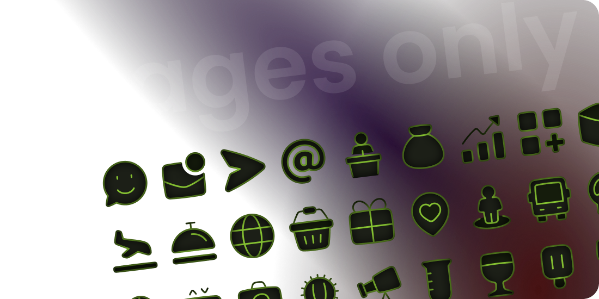
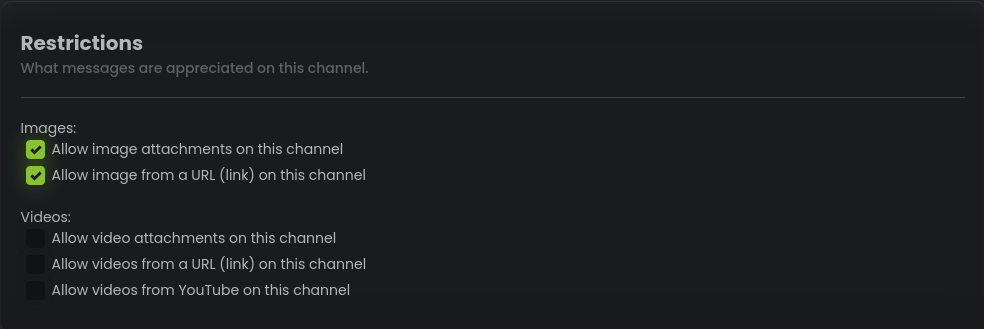
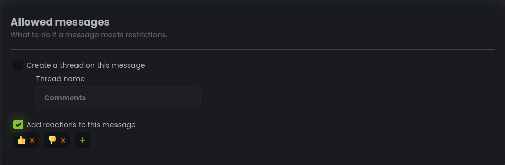
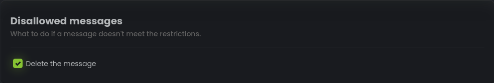

# Image-only Channel

## Introduction

The Image Channel is a specialized type of channel within StartIT that exclusively accepts images and videos.
This feature is designed to enhance the visual experience of your community by focusing on media-rich content. The Image
Channel provides flexibility in message restrictions and allows for automated actions such as adding reactions to images
and handling disallowed messages.



1. **Exclusive Image and Video Content:** The Image Channel ensures that only images and videos can be posted,
   providing a dedicated space for visual media within your server. This enhances the visual appeal and encourages users
   to share engaging content.

2. **Flexible Message Restrictions:** Administrators can set up various restrictions for the types of images and videos
   allowed in the Image Channel. This gives you control over the content posted, ensuring it aligns with your server's
   guidelines.

3. **Automated Reactions on Images:** To increase interactivity, the bot can automatically add reactions to images
   posted in the Image Channel. This enables users to express their reactions to memes, funny pictures, or any visual
   content shared by others.

4. **Thread Creation for Organized Discussions:** The option to create threads on specific messages promotes organized
   discussions about a particular image or video. Threads keep conversations related to the content, preventing clutter
   and facilitating focused interactions.

5. **Handling Disallowed Messages:** Messages that do not meet the specified restrictions can be dealt with
   automatically. The bot provides the option to delete such messages, ensuring that only appropriate content remains in
   the channel.

## Why the Image Channel Matters

The Image Channel feature serves as an attractive and engaging space for visual media within your Discord server. Here's
why it's beneficial:

```cards
# Visual Appeal
The dedicated Image Channel makes it easier for users to find and enjoy image and video content.

# Controlled Content
With message restrictions, you can ensure that only appropriate and relevant media is shared within the channel.

# Interactivity
By automatically adding reactions to images, the bot encourages members to express their reactions and opinions.

# Organized Discussions
Thread creation fosters more focused and organized discussions around specific media.

# Content Quality
Handling disallowed messages helps maintain a high standard of content within the channel.
```

By utilizing the Image Channel feature in StartIT, you create an enriching environment for visual content and
enhance overall user engagement.

## How Users Interact with the Image Channel

1. Users can post images and videos directly to the Image Channel.

2. The bot will automatically check if the posted content complies with the specified restrictions.

3. If the content meets the restrictions:

    - If enabled, the bot will add the specified reactions to the image, allowing users to react to the content.

    - If enabled, the bot will create a thread on the image, encouraging organized discussions related to the content.

4. If the content does not meet the restrictions:

    - If enabled, the bot will delete the message to maintain the channel's content quality and adherence to guidelines.

---

## Admin: Setting Up the Image Channel

To set up the Image Channel with the desired configurations, start by creating a new configuration for the Image Channel
in the Moderated Channels plugin.

### Channel name


Select the channel in which you want to enable the Image Channel feature. Only images and videos
   posted in this channel will be accepted.

### Restrictions



Choose the types of media that are allowed in the Image Channel:

  - Allow image attachments on this channel
  - Allow image from a URL (link) on this channel
  - Allow video attachments on this channel
  - Allow videos from a URL (link) on this channel
  - Allow videos from YouTube on this channel

### Allowed Messages



Determine the actions to be taken when a message meets the specified restrictions:

  - Create a thread on this message
    - Thread Name: [Enter the desired thread name]

  - Add reactions to this message
    - Select Reactions: [Choose the emojis that the bot will automatically add to images]

### Disallowed Messages



Define the action to be taken if a message does not meet the restrictions:

  - Delete the message
