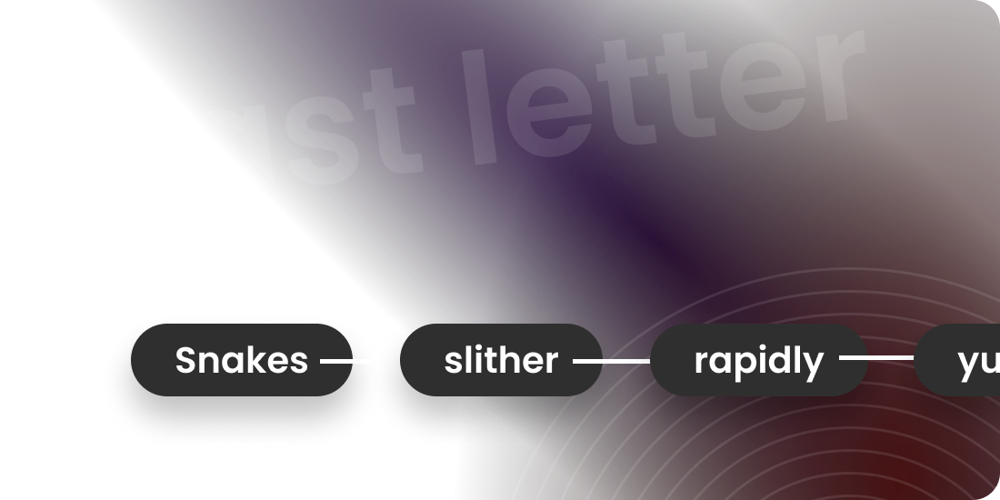

# Last Letter Channel

## Introduction

The Last Letter Channel is an exciting and interactive feature of StartIT that adds a fun twist to word games
within your community. In this channel, users engage in a challenge where they have to write words that begin with the
last letter of the previous word. It's an entertaining way to stimulate creativity, vocabulary, and quick thinking among
your members.



1. **Word-based Game:** The Last Letter Channel revolves around a word-based game that keeps users entertained and engaged. It provides an
opportunity for friendly competition and fosters a sense of camaraderie within the community.

2. **Encourages Active Participation:** By offering an entertaining activity that requires continuous input from users, the Last Letter Channel encourages
regular engagement and interaction among members.


## Why the Last Letter Channel Matters

The Last Letter Channel is more than just a game; it can have several positive impacts on your community:

```cards
# Community Bonding
This feature encourages members to interact and bond over a shared activity, promoting a sense of togetherness.

# Inclusive Entertainment
The Last Letter Channel is accessible to users of all ages and backgrounds, making it an inclusive form of entertainment for your community.

# Encourages Regular Activity
With an ongoing word chain, users are motivated to return to the channel regularly to see how the game progresses.

# Language Development
The game can aid in language development, particularly for users looking to improve their vocabulary and language skills.
```

By implementing the Last Letter Channel in your Discord server, you create a fun and interactive space where users can
come together, have fun, and expand their knowledge of language—all while building stronger connections within the
community.

## How to Use the Last Letter Channel

1. **Join the Last Letter Channel**: To participate in the Last Letter game, users must first join the designated Last
   Letter Channel in your Discord server.

2. **Start with a Word**: The game begins with any user posting a word in the channel. This word will serve as the
   starting point for the ongoing chain.

3. **Respond with a Word**: After the first word has been posted, other users take turns responding with words that
   begin with the last letter of the previous word.

4. **Keep the Chain Going**: The objective is to maintain the word chain without repetition or breaking the sequence.
   Each word posted should start with the letter that the previous word ends with.
