# StartIT Lemon update


```language
Other languages:
pl: Ten dokument jest również dostępny w języku polskim - KLIKNIJ TUTAJ
```

## New plugin: Automations

We know that every server is unique and has its own requirements. Therefore, we have created a new plugin that allows you to
customize the bot according to your own needs. Automations is a new plugin that allows you to program your bot to perform
specific actions in specific situations. You can set the bot **to perform certain actions depending on the
events** on the server. For example, when someone sends a message on the channel, the bot can automatically send a welcome message
or add a reaction. The possibilities are endless!

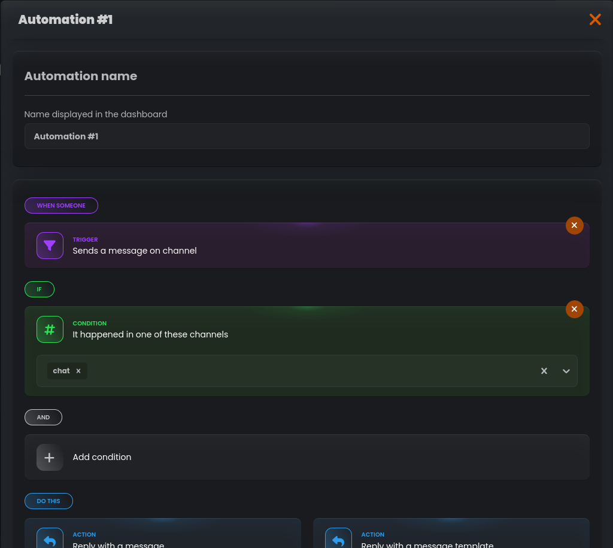

### Automations in Embeds plugin.

You can use automation blocks in the **Embeds** plugin. This allows you to create more advanced
messages that will have buttons underneath them that perform the actions you specify.

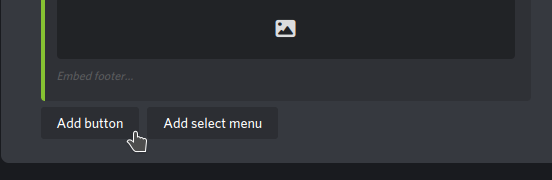

### Automations in the Economy plugin.

You will now also see automation blocks in the **Economy** plugin, specifically in the item configuration.
You can now configure more advanced programs to run when you purchase an item or when item is 
used.

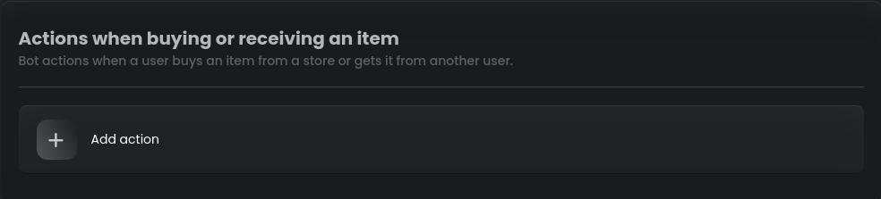

## Moderation: punishment dashboard

Starting today, each punishment that a user receives will have a unique identifier.
We have created a new panel where you can see all the penalties that have been imposed on users.


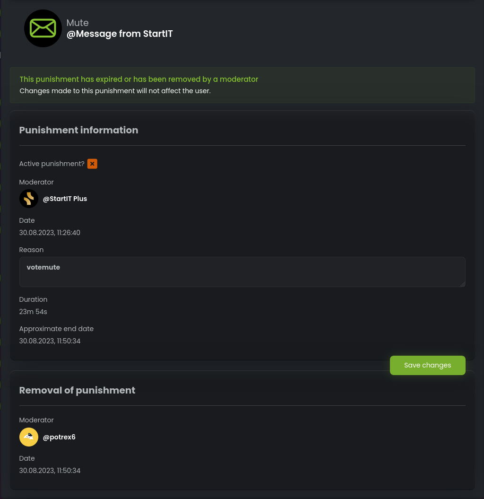

### This dashboard is also available as a command

Dostępne komendy:
 - `/punishments edit-reason <id> <reason>` - Edit punishment reason
 - `/punishments info <id>` - Show punishment info
 - `/punishments list [user]` - Show punishment list
 - `/punishments list-mod <moderator>` - Show punishment list
 - `/punishments remove <id> [reason]` - Remove punishment

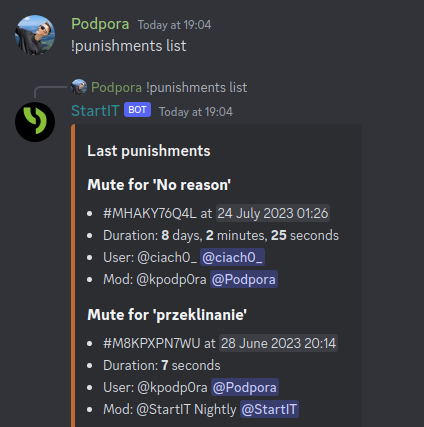

## Economy: Paid nickname change

The "Change User Nickname" item is a special tool that allows users to modify their nickname within the server. It
provides a fun and interactive way for users to personalize their identity and add a touch of creativity to their
presence. With this item, users can easily update their nickname without the need for manual intervention from server
administrators.

More info [in our docs](/docs/change-nickname-item).

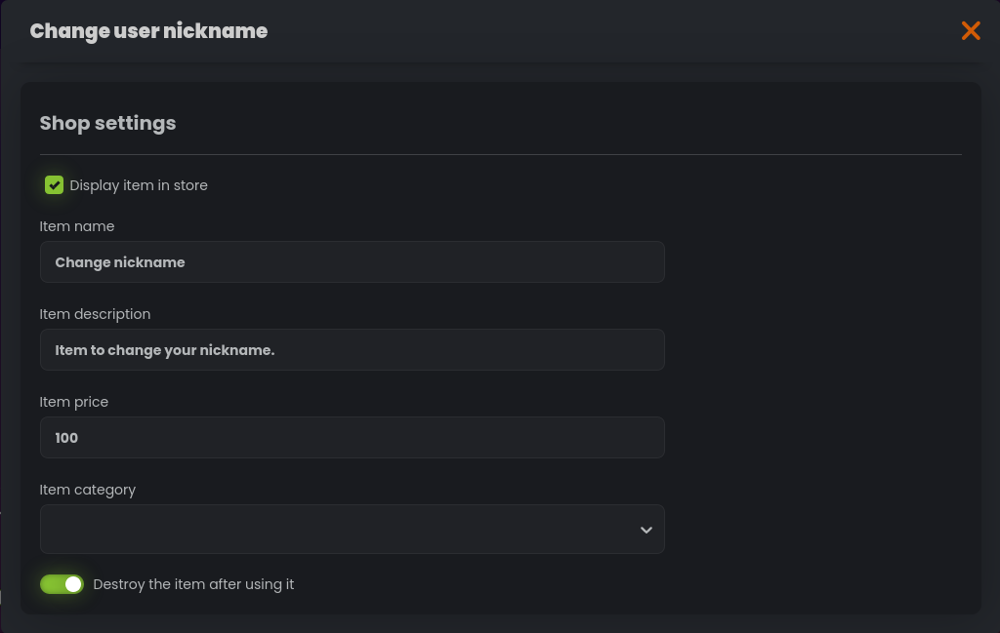

## Economy: Taxes and fines

Give your server more realism with the new tax system. You can set taxes on almost anything and
customize them to suit your needs. This provides server owners with a way to effectively manage and distribute 
revenue efficiently.

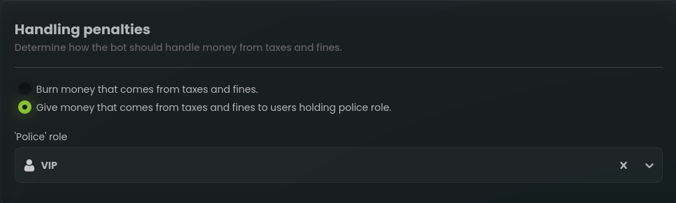

### The police role receives money from:
 - Mandates from the Auto Moderation plugin (e.g., writing swear words)
 - Mandates from the Moderation plugin (`/warn` command).
 - Money from failed crime attempts (`/crime` command).
 - Money from failed robbing attempts (`/rob` command)
 - Money from failed odd jobs (`/slut` command)
 - Selling temporary voice channels from the Auto channels plugin

Optionally, the police role can also get taxes from server transfers (`/pay` command):

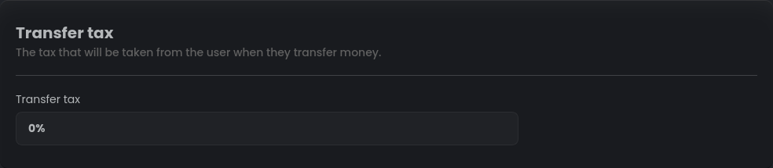

### Additional tax: /collect-income

You can set that every time you use the **/collect-income** command, the user will pay tax to any role 
(not necessarily police):

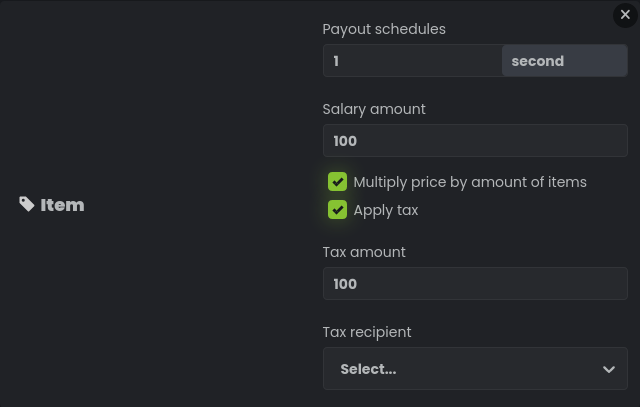

## Economy: Promotion system

Change straightforwardly the price of all items on the server by a certain amount or percentage.
You can also set the scope of the promotion to apply only on weekends, for example.

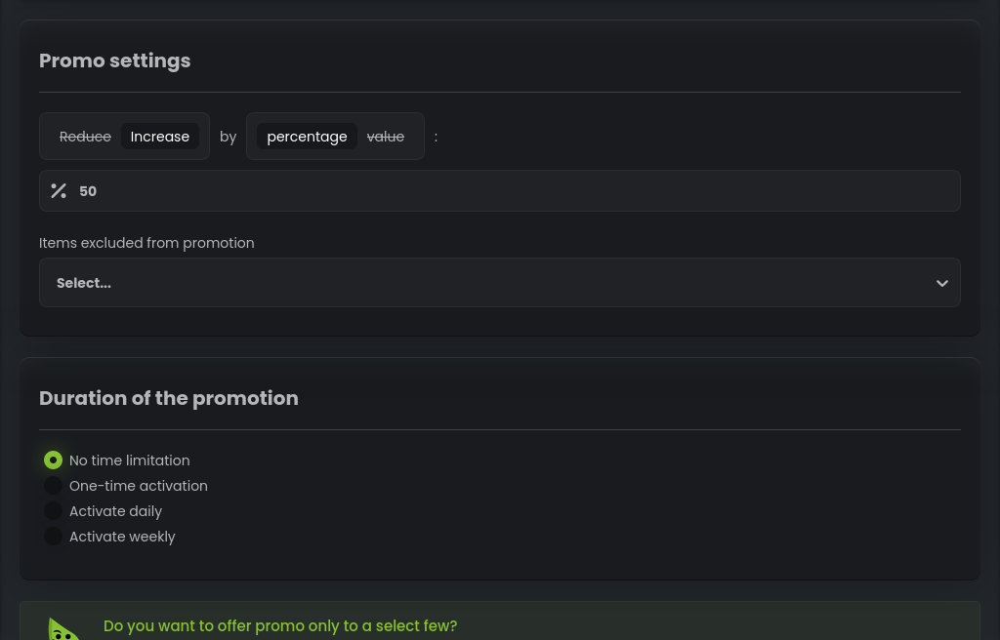

More info [in our docs](/docs/discounts).

## Economy: Improved item settings

We have improved the item settings in the dashboard. You have now more control over your items.
Check out our new features such as:

### Fraud chance

Create your **own black market** on the server. From now on, you can set the chance of fraud when buying an item. The bot
will randomly decide whether the user will receive the item or not. This adds a new layer of excitement to the game.

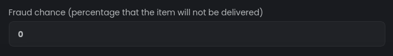

### Change the price of an item depending on the role

Set VIPs discounts or tax users by setting them a higher than normal price.

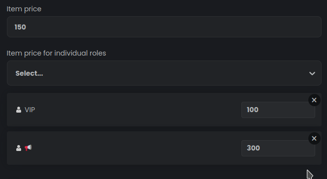

### Item limit in the store

From now on, you can set the number of items in the warehouse. Create exclusive items with a limited number of sales.

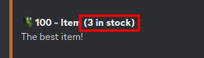

### Item limit in the backpack

Set how many items a user can have in their backpack.

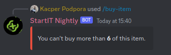

## Economy: Crafting recipes

The `/crafting` command in StartIT allows users to combine various ingredients to create new items or products. 
To craft a recipe, you need to gather all the necessary ingredients. These ingredients can include items, roles, cases, 
or even a certain amount of money.

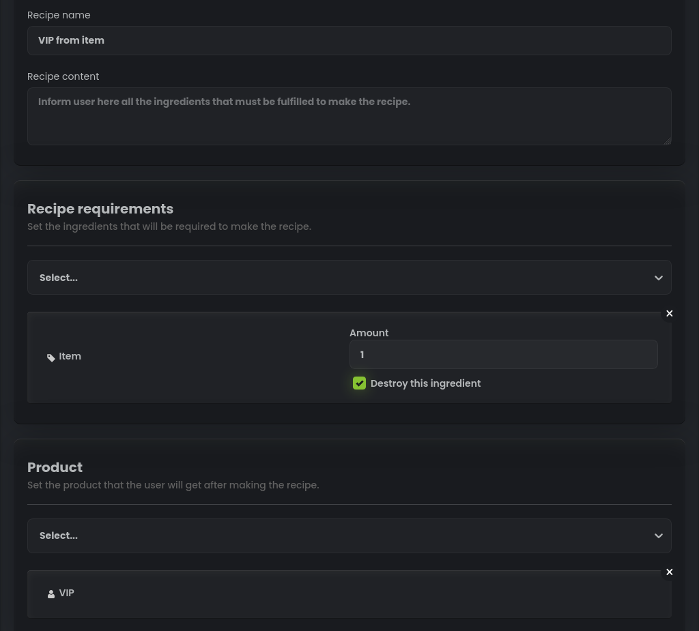

More info [in our docs](/docs/configuring-crafting).

## Item multiplier in /collect-income

From now on, the **/collect-income** command can give you more money when the user has several of the same items in
their backpack.

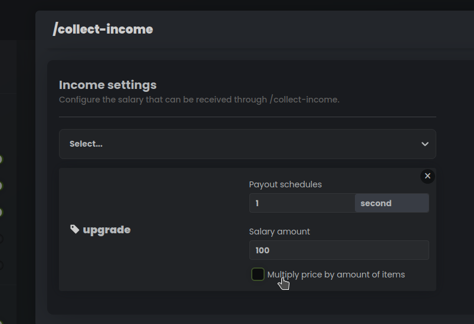


## Economy: Secondary item trading

From now on, users can trade items among themselves. We have created the **/user-market** command to trade items
between users. Users can now buy and sell items to other users. 


Use the `/market list` command to see a list of items for sale.
To list your item on the market, use the `/market sell [quantity] <item name> <price>` command.

## New command: /votemute

Leave your server quiet when there are no administrators online. The **/votemute** command allows users to mute other
users by voting. When enough people vote to mute, the bot will mute the user for a time set in the panel.


## Voice support channel

The **Voice Support channel** is a new feature that allows server staff to provide support to users in a voice channel.
When a user joins the channel, the bot will automatically **notify the staff** that someone is waiting for help. The bot
will also automatically move the user to the waiting room and then to the support room when the staff member is ready to
help.

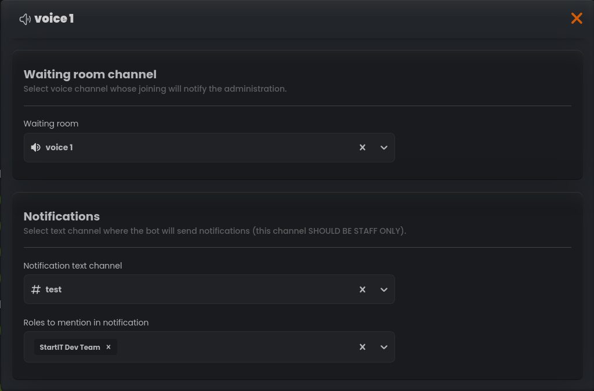

Channel with notifications:

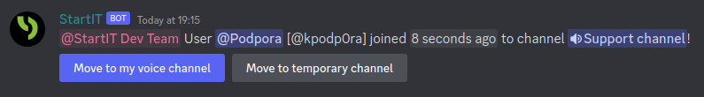

## Improved command: /poll

Create **advanced server pools** with the improved /poll command. Now you can set voting to last only for a certain 
period of time or to make voting anonymous.

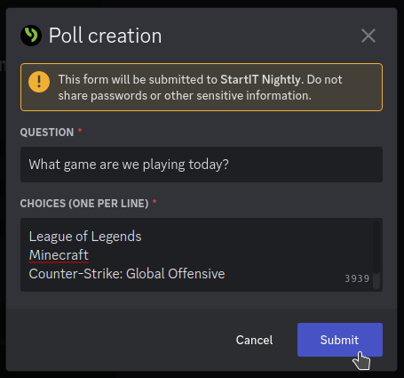

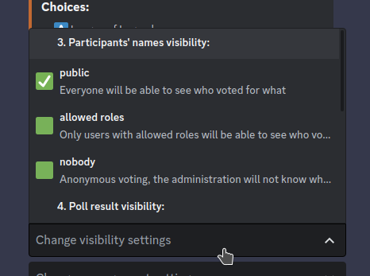

## New command: /random-question

Increase server activity with the new **/random-question** command. This command allows you to start a conversation with
your community by asking a random question. The bot will ask one of the 340 prepared questions after entering the
command. Find a question for yourself and start a discussion!

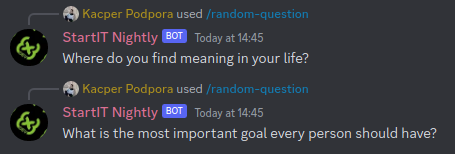

## Enhancements to current commands

We are constantly improving our commands to make them even better. This update makes several improvements to the current
commands. In some cases, we have either changed the appearance or improved the current functionality. Here is a list 
of the most important changes:

### Execute a command on someone by quoting their message.

When you put a command in a quoted message, you no longer need to specify that person in the argument – StartIT will 
automatically guess what you want to do and execute the command on the quoted person.

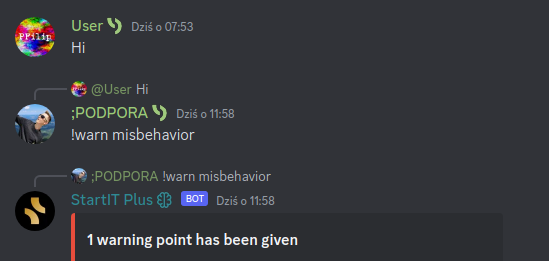

### User balance in /dep and /with commands

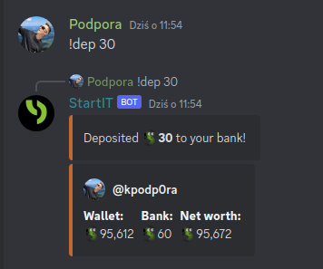

### Select menu to fast buy items in /shop

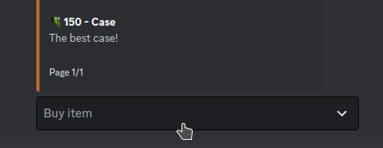

### Managing user backpacks

New command: /economy backpack [add/remove] \
Thanks to it, you can add or remove items from a user's backpack.


### Better /warnings list design

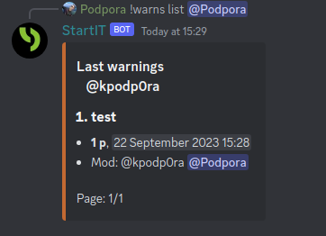

### Mute progress bar in warn command


### Improved appearance of moderation logs

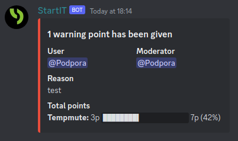

### Review system in the /userinfo command

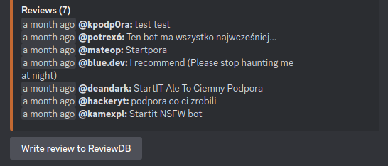

## Levels: More XP configuration

From now on, you have more influence over how users earn XP. You can set users to get more XP for
long messages, attachments, and on selected channels. You can also block XP when a user is muted
on a channel.

### More XP for long messages (and attachments)

Reward users who write longer messages and give them additional XP for that. You can also set the bot to give more XP 
when a photo is attached to the message.

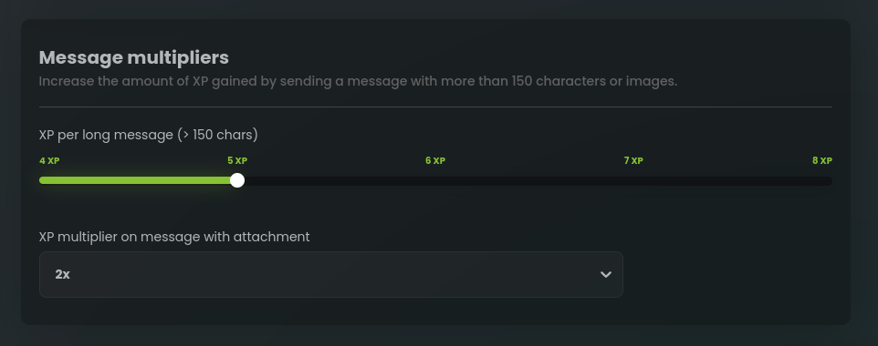

### XP multiplier on selected channels

Set on which channels the user will earn more XP.

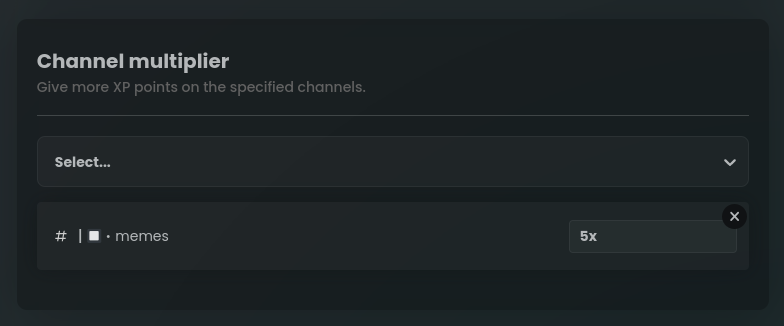

### Block XP when the user is muted on the channel.

No more sitting quietly on the channel! From now on, you can block XP when a user is muted.

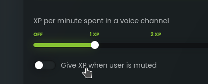

## Moderated channels: Person Below

The Person Below channel works like a fun question-and-answer chain on your Discord server. As an administrator, you can 
initiate a conversation by posting a question in a designated channel. The bot will then add "Yes" and "No" buttons 
below the question to make it easier to answer.


The user then needs to use the "Yes" or "No" button to answer the question and then ask their own so the chain of 
questions and answers can continue.

See [our documentation](/docs/person-below-channel) for more information.

## Moderowane kanały: Waterassetmark in images

Someone keeps stealing memes from your server? After this update, when you set up a **channel with images** in the 
Moderated plugin, bot can automatically overlay the server logo on the images that are uploaded to the channel.

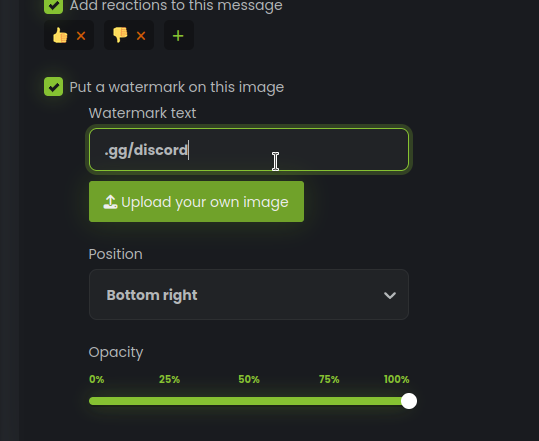

## Organize server elections

You can use this feature so that, for example, users can vote for the **moderator of the month**, or select the best 
user among themselves. This allows you to increase activity on the server and motivate users to be active.
During the election, the bot will automatically create a message where users can vote for their favorite
candidate.

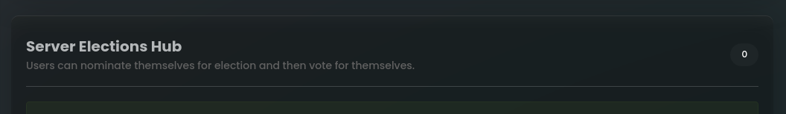

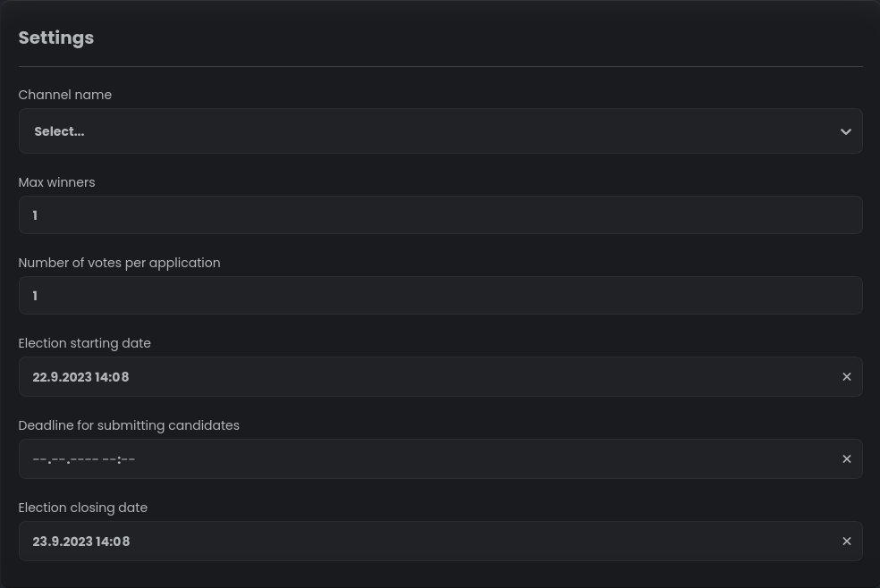

## Tickets

### Creating tickets in threads

From now on, in the panel, you can set that tickets will be created in the form of threads, instead of new channels.
We recommend this option, because threads are easy to archive and do not take up much space on the server.


### Improving ticket archiving

From now on, additional information will appear in the ticket history (eg. answers from the form).
Also, when the archive contains any link, the bot will try to add its embedding under the message.

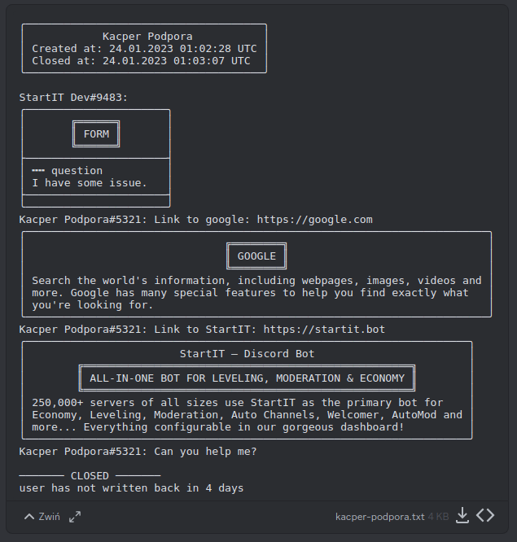

### Set the time zone in the ticket archive

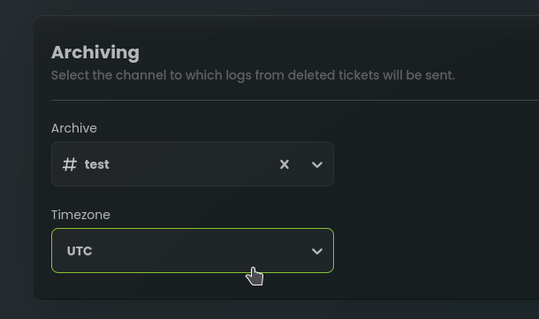

### Ticket numbering in the channel name

Arrange tickets by giving each a unique number in the channel name.

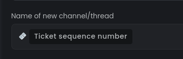

### Maximum number of open requests

Specify how many open tickets one user can have open at the same time.

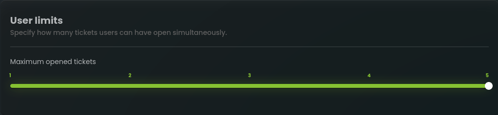

## Giveaways

### Paid entry to the giveaway

From now on, you can set that users must pay to join the giveaway.

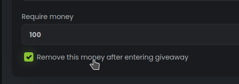

## Role for people on voice chat

Ability to create a role for people who are on any voice channel. The bot will take this role when the user leaves the
channel.


## Select-roles

A selection field will appear under the message where users can select which roles the bot should give them.


More info [in our docs](/docs/select-roles).

## New bot status settings

Distinguish your own bot from others. As of now, there are new personalization settings in StartIT Plus 
status.

- Ability to set "**available on phone**" status:


- Ability to enter your **own status text**:

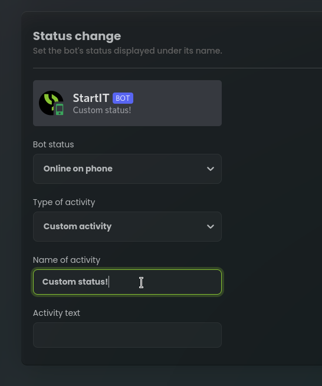
