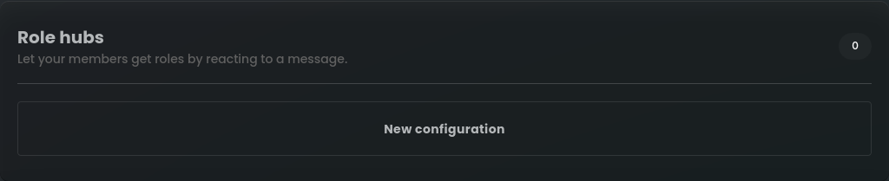
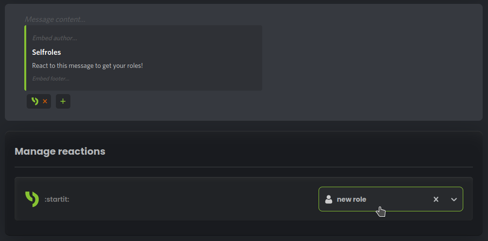
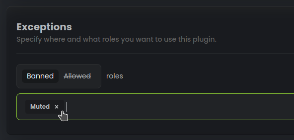
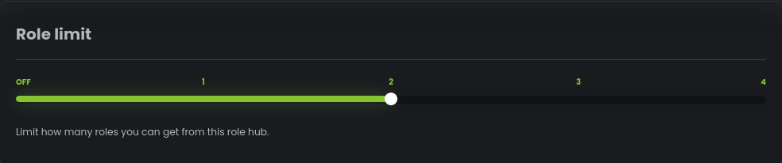

# Reaction roles

Once you complete steps below, your members will be able to react on the Role Hub message to obtain their desired 
roles and enjoy a more personalized experience on your Discord server.

## Create a new configuration

To set up Selfroles for your Discord server, go to StartIT Dashboard -> Selfroles -> Role hubs.

## Choose a Channel

Select the channel where you want the Role Hub message to be located.

 

## Select a Panel Mode

Choose how Selfroles will work based on your preferences and server requirements:

- **Normal**: Reacting adds roles, unreacting removes roles.
- **Drop**: Reacting removes roles, unreacting does nothing.
- **Verify**: Reacting adds roles, unreacting does nothing.
- **Reverse**: Reacting removes roles, unreacting adds roles.

## Customize the Message

Personalize the message content and embed content to make it more appealing to your members.
You can also click on green embed bar to change its color.

Add reactions to the message to represent different roles that members can choose from.

Next, in "Manage reactions" section, assign reactions to specific roles so that members receive the appropriate roles
upon reacting to the message.

## Set Exceptions (Optional)

By setting exceptions for specific roles you can limit who can or cannot assign themselves roles on this role hub.

## Role limit

Set how many roles can user receive at once. 

In this example we restrict that single user can gain only 2 roles from this hub.
[This is only available in "Normal" panel mode]
