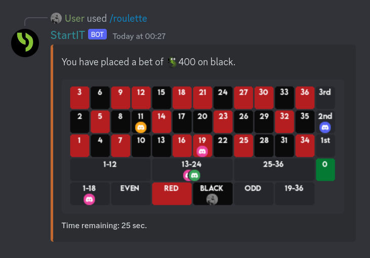

# Roulette – A Place for Gambling

## Introduction to Roulette on our Bot

Welcome to the thrilling world of Roulette on StartIT! Roulette is a popular gambling game where players place
bets on various spaces on a roulette board, hoping that luck will be on their side. In this guide, we will walk you
through how Roulette works on our bot and provide insights on tactics to enhance your chances of winning.

## Getting Started

In Roulette, the betting table consists of different spaces, each marked with numbers and colors. Players can place bets
on a single space, multiple spaces, or even a combination of spaces. To start playing Roulette, simply use the
`/roulette <bet> <space>` command. The bot will respond by displaying the Roulette board on the channel and placing your
avatar on the space where you've placed your bet. The game will continue for 30 seconds, during which other players can
also place their bets on the same table.

## Types of Bets

When using the `/roulette <bet> <space>` command, you can place different types of bets by specifying a valid space
argument (marked green in the documentation). Here are the available bet types and their corresponding payouts:

- **Single Number Bet (Straight Bet):** Betting on a specific number. Payout: Bet amount * 36.

- **Column Bet:** Betting on a vertical column of numbers on the betting table. Examples include the third column (`
  3rd`), the second column (`2nd`), or the first column (`1st`). Payout: Bet amount * 3.

- **Dozens Bet:** Betting on whether the winning number falls within the first dozen (`1-12`), second dozen (`13-24`),
  or third dozen `25-36`). Payout: Bet amount * 3.

- **Even/Odd Bet:** Betting on whether the winning number will be `even` or `odd`. Payout: Bet amount * 2.

- **Red/Black Bet:** Betting on whether the winning number will be `red` or `black`. Payout: Bet amount * 2.

- **Low/High Bet:** Betting on whether the winning number will be within the range `1-18` (Low) or `19-36` (High).
  Payout: Bet amount * 2.

Please note that Roulette is a game of chance, and no strategy guarantees consistent winnings. Play responsibly and have
fun!

## Examples of Tactics

While Roulette is largely a game of chance, some strategies can help you manage your bets and potentially increase your
odds of winning:

1. **Martingale System:** This strategy involves doubling your bet after each loss. When you win, you start over with
   your original bet. The idea is that a win will cover previous losses and yield a profit.

2. **D'Alembert System:** In this strategy, you increase your bet by one unit after a loss and decrease it by one unit
   after a win. It aims to create a balanced betting approach.

3. **Fibonacci System:** Following the Fibonacci sequence, you bet the sum of the previous two bets. If you lose, you
   move one step forward in the sequence, and if you win, you move two steps back.

4. **Outside Bets:** Betting on options with almost a 50% chance of winning, such as red/black or even/odd, can provide
   more frequent, albeit smaller, wins.

Remember that while these strategies can be fun to experiment with, Roulette remains a game of chance, and there is no
guaranteed method to win consistently. Always play responsibly and within your limits.

## Summary

Roulette on StartIT offers an exciting and engaging experience for users looking to try their luck and enjoy
some gambling fun. By understanding the mechanics of the game and employing various betting strategies, you can enhance
your Roulette gameplay and potentially increase your chances of winning.

So, are you ready to take a spin on the Roulette wheel? Place your bets and let the wheel decide your fate! Good luck
and enjoy the thrill of the game!

If you have any further questions or need assistance, feel free to reach out to our support or consult the documentation
for more detailed information on Roulette and other features.
