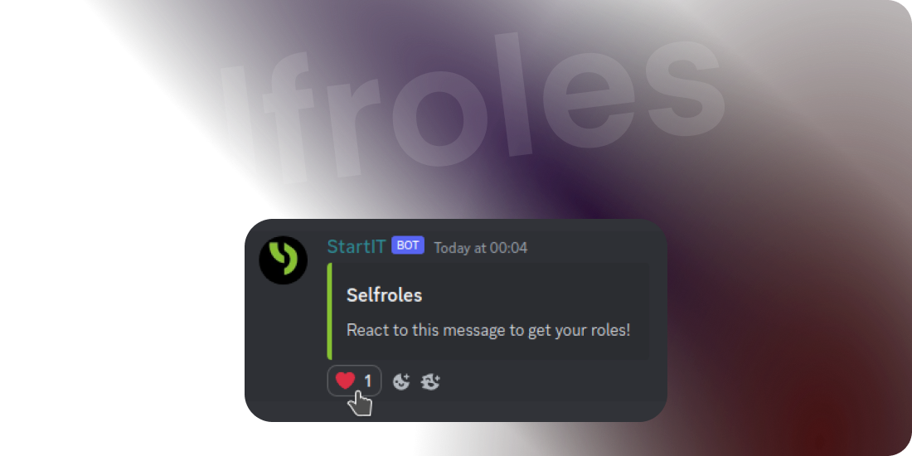

# Selfroles



**Selfroles** is an exciting feature of StartIT that allows your server members to assign and manage their roles by
reacting to specific messages. With Selfroles, you can streamline the process of role assignment and empower your
community members to personalize their Discord experience. This documentation will guide you through setting up and
configuring Selfroles, so you can make the most out of this powerful feature.

## Why You Need Selfroles

Selfroles offer several benefits for your Discord community:


```cards
# Customization
Members can personalize their profiles by selecting roles that represent their interests, skills, or affiliations.

# User Empowerment
Empower your members to choose their roles autonomously, reducing the need for manual role assignment by administrators.

# Community Engagement
By allowing members to interact with role assignment messages, you create an engaging and interactive environment.

# Flexibility
Selfroles work well for hobby-based communities, gaming guilds, or any server where users have diverse interests and roles.
```
