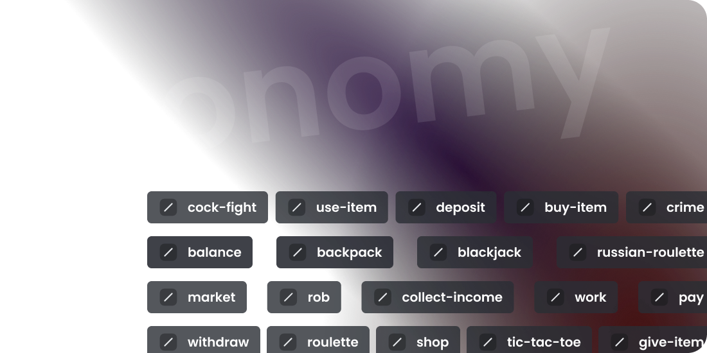

# Why do you need economy?

The economy plugin of StartIT provides a fun and interactive way for users to engage with the server and earn
virtual currency. 

Here are a few reasons why you might want to use the economy plugin:

1. **Boost server activity:** The economy plugin motivates users to actively participate in the server by providing
   various ways to earn virtual money. This encourages more interactions and conversations among members, leading to a
   livelier and more engaging community.

2. **Gamify the server experience:** By integrating an economy system, you can introduce a sense of gamification to your
   server. Users can work, chat, play games, and engage in various activities to earn virtual money. This adds an
   element of fun and competition, keeping users entertained and invested in the server.

3. **Encourage user interaction:** With the economy plugin, users can gain virtual currency by chatting on text channels
   or talking on voice channels. This feature promotes active participation and helps foster a sense of community among
   members.

4. **Enable virtual transactions:** The economy plugin allows users to store their virtual currency in different places,
   such as their wallet or the bank. They can use the currency to purchase items from the shop or trade them with other
   users. This creates a virtual economy within the server, enabling users to engage in virtual transactions and
   interactions.

5. **Customizable item system:** The economy plugin includes a comprehensive item system. Users can buy items from the
   shop, trade them with others, and use them in various ways. Items can have different effects, such as granting roles,
   providing bonuses, or mimicking real-world businesses. The flexibility of the item system allows you to create unique
   and interactive experiences for your server members.

By implementing the economy plugin and leveraging its features, you can enhance user engagement, create a dynamic server
environment, and provide an enjoyable and interactive experience for your community members.
