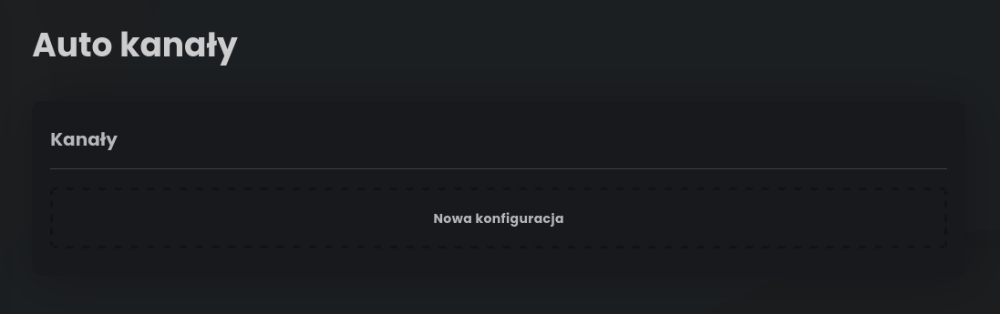
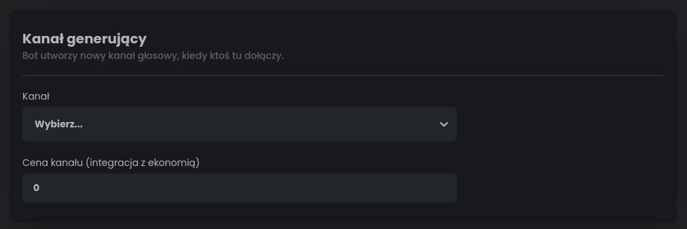
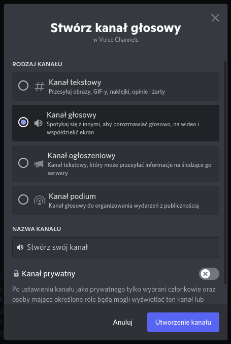
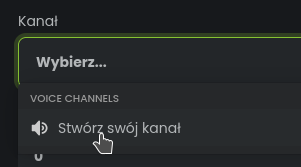
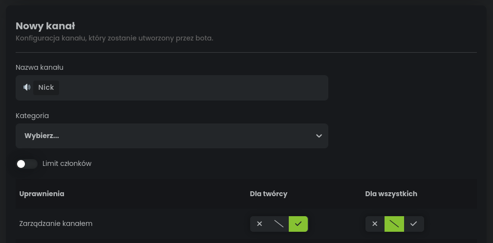
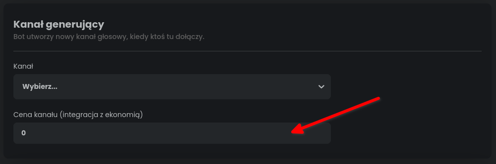

# Omówienie pluginu auto kanały

Dzięki temu pluginowi Twoi użytkownicy będą mogli stworzyć własne kanały głosowe. 
Bot dopilnuje, aby te kanały były skasowane tak szybko, jak przestaną być potrzebne.

## Jak skonfigurować auto kanał?

Chcąc skonfigurować auto kanał, powinno się wpierw wejść w zakładkę Auto kanały, 
następnie kliknąć Nowa konfiguracja.

### Kanał generujący

Kanał generujący to specjalny rodzaj kanału, na którym nie można rozmawiać. 
Służy on jako przycisk umożliwiający użytkownikom tworzenie swoich tymczasowych kanałów. 
Tymczasowych, gdyż bot usunie je, gdy tylko staną się puste (każdy z nich wyjdzie).

Aby plugin działał, musisz wybrać jakiś kanał, który stanie się generującym.
Jeżeli jeszcze tego nie zrobiłeś, przejdź do aplikacji Discord i stwórz go.

Po utworzeniu kanału wybierz go w naszym panelu.

### Nowy kanał

Panel StartIT pozwala na dostosowanie jakie cechy powinien mieć nowo stworzony kanał.

Dostępne tu wartości do zmiany to:
- **Nazwa kanału** - Jak ma się nazywać nowy, tymczasowy kanał. Jest możliwość skorzystania tu również ze zmiennej "Nick", 
pod którą bot podłoży pseudonim użytkownika, który zainicjował tworzenie kanału.
- **Kategoria** - opcjonalne pole, które umożliwia wybranie kategorii, w której kanały będą się tworzyć.
- **Limit członków** - Po przesunięciu suwaka jest możliwość wpisania maksymalnej liczby użytkowników, 
które mogą rozmawiać na tym kanale.
- **Uprawnienia** - Dzielą się na uprawnienia ustanawiane dla wszystkich oraz uprawnienia ustawiane ekskluzywnie dla twórcy kanału. 
Twórca kanału to osoba, która weszła na kanał generujący i zainicjowała proces tworzenia kanału.

## Integracja z ekonomią (opcjonalne)

Plugin auto kanały umożliwia pobieranie opłat od użytkowników, którzy zainicjowali tworzenie kanału.

Aby skonfigurować opłaty, należy odszukać pole "Cena kanału" widoczne wyżej. 
Następnie trzeba wpisać tam cenę, którą bot ma pobierać od użytkowników.

Jeżeli użytkownik nie będzie miał wystarczającej ilości pieniędzy na koncie, 
bot wyrzuci go z kanału generującego i nie stworzy nowego kanału.
