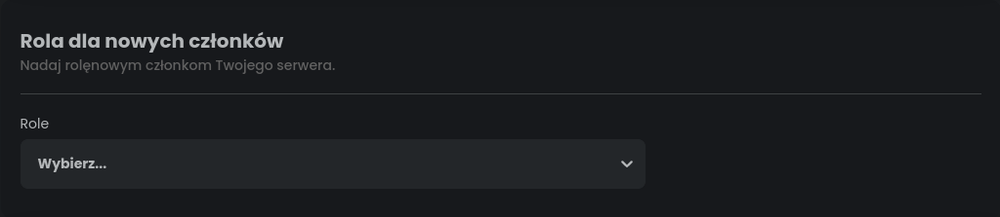
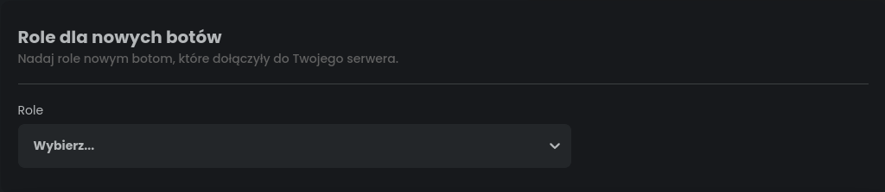
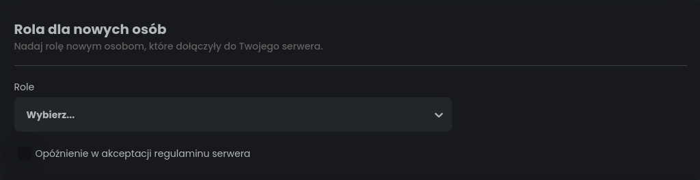
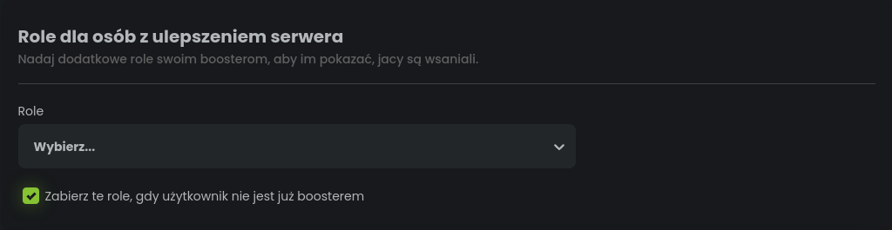
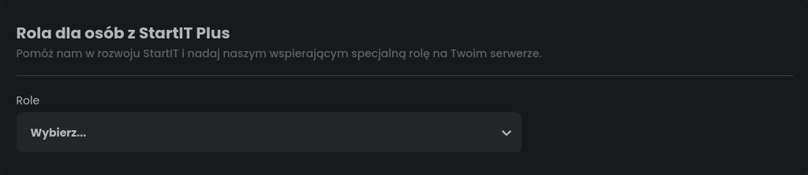
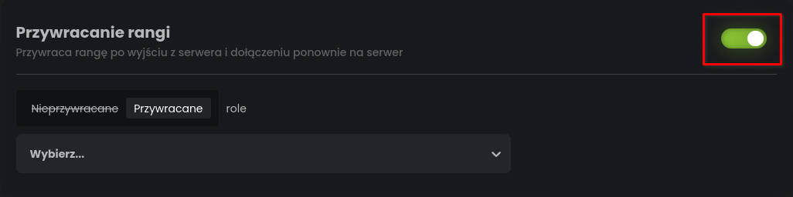
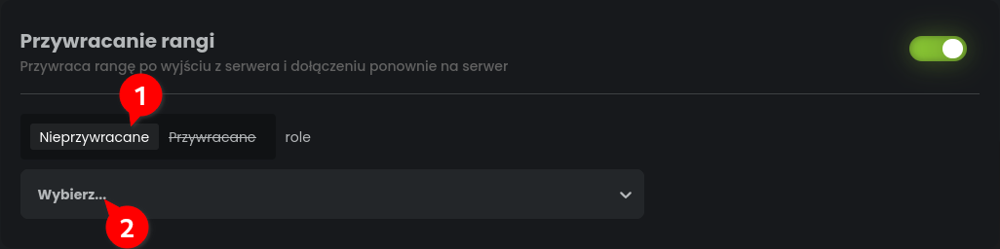
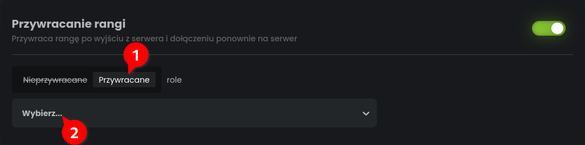

# Omówienie pluginu auto role

Zamysł tego pluginu jest dosyć prosty. Bot będzie nadawał użytkownikom role w określonych sytuacjach.

## Rola przy dołączeniu na serwer

StartIT dzieli członków na osoby oraz boty i daje Ci możliwość zdecydowania, kto ma dostać jaką rolę przy dołączeniu.

### Rola dla nowych członków

Możliwe ustawienia:
- **Role** - lista ról, które bot nada nowym osobom oraz botom.

### Rola dla nowych botów

Możliwe ustawienia:
- **Role** - lista ról, które bot nada nowym botom.

### Rola dla nowych osób

Możliwe ustawienia:
- **Role** - lista ról, które bot nada nowym osobom (bez botów).
- **Opóźnienie w akceptacji regulaminu serwera** - Zaznacz tę opcję, gdy masz włączone sprawdzanie członków na serwerze

## Rola dla Twoich Nitro Boosterów

Jedna rola Nitro Booster nie wystarcza? Nasz bot umożliwia wybranie dodatkowych ról.

Możliwe ustawienia:
- **Role** - lista ról, które bot nada użytkownikom po ulepszeniu serwera.
- **Zabierz te role, gdy użytkownik nie jest boosterem** - określa czy bot powinien zabrać rolę użytkownikowi, gdy ten się rozmyśli i cofnie swoje ulepszenie.

## Rola dla subskrybentów StartIT Plus

Jeżeli chcesz wspomóc naszą pracę, stwórz na swoim serwerze rolę "StartIT Plus" i wybierz ją w polu niżej.

Bot będzie automatycznie ją nadawać użytkownikom, którzy wsparli nas pieniężnie.

Dziękujemy <3

## Przywracane role

Discord domyślnie usuwa użytkownikom wszystkie role, gdy ten wyjdzie z serwera.
Jeżeli nie jesteś zadowolony z takiego działania, możesz wykorzystać naszego bota, 
aby oddawać role użytkownikom, którzy wyszli (albo zostali wyrzuceni) z serwera, a potem do niego wrócili.

W tym celu kliknij przełącznik w sekcji "Przywracane rangi".

Od teraz bot będzie oddawał role użytkownikom, którzy wejdą ponownie na serwer.

### Wykluczenie ról z przywracania

1. Jeżeli nie chcesz, aby bot przywracał określone rangi, kliknij słowo "Nieprzywracane".
2. W polu niżej wybierz role, które bot powinien ignorować.

### Przywracanie tylko określonych ról

1. Jeżeli chcesz, aby ta funkcja działała tylko na określonych rolach, kliknij słowo "Przywracane".
2. W polu niżej wybierz role, które mają być przywracane po wejściu ponownego użytkownika.
