# StartIT Aktualizacja Lemon


```language
Inne języki:
en: This document is also available in language English – CLICK HERE
```

## Nowy plugin: Automatyzacje

Wiemy, że każdy serwer jest unikatowy i ma własne wymagania. Dlatego stworzyliśmy nowy plugin, który pozwala na
dostosowanie bota do własnych potrzeb. Automatyzacje to nowy plugin, który pozwala zaprogramować bota do wykonywania
określonych czynności w określonych sytuacjach. Możesz ustawić, aby bot **wykonywał określone czynności w zależności od
wydarzeń** na serwerze. Na przykład, gdy ktoś wyśle wiadomość na kanale, bot może automatycznie wysłać wiadomość powitalną
lub dodać reakcję. Możliwości są nieograniczone!

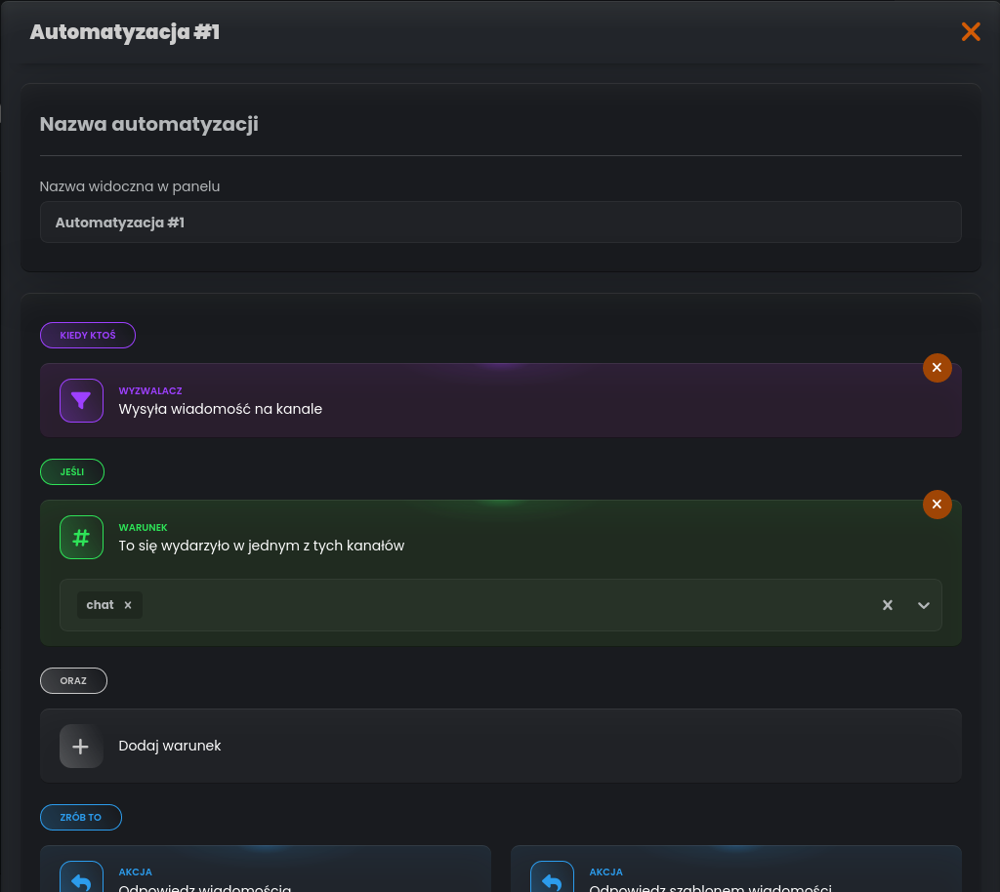

### Automatyzacje w pluginie osadzenia

Z bloczków automatyzacji możesz korzystać w pluginie **Osadzenia**. Dzięki temu możesz tworzyć bardziej zaawansowane
wiadomości, które będą mieć pod sobą przyciski wykonywające określone przez Ciebie akcje.

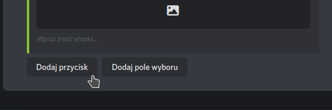

### Automatyzacje w pluginie ekonomia

Bloczki automatyzacji zobaczysz teraz również w pluginie **Ekonomia**, a konkretnie w konfiguracji przedmiotów.
Teraz możesz skonfigurować bardziej zaawansowane programy, które mają być uruchamiane po zakupie przedmiotu oraz przy 
jego użyciu.

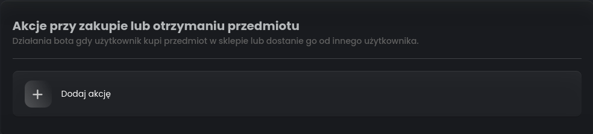

## Moderacja: Panel z karami

Od dzisiaj, każda kara, którą otrzyma użytkownik, będzie miała swój unikalny identyfikator.
Stworzyliśmy nowy panel, w którym możesz zobaczyć wszystkie kary, które zostały nałożone na użytkowników.

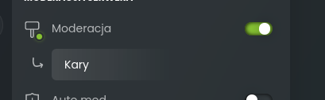

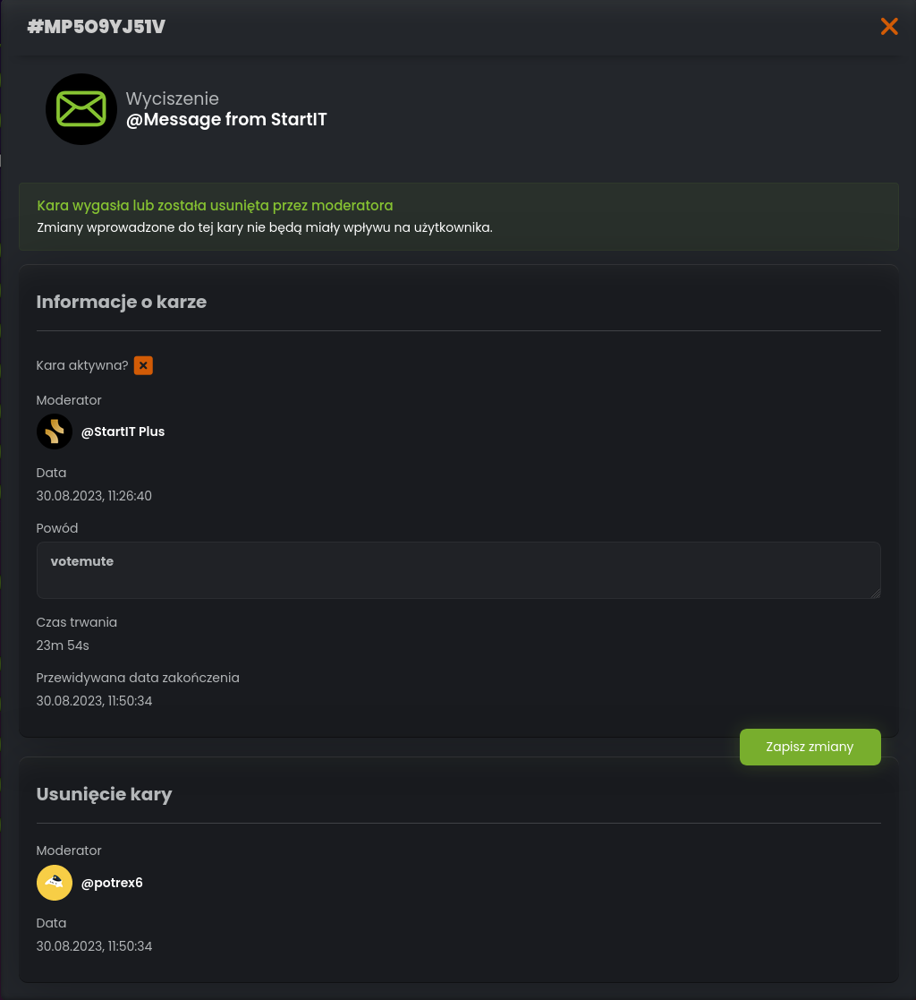

### Panel ten dostępny jest również w postaci komendy

Dostępne komendy:
 - `/punishments edit-reason <id> <powód>` - Edytuj powód kary
 - `/punishments info <id>` - Pokaż informacje o karze
 - `/punishments list [użytkownik]` - Pokaż listę kar
 - `/punishments list-mod <moderator>` - Pokaż listę kar
 - `/punishments remove <id> [powód]` - Usuń karę

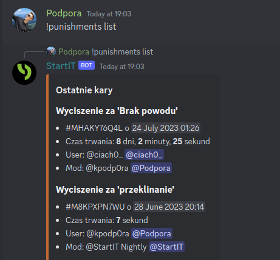

## Ekonomia: Płatna zmiana pseudonimu

Przedmiot "Zmień pseudonim użytkownika" to specjalne narzędzie, które pozwala użytkownikom modyfikować swój pseudonim na
serwerze. Zapewnia to użytkownikom zabawny i interaktywny sposób na spersonalizowanie swojej tożsamości i dodanie
odrobiny kreatywności do swojej osobowości. Dzięki temu przedmiotowi użytkownicy mogą łatwo zaktualizować swój pseudonim
bez konieczności ręcznej interwencji administratorów serwera.

Więcej informacji w [naszej dokumentacji](/docs/change-nickname-item).

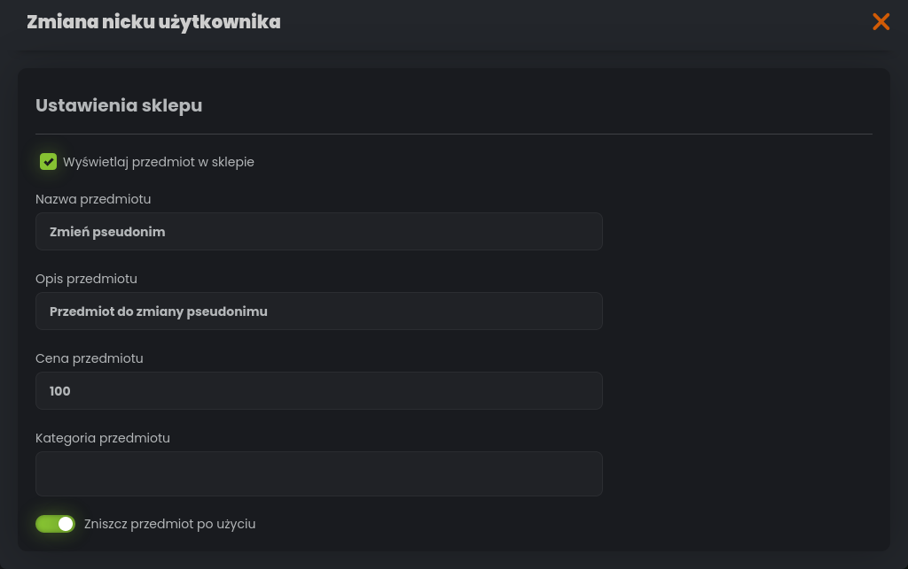

## Ekonomia: Podatki i mandaty

Nadaj swojemu serwerowi więcej realizmu dzięki nowemu systemowi podatków. Podatki możesz ustawić na niemal wszystko i
dostosować je do swoich potrzeb. Zapewnia to właścicielom serwerów sposób na efektywne zarządzanie i dystrybucję 
dochodów efektywnie.

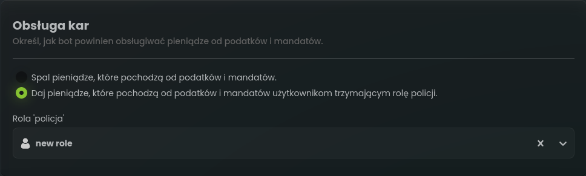

### Rola policyjna otrzymuje pieniądze z:
 - Mandatów z pluginu Auto moderacja (np. pisanie przekleństw)
 - Mandatów z pluginu Moderacja (komenda `/warn`)
 - Pieniędzy z nieudanych prób kradzieży (komenda `/crime`)
 - Pieniędzy z nieudanych prób włamania (komenda `/rob`)
 - Pieniędzy z nieudanej pracy dorywczej (komenda `/slut`)
 - Sprzedaży tymczasowych kanałów głosowych z pluginu Auto kanały

Opcjonalnie rola policyjna może również dostawać podatki z przelewów serwerowych (komenda `/pay`):

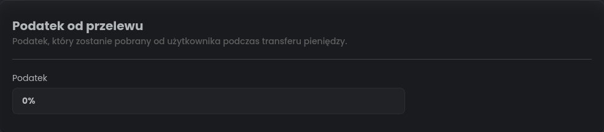

### Dodatkowy podatek: /collect-income

Możesz ustawić, aby przy każdym użyciu komendy **/collect-income** użytkownik płacił podatek na rzecz dowolnej roli 
(niekoniecznie policyjnej):

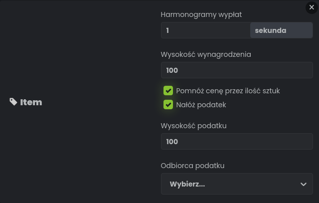

## Ekonomia: System promocji

Zmień prosto cenę wszystkich przedmiotów na serwerze o określoną kwotę lub procent.
Możesz również ustawić zakres działania promocji, aby obowiązywała na przykład tylko w weekendy.

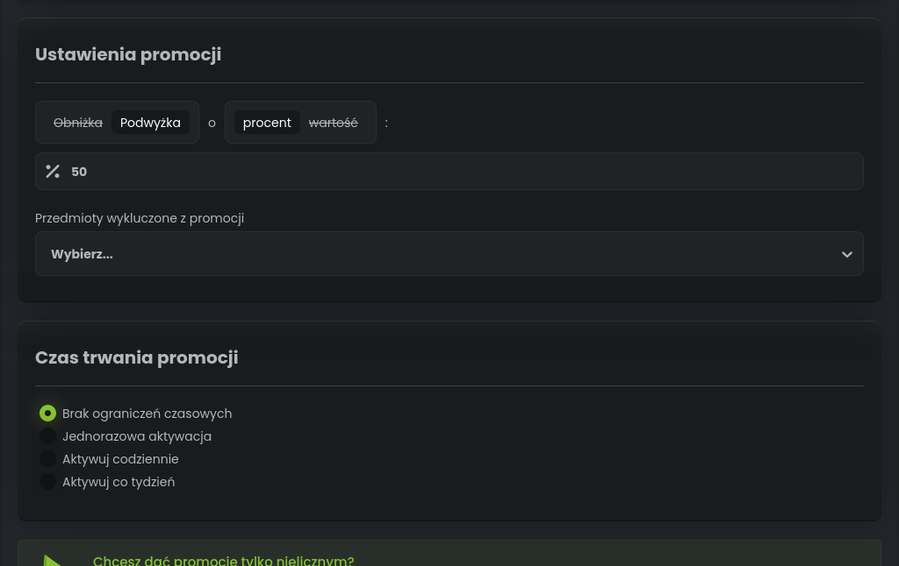

Więcej informacji w [naszej dokumentacji](/docs/discounts).

## Ekonomia: Ulepszone ustawienia przedmiotów

Ulepszyliśmy ustawienia przedmiotów na panelu. Masz teraz większą kontrolę nad swoimi przedmiotami.
Sprawdź nasze nowe funkcję, takie jak:

### Szansa na oszustwo

Stwórz **własny czarny rynek** na serwerze. Od teraz możesz ustawić szansę na oszustwo przy zakupie przedmiotu. Bot
losowo zdecyduje, czy użytkownik otrzyma przedmiot, czy nie. Dodaje to nową warstwę emocji do gry.

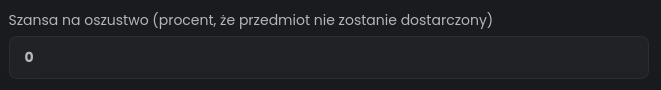

### Zmiana ceny przedmiotu w zależności od roli

Ustaw VIP-om zniżki lub skaż użytkowników, ustawiając im wyższą niż normalną cenę.

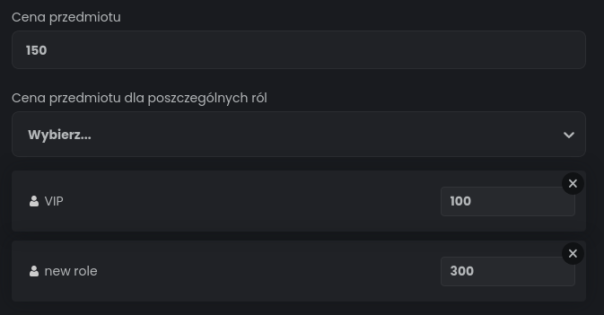

### Limit przedmiotów w sklepie

Od teraz można ustawić ilość przedmiotów w magazynie. Stwórz ekskluzywne przedmioty z limitem sprzedaży.

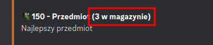

### Limit przedmiotów w plecaku

Ustaw, ile przedmiotów może mieć użytkownik w plecaku.

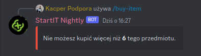

## Ekonomia: Receptury rzemieślnicze

Komenda `/crafting` w StartIT pozwala użytkownikom łączyć różne składniki w celu tworzenia nowych przedmiotów lub 
produktów. Aby wykonać recepturę, musisz zebrać wszystkie niezbędne składniki. Składniki te mogą obejmować przedmioty, 
role, skrzynie, a nawet pewną ilość pieniędzy.

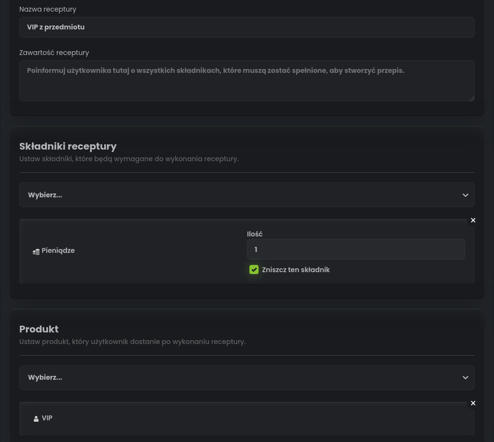

Więcej informacji w [naszej dokumentacji](/docs/crafting).

## Mnożnik przedmiotów w /collect-income

Od teraz komenda **/collect-income** może dawać więcej pieniędzy, gdy użytkownik ma w swoim plecaku kilka tych samych
przedmiotów.

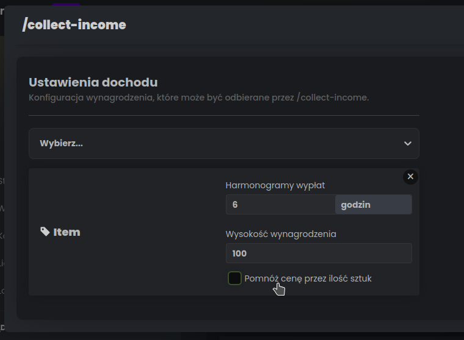

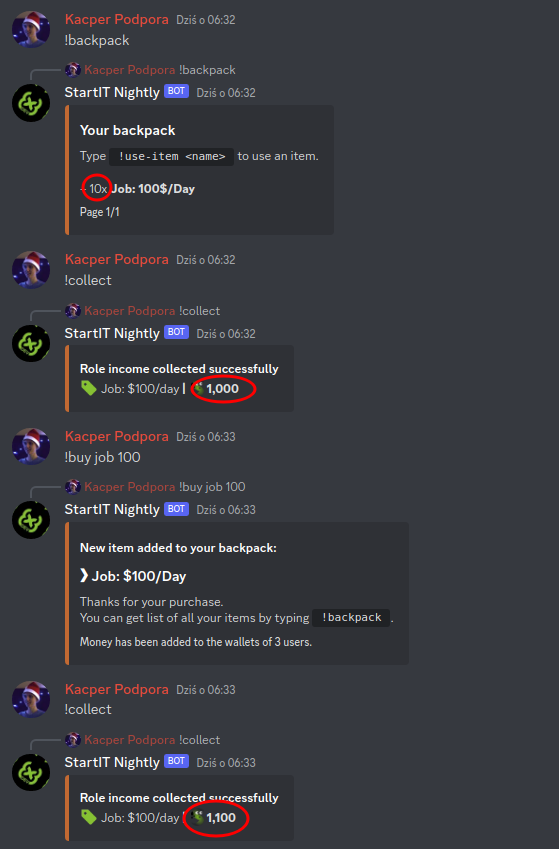

## Ekonomia: Handel wtórny przedmiotami

Od teraz użytkownicy mogą handlować przedmiotami między sobą. Utworzyliśmy komendę **/user-market** do handlu przedmiotami
między użytkownikami. Użytkownicy mogą teraz kupować i sprzedawać przedmioty innym użytkownikom. 


Użyj komendy `/market list` aby zobaczyć listę przedmiotów na sprzedaż.
Aby wystawić swój przedmiot na rynku, użyj komendy `/market sell [ilość] <nazwa przedmiotu> <cena>`.

## Nowa komenda: /votemute

Pozostaw twój serwer w spokoju, gdy nie ma administratorów online. Komenda **/votemute** pozwala użytkownikom na wyciszenie 
innych użytkowników poprzez głosowanie. Gdy wystarczająca liczba osób zagłosuje za wyciszeniem, bot wyciszy użytkownika na ustawiony w panelu czas.

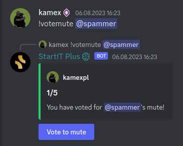

## Kanał wsparcia głosowego

Kanał **wsparcia głosowego** to nowa funkcja, która umożliwia moderacji serwera udzielanie wsparcia użytkownikom w 
kanale głosowym. Gdy użytkownik dołączy do kanału, bot automatycznie **powiadomi administrację**, że ktoś czeka na 
pomoc. Bot również przeniesie użytkownika do poczekalni, a następnie do pokoju wsparcia, gdy moderator będzie gotowy do 
pomocy.

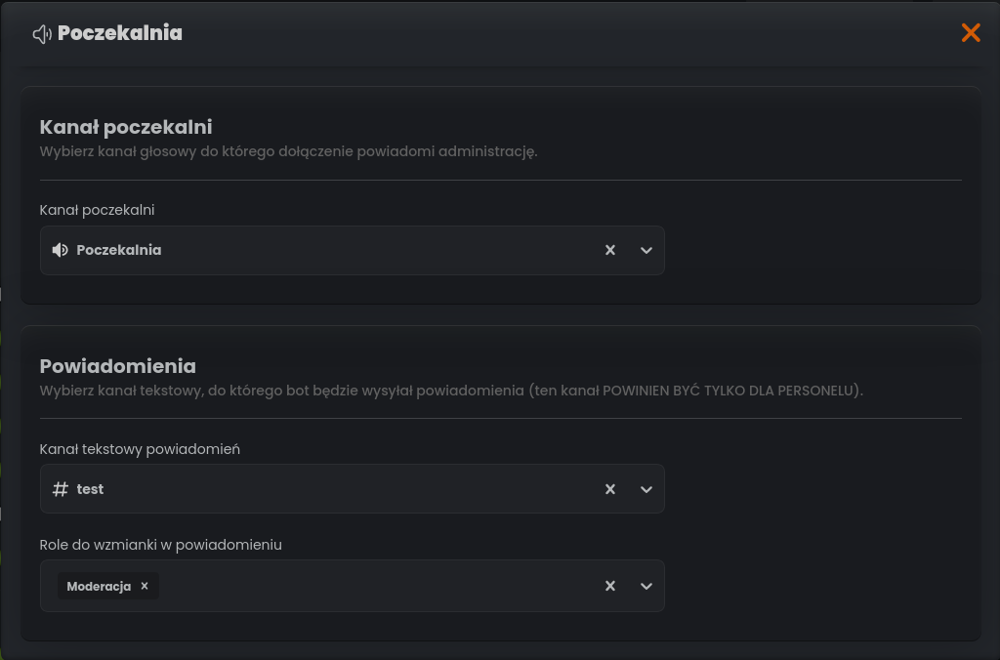

Kanał z powiadomieniami:

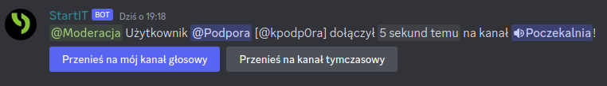

## Ulepszona komenda: /poll

Stwórz **zaawansowane ankiety serwerowe** za pomocą ulepszonej komendy /poll. Teraz możesz ustawić, aby głosowanie trwało
tylko przez określony czas lub aby głosowanie było anonimowe.

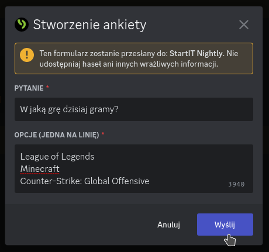

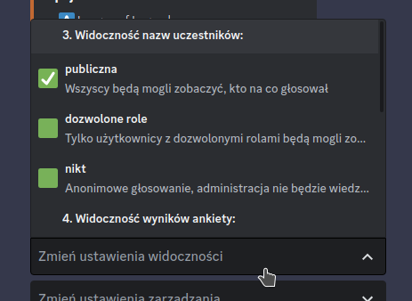

## Nowa komenda: /random-question

Zwiększ aktywność na serwerze dzięki nowej komendzie **/random-question**. Polecenie to umożliwia rozpoczęcie rozmowy 
społecznością poprzez zadanie losowego pytania. Bot zada jedno z 340 przygotowanych pytań po wprowadzeniu komendy. 
Znajdź pytanie dla siebie i rozpocznij dyskusję!

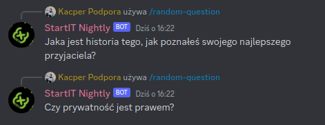

## Ulepszenia obecnych komend

Ciągle ulepszamy nasze komendy, aby były jeszcze lepsze. Aktualizacja ta wprowadza kilka ulepszeń do obecnych komend.
W niektórych przypadkach zmieniliśmy wygląd albo ulepszyliśmy obecne funkcjonalności.
Oto lista najważniejszych zmian:

### Wykonaj komendę na kimś cytując jego wiadomość

Gdy umieścisz komendę w cytowanej wiadomości, nie musisz już podawać tej osoby w argumencie – bot automatycznie domyśli
się co chcesz zrobić i wykona komendę na cytowanej osobie.

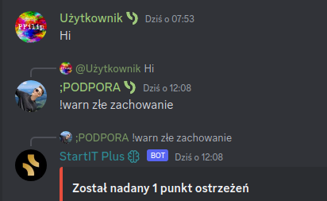

### Saldo konta w komendach /dep i /with

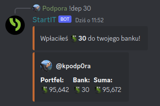

### Menu wyboru do szybkiego zakupu przedmiotów w /shop

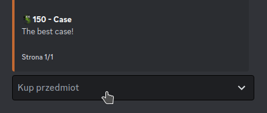

### Zarządzanie plecakami użytkowników

Nowa komenda: /economy backpack [add/remove] \
Dzięki niej możesz komuś dodawać lub usuwać przedmioty z plecaka.

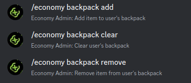

### Lepszy wygląd komendy /warnings

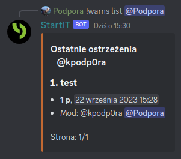

### Pasek postępu wyciszenia w poleceniu /warn

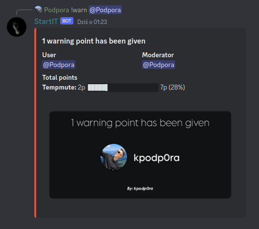

### Ulepszony wygląd logów moderacyjnych

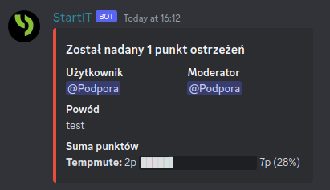

### System recenzji w komendzie /userinfo

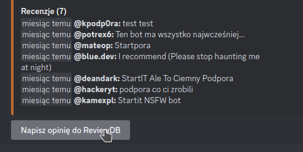

## Poziomy: Więcej ustawień XP

Masz od teraz większy wpływ na to, jak użytkownicy zdobywają XP. Możesz ustawić, aby użytkownicy otrzymywali więcej XP za
długie wiadomości, załączniki, a także na wybranych kanałach. Możesz również zablokować XP, gdy użytkownik jest wyciszony
na kanale.

### Więcej XP za długie wiadomości (i załączniki)

Doceń użytkowników, którzy piszą dłuższe wiadomości i nadaj im dodatkowy XP za to. Możesz także ustawić, aby bot dawał
więcej XP, gdy do wiadomości dołączone jest jakieś zdjęcie.

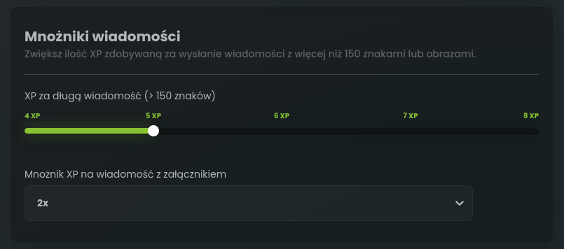

### Mnożnik XP na wybranych kanałach

Ustaw, na których kanałach użytkownik pozyska więcej XP.

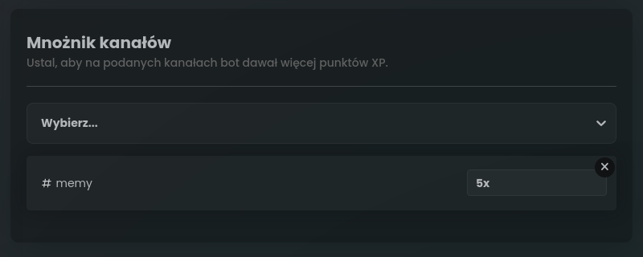

### Zablokuj XP, gdy użytkownik jest wyciszony na kanale.

Koniec z siedzeniem cicho na kanale! Od teraz możesz zablokować XP, gdy użytkownik jest wyciszony.

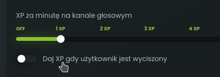

## Moderowane kanały: Osoba niżej

Kanał "Osoba niżej" działa jak zabawny łańcuch pytań i odpowiedzi na serwerze Discord. Jako administrator, możesz 
zainicjować rozmowę, publikując pytanie w wyznaczonym kanale. Bot doda następnie przyciski "Tak" i "Nie" pod pytaniem, 
aby ułatwić udzielenie odpowiedzi.


Użytkownik następnie musi za pomocą przycisku "Tak" lub "Nie" odpowiedzieć na pytanie, a następnie zadać swoje, aby
łańcuch pytań i odpowiedzi mógł się kontynuować.

Więcej informacji w [naszej dokumentacji](/docs/person-below-channel).

## Moderowane kanały: Znak wodny w obrazkach

Ktoś ciągle kradnie Ci memy z serwera? Po tej aktualizacji, gdy ustawiasz **kanał z obrazkami** w pluginie Moderowane 
kanały, bot może automatycznie nakładać logo serwera na obrazki, które są wysyłane na kanał.


## Organizuj wybory serwerowe

Możesz wykorzystać tę funkcję, aby np. użytkownicy mogli **zagłosować na moderatora miesiąca**, albo wyłonić najlepszego 
użytkownika spośród siebie. Dzięki temu możesz zwiększyć aktywność na serwerze i zmotywować użytkowników do aktywności.
Podczas wyborów bot automatycznie utworzy wiadomość, w której użytkownicy będą mogli głosować na swojego ulubionego 
kandydata.

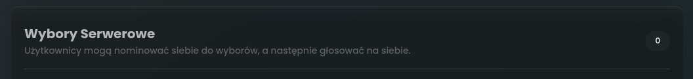

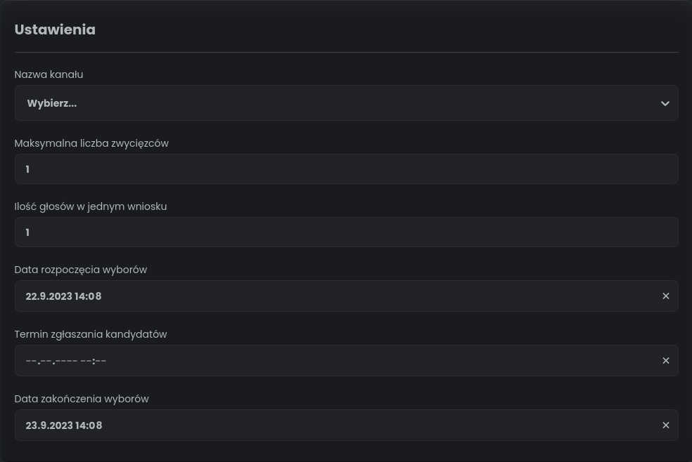

## Zgłoszenia

### Tworzenie zgłoszeń w wątkach

Od teraz w panelu możesz ustawić, aby zgłoszenia tworzyły się w formie wątków, zamiast nowych kanałów.
Polecamy tę opcję, gdyż wątki łatwo archiwizować i nie zajmują dużo miejsca na serwerze.

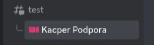

### Ulepszenie archiwizacji zgłoszeń

Od teraz w historii zgłoszenia, pojawią się dodatkowe informacje (np. odpowiedzi z formularza).
Również, gdy w archiwum pojawi się jakiś link, bot spróbuje dodać jego osadzenie pod wiadomością.

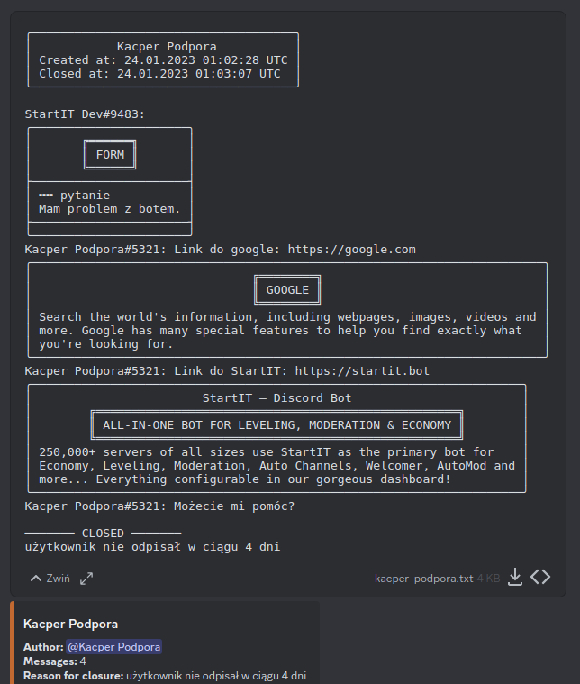

### Ustaw strefę czasową w archiwum zgłoszeń

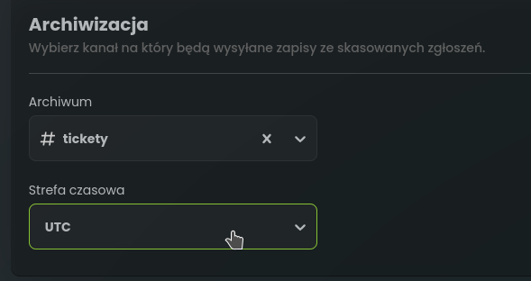

### Numerowanie zgłoszeń w nazwie kanału

Uporządkuj zgłoszenia, nadając każdemu unikalny numer widoczny w nazwie kanału.

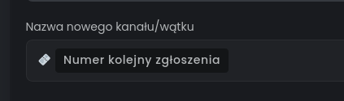

### Maksymalna ilość otwartych zgłoszeń

Określ, ile jeden użytkownik może mieć jednocześnie otwartych zgłoszeń. 

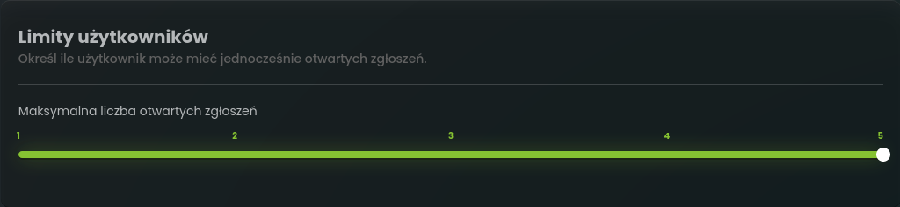

## Konkursy

### Płatny wstęp do konkursu

Od teraz możesz ustawić, aby użytkownicy musieli zapłacić, aby dołączyć do konkursu.

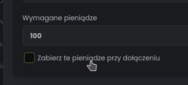

## Rola dla osób na chat głosowym

Możliwość utworzenia roli dla ludzi, którzy są na dowolnym kanale głosowym. Bot zabierze tę rolę, gdy użytkownik opuści
kanał.

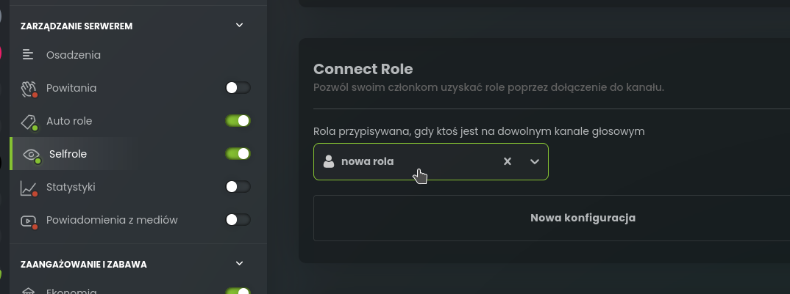

## Panele z wyborem roli

Pod wiadomością pojawi się pole wyboru, gdzie użytkownicy będą mogli zaznaczyć, które role bot ma im nadać.

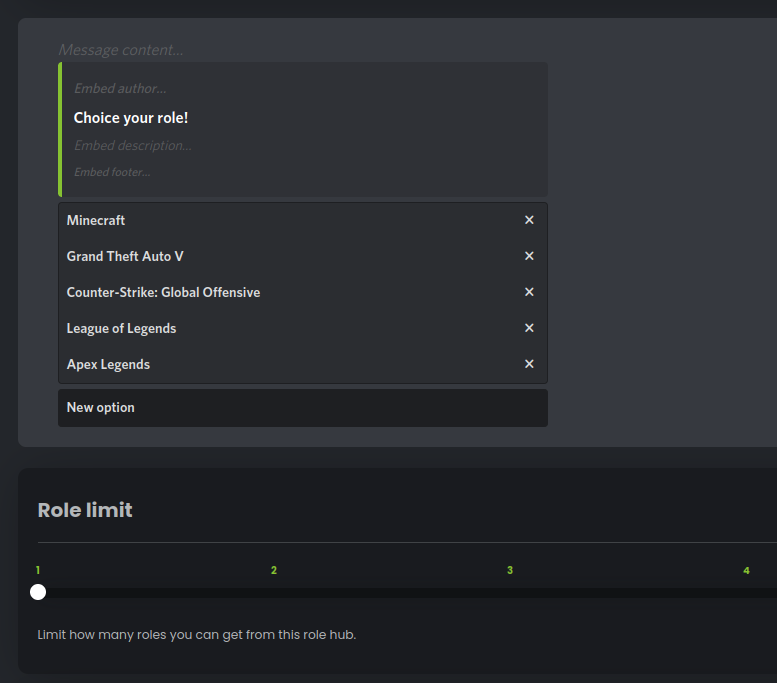

Więcej informacji w [naszej dokumentacji](/docs/select-roles).

## Nowe ustawienia statusu bota

Wyróżnij swojego własnego bota spośród innych. Od teraz w StartIT Plus pojawiły się nowe ustawienia personalizacji 
statusu.

- Możliwość ustawienia statusu „**dostępny na telefonie**”:

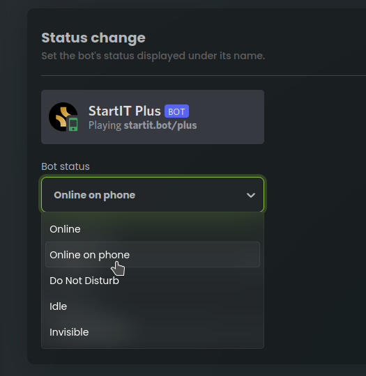

- Możliwość wpisania **własnego tekstu statusu**:

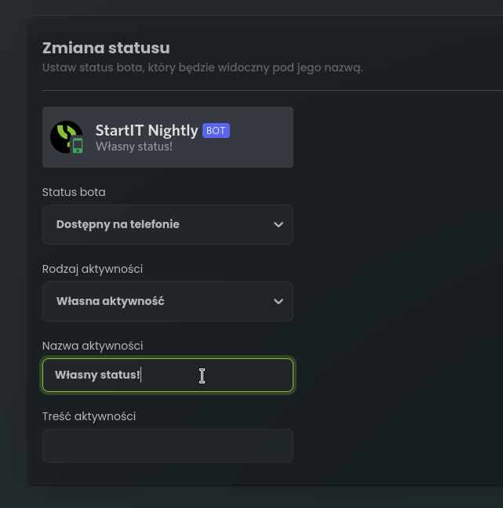
