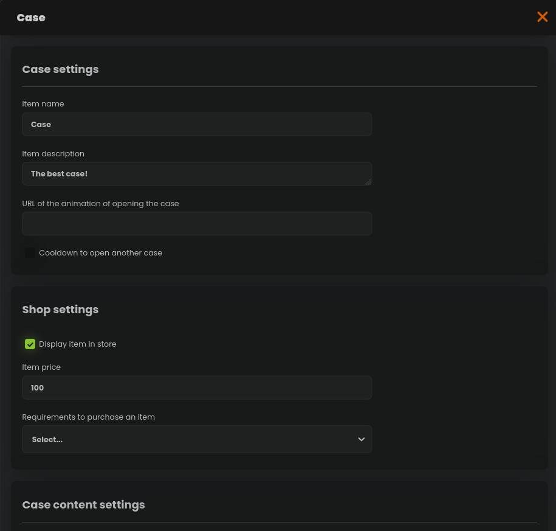
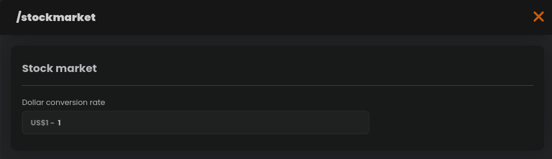
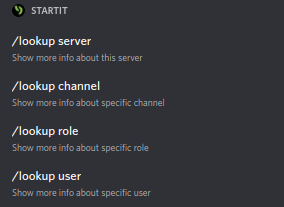
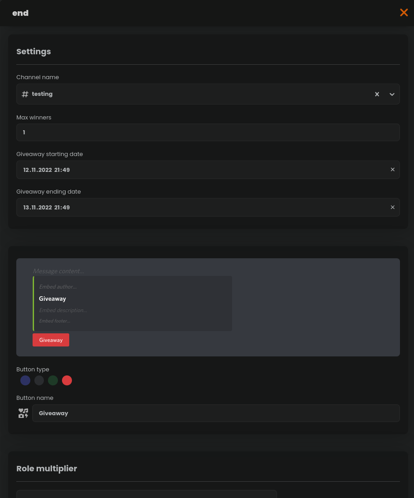
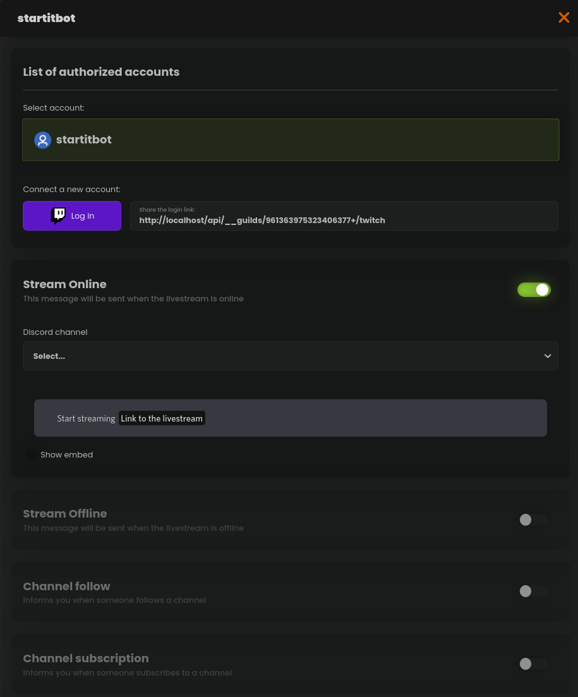
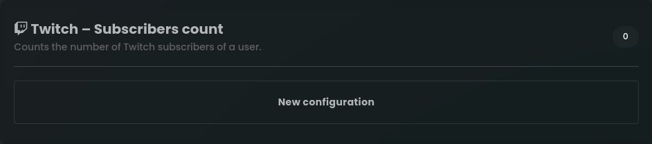
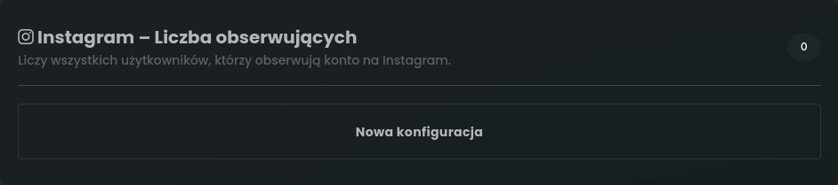
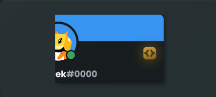
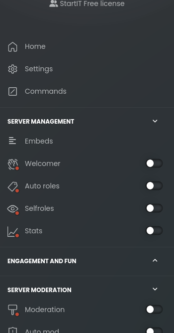
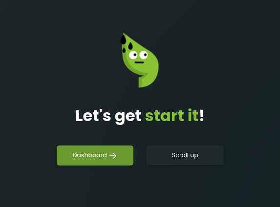

# Update 12/11/2022

## Chests

From now on you can add so-called chests to the server shop, which are able to randomly give players money, roles or other items.

## Stockmarket

We added a new command **/stockmarket**, which allows you to virtually buy stocks of known companies.

To start using this feature on your server, go to the command configuration in the Economy plugin and set the dollar converter to your server currency.

Users will be able to buy stocks using the command **/stockmarket buy \[amount] \[name]**.
Bought stocks can be viewed using the command **/stockmarket backpack**, and then sold for a profit using **/stockmarket sell**.

The list of all available stocks is listed on the page: [https://startit.bot/stocks](https://startit.bot/stocks)

Happy trading, future investors!

## /lookup

New command for getting information about data roles, channels and users.

## New plugin: Giveaways

From now on, you can create giveaways using our panel!

The bot will randomly choose a winner after a set time and give him a reward.

## New plugin: Media notifications

Are you a creator? Do you want your latest videos to be automatically posted on the server? Use our new plugin that allows you to automatically publish videos from YouTube and Twitch on the server.

## New stats

We added new stats:
- Number of Twitch subscribers
- Number of Instagram followers

## Badge in the profile for StartIT Plus users

Discord recently added a new badge for users who created their own bot on Discord. Thanks to this, StartIT Plus users will be able to easily receive this badge without the need to program their own bot.

## Divided plugins into few categories

We split plugins into categories to make them easier to find:
 - **Server management** (Embeds, Welcomes, Auto roles, Selfroles, Stats, Social notifications)
 - **Engagement and fun** (Economy, Levels, Giveaways, Auto channels, Images, Tools)
 - **Server moderation** (Moderation, Auto mod, Logs, Auto responder, Moderated channels, Tickets)

## Footer on home page has been updated

