# Update 20/01/2023

## Economy reinvented!

We have rebuilt the economy configuration panel to make it more intuitive and easier to use. We've also changed the way we save user data to make it secure.

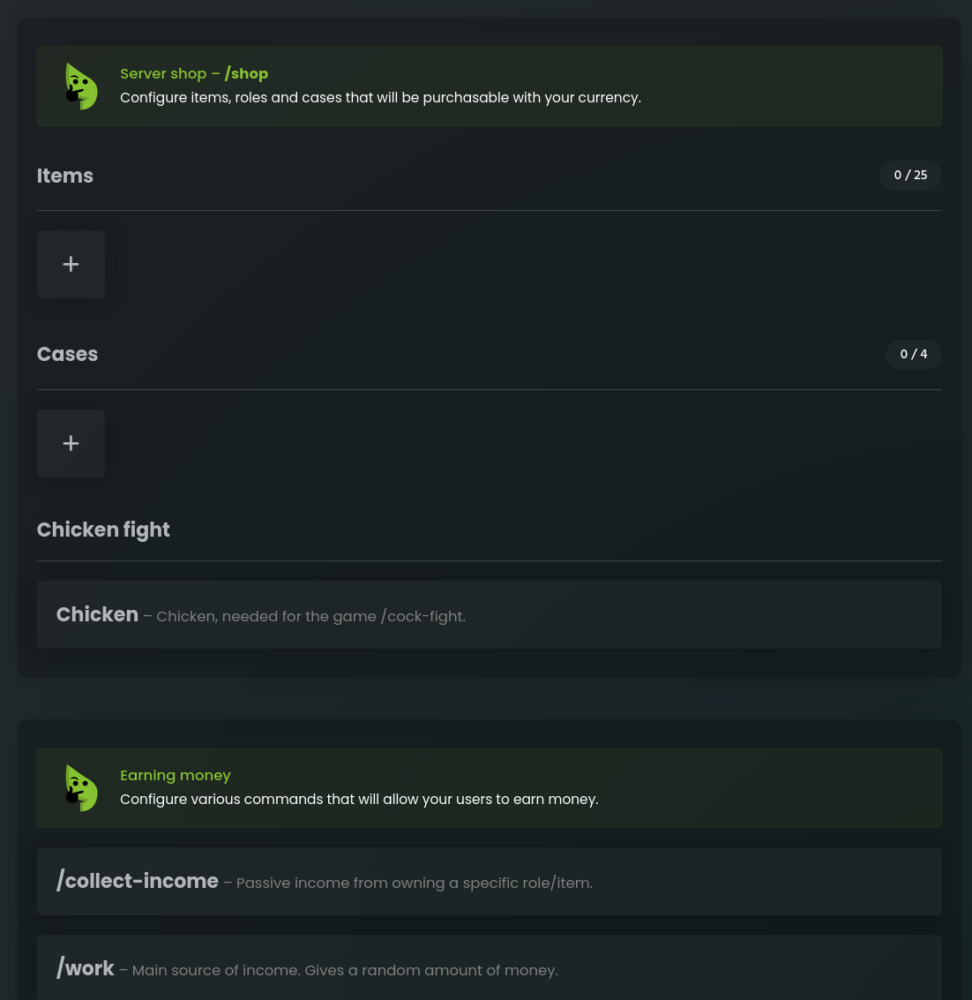

## Money for writing on chat!

Reward users for chatting. Set in the economy configuration panel how much money a user will receive for each message. You can also give money for talking on the voice channel.

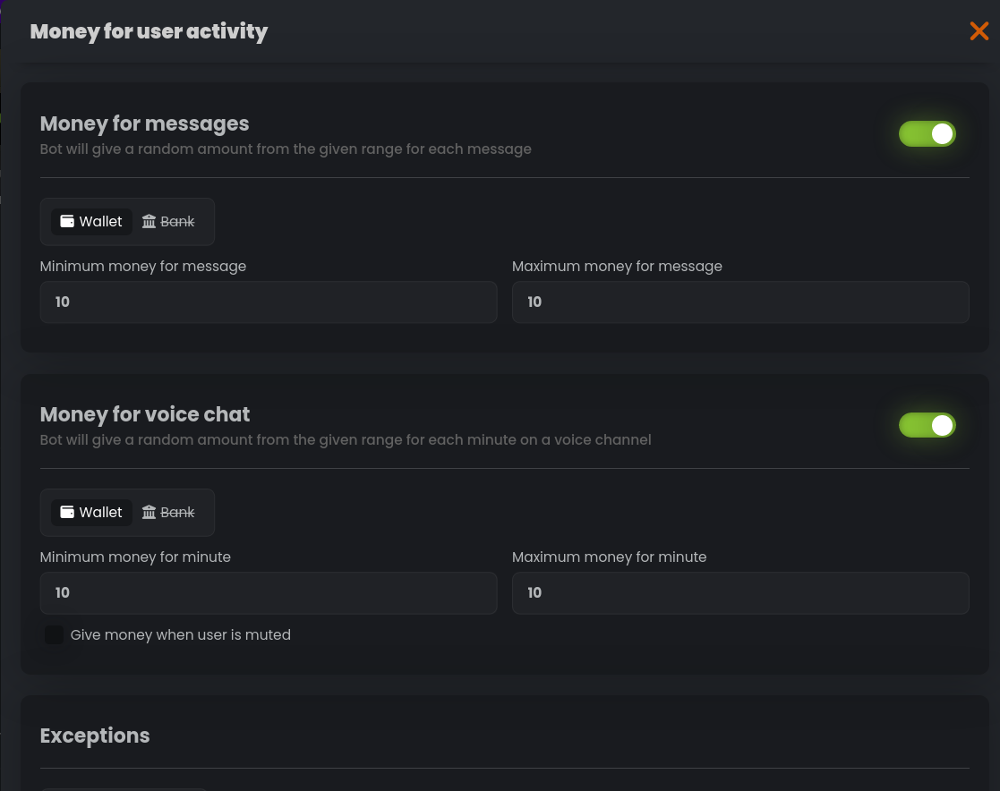

## Categories in the store

A lot of items? From now on it's not a problem! Group them into categories to make them clearer.

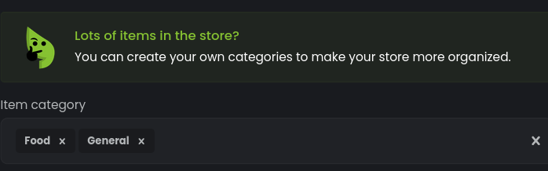

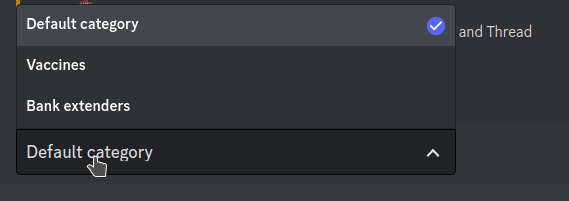

## Separator of groups of digits

Do you trade with big money? Now you won't get the numbers wrong! Choose how you want the bot to display large amounts.

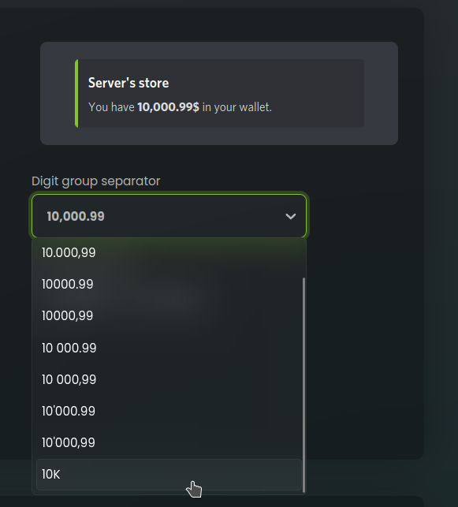

## Stocks money in your balance!

From now on, the sum of the value of all your shares in the stock market is displayed under the /balance command.

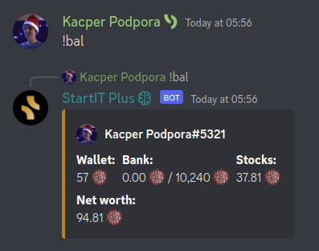

## Limit the capacity of users' banks

Force users to hold a certain amount in their wallet. From now on, you can set a limit on how much money a user can keep in their bank. The limit can be expanded by roles and items.

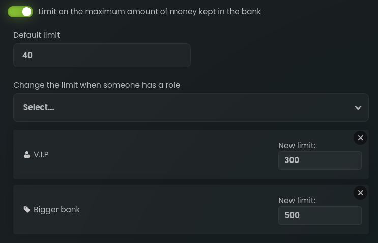

## Tax system

Tax the transfers on your server. Set up a tax to be charged with each payment.

## More flexibility of collect-income

The payment amount in /collect-income can now be given as a percentage. You can also set a negative value to collect money from users.

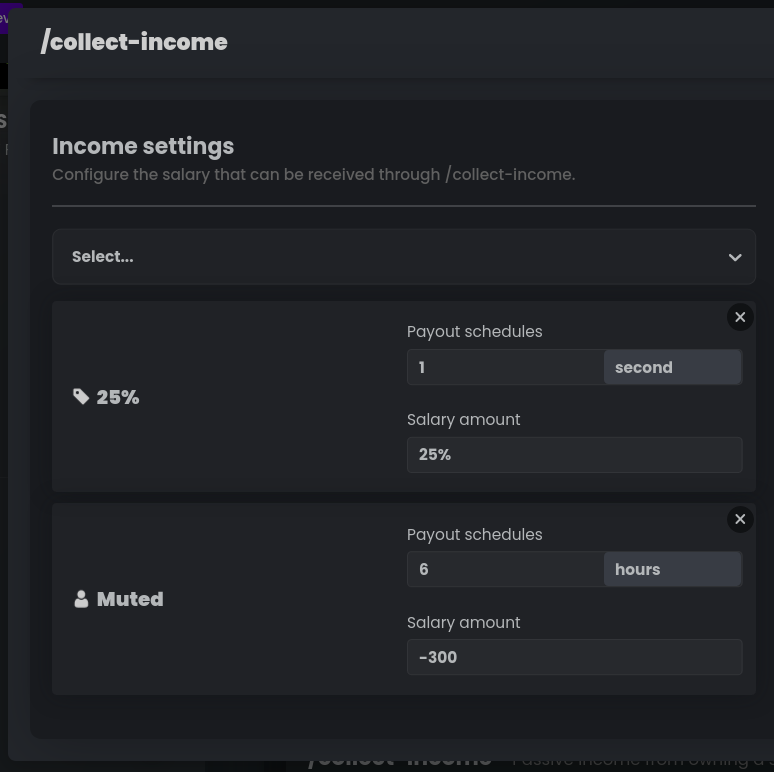

## Item purchase limit

Limit how many times an item can be purchased by your users.

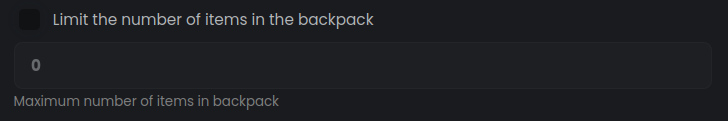

## Manage permissions for /eco

/eco is a command that allows you to manage the economy, give money, delete, etc. From now on you can set who can use it.

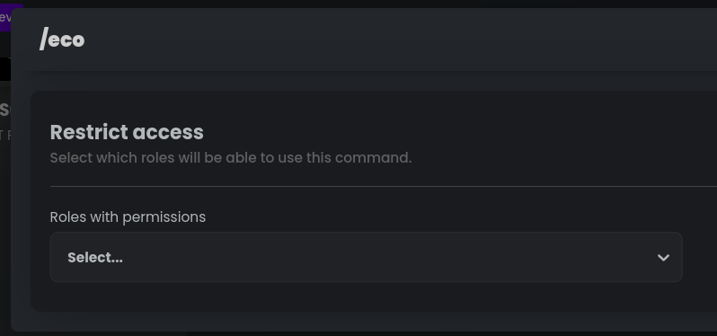

## Earn from the server store!

From now on, you can set the owner of the item. This is a special role whose owners will share equally the profits from the sale of this item in the server store.

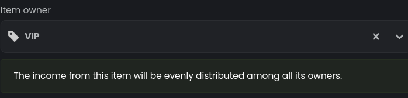

## Autochannels Voice Dashboard

Allow users to manage their channels. Each auto voice channel can now have a panel that allows to change the name, category, owner and permissions of the channel.

You can activate this panel in the server dashboard.

## Log in to your StartIT account.

From now on, you can log into StartIT account through our panel and chat with users as a bot.

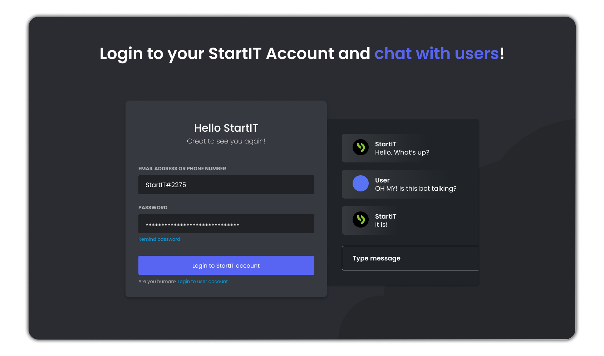

Feature available only for StartIT Plus users.

## Ability to purchase StartIT Plus on other people's servers!

From now on you can purchase StartIT Plus for someone else's server! The owner will be notified that a license has been gifted to them.
Don't be afraid, you can take this license and transfer it to some other server at any time - your license, your rules.

Read more about StartIT Plus: [https://startit.bot/plus](https://startit.bot/plus)

## Improved giveaways

We are constantly working on improving Giveaways. This month, we introduced a button that displays a list of people participating in a giveaway.

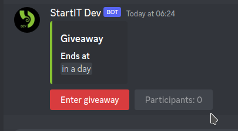

## 270,000 servers

Thank you for your trust! StartIT is now on 270,000 servers. This is a huge number for us, and we will continue to work on improving StartIT to make it even better for you.

For the occasion, we have added a new friend to our logo, who will be with us for a few days. Let us know if you see him!

From us, that's it for today, we wish you a wonderful weekend.

Bot Configuration: [https://startit.bot/](https://startit.bot/) \
Support our work: [https://startit.bot/plus](https://startit.bot/plus) <3

