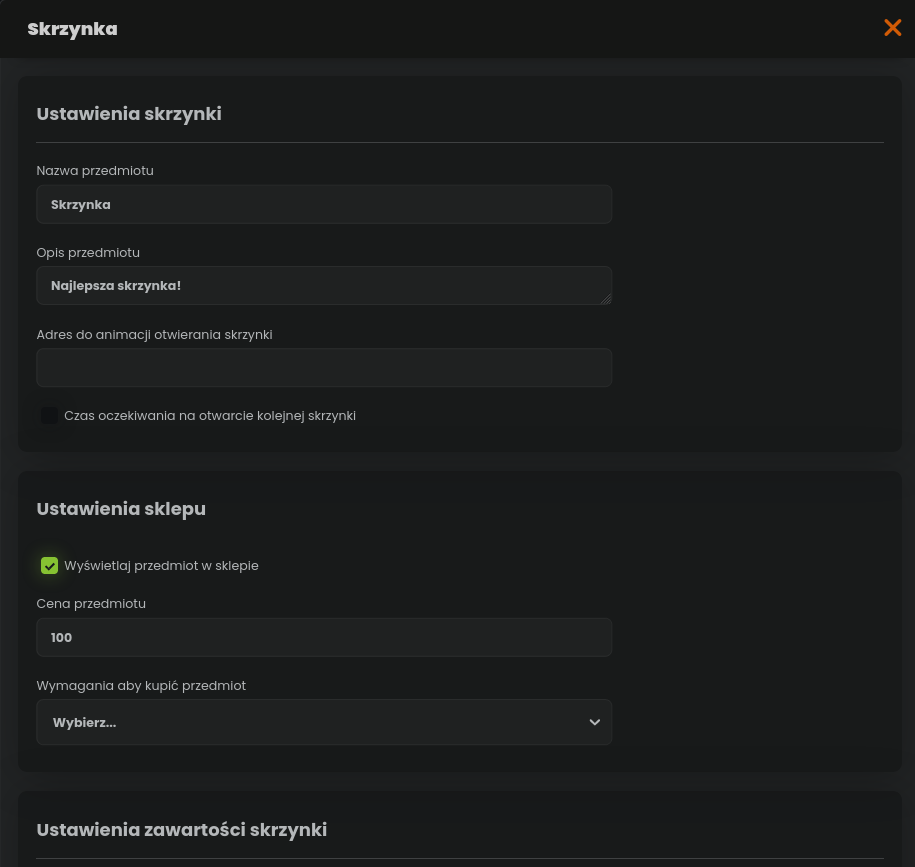
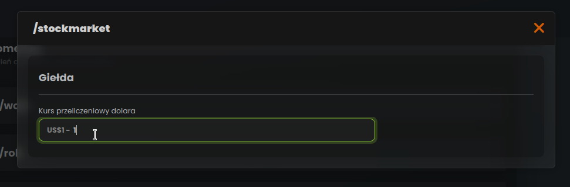
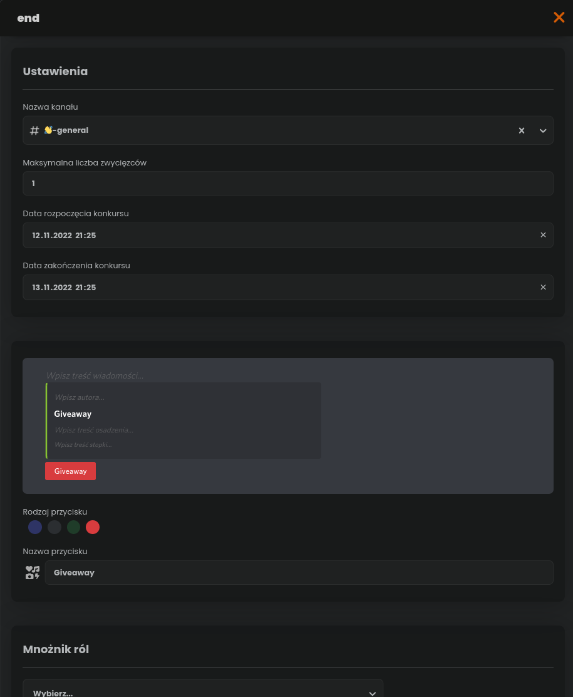
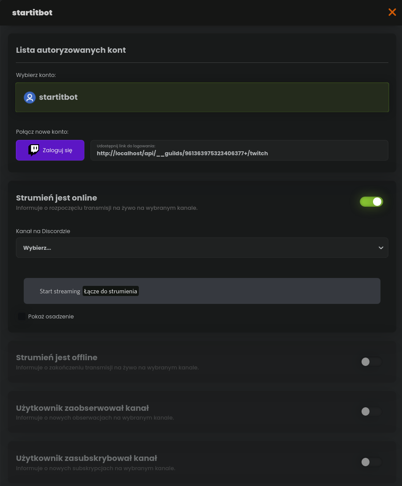
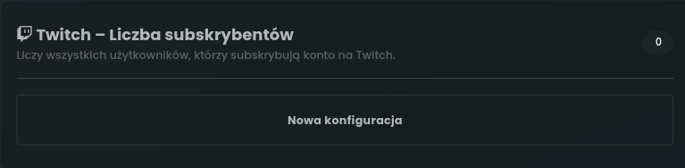
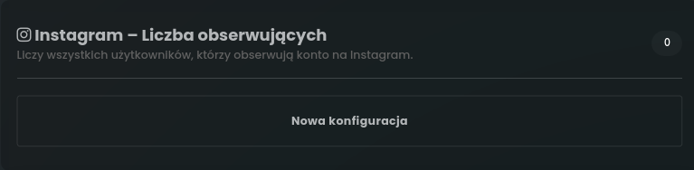
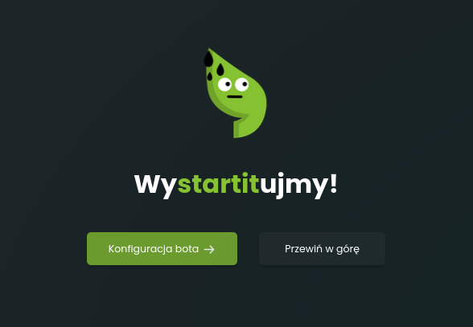

# Aktualizacja 12/11/2022

## System skrzynek

Od teraz do sklepu serwerowego możesz dodać tzw. skrzynki, które to po otworzeniu są w stanie losowo nadać użytkownikom pieniądze, role lub inne przedmioty.

## Giełda

Dodaliśmy nową komendę **/stockmarket**, która umożliwia wirtualne kupowanie akcji giełdowych znanych firm.

Aby zacząć korzystać z tej funkcji na swoim serwerze przejdź do konfiguracji tej komendy w pluginie Ekonomia i ustaw przelicznik dolara na twoją walutę serwerową.

Użytkownicy będą mogli kupić akcje za pomocą komendy **/stockmarket buy \[ilość] \[nazwa]**.
Zakupione akcje można podejrzeć komendą **/stockmarket backpack**, a później sprzedać z zyskiem za pomocą **/stockmarket sell**.

Lista wszystkich dostępnych akcji, wypisana jest na stronie: [https://startit.bot/stocks](https://startit.bot/stocks)

Miłej zabawy przyszli inwestorzy!

## /lookup

Nowa komenda do pobierania informacji o danych rolach, kanałach i użytkownikach.

## Nowy plugin: Konkursy

Od teraz możesz tworzyć za pomocą naszego panelu tworzyć konkursy!

Bot po ustalonym czasie wylosuje zwycięzcę i da mu nagrodę.

## Nowy plugin: Powiadomienia z mediów

Jesteś twórcą? Chcesz, aby twoje najnowsze filmy były automatycznie publikowane na serwerze? Skorzystaj z naszego nowego pluginu, który pozwala na automatyczne publikowanie filmów z YouTube i Twitcha na serwerze.

## Nowe statystyki

Dodaliśmy nowe statystyki:
- Liczba subskrybentów Twitch
- Liczba obserwujących Instagram

## Odznaka w profilu dla użytkowników StartIT Plus

Discord niedawno dodał nową odznakę dla użytkowników, którzy stworzyli własnego bota na Discordzie. Dzięki temu użytkownicy StartIT Plus będą mogli w łatwy sposób odebrać tę odznakę, bez potrzeby programowania własnego bota.

## Podział pluginów na kategorie

Podzieliliśmy pluginy na kategorie, aby ułatwić ich wyszukiwanie:
 - **Zarządzanie serwerem** (Osadzenia, Powitania, Auto role, Selfrole, Statystyki, Powiadomienia z mediów)
 - **Zaangażowanie i zabawa** (Ekonomia, Poziomy, Konkursy, Auto kanały, Obrazy, Narzędzia)
 - **Moderacja serwera** (Moderacja, Auto mod, Logi, Auto odpowiedzi, Moderowane kanały, Zgłoszenia)

## Aktualizacja stopki na stronie głównej

