# Aktualizacja 20/01/2023

## Ekonomia wymyślona na nowo!

Przebudowaliśmy panel konfiguracji ekonomii, aby był bardziej intuicyjny i łatwiejszy w obsłudze. Zmieniliśmy również sposób, w jaki zapisujemy dane z ekonomii, aby były bezpieczne.

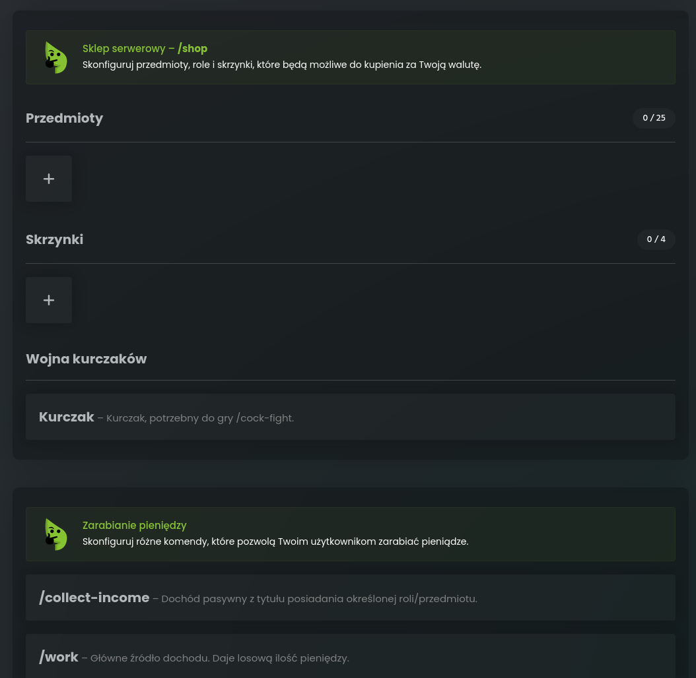

## Pieniądze za pisanie na chacie!

Nagradzaj użytkowników za rozmowę na chacie. Ustaw w panelu konfiguracji ekonomii, ile pieniędzy użytkownik otrzyma za każdą wiadomość. Możesz też dawać pieniądze za rozmowę na kanale głosowym.

## Kategorie w sklepie

Dużo przedmiotów? Od teraz to nie problem! Pogrupuj je w kategorie, aby były bardziej przejrzyste.

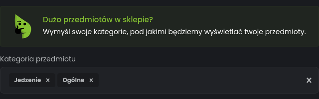

## Separator grup cyfr

Obracasz dużymi pieniędzmi? Teraz nie pomylisz liczb! Wybierz, w jaki sposób bot ma wyświetlać duże kwoty.

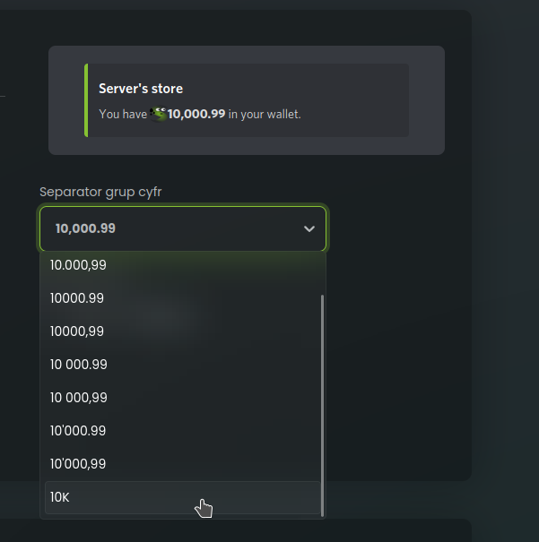

## Pieniądze z akcji w twoim podsumowaniu!

Od teraz suma wartości wszystkich twoich akcji na giełdzie wyświetla się pod komendą /balance – dla Twojej wygody.

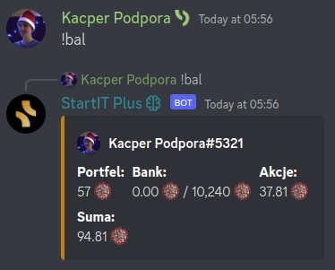

## Ogranicz pojemność banków użytkowników

Zmuś użytkowników do przetrzymywania pewnej kwoty w portfelu. Od teraz możesz ustawić limit, ile pieniędzy użytkownik może przetrzymywać w swoim banku. Limit może być poszerzony przez role i przedmioty.

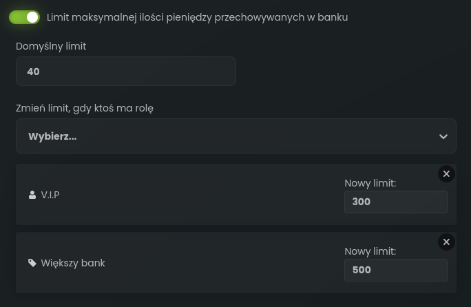

## System podatków

Opodatkuj przelewy na Twoim serwerze. Ustaw podatek, który będzie pobierany przy każdej płatności.

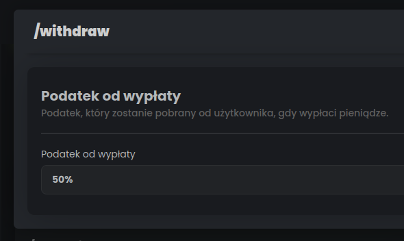

## Większa elastyczność collect-income

Wysokość wynagrodzenia w /collect-income może być teraz podawana w procentach. Możesz również ustawić negatywną wartość, aby pobierać pieniądze od użytkowników.

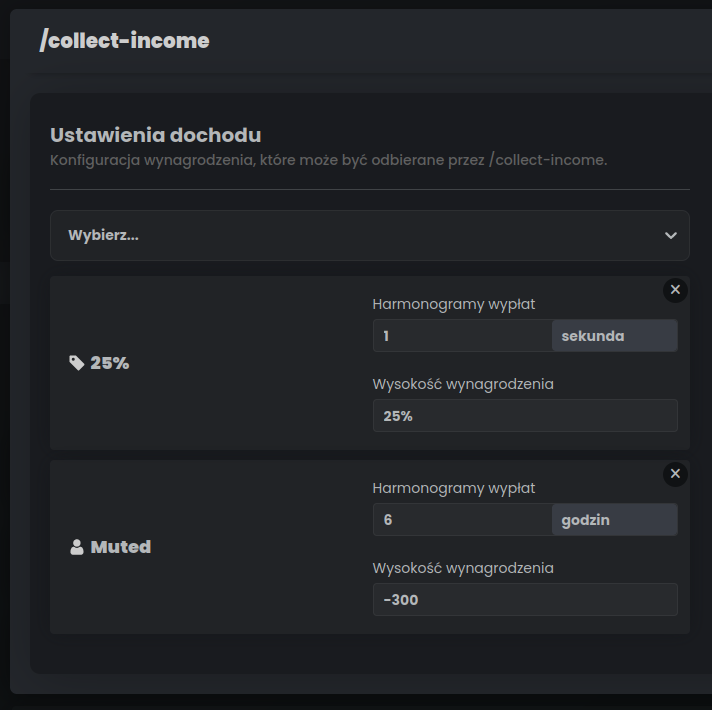

## Limit zakupów przedmiotu

Ogranicz, ile razy dany przedmiot może być kupowany przez Twoich użytkowników.

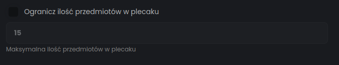

## Zarządzanie uprawnieniami do /eco

/eco to komenda, która pozwala na zarządzanie ekonomią, dawanie pieniędzy, usuwanie itp. Od teraz możesz ustawić, kto może ją używać.

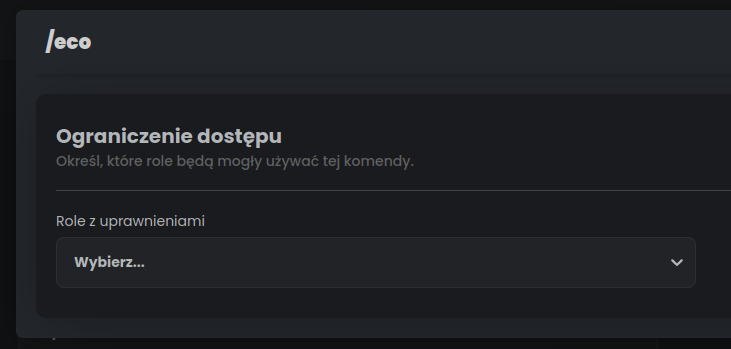

## Zarabiaj ze sklepu serwerowego!

Od teraz możesz ustawić właściciela przedmiotu. Jest to specjalna rola, której posiadacze podzielą się równo zyskami ze sprzedaży tego przedmiotu w sklepie serwerowym.

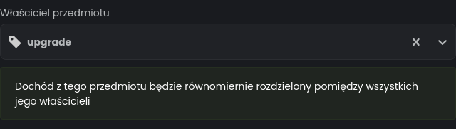
## Panel w autokanałach

Pozwól użytkownikom na zarządzanie swoimi kanałami. Każdy auto kanał głosowy może teraz mieć panel, który pozwoli na zmianę nazwy, kategorii, właściciela i uprawnień kanału.

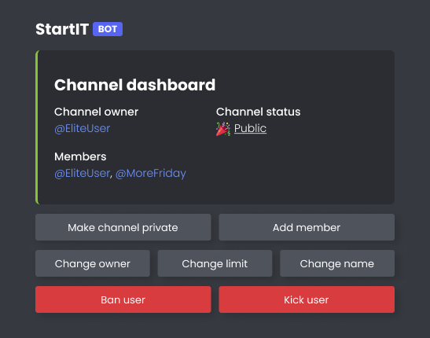

Panel ten możesz aktywować w panelu konfiguracji autokanałów.

## Zaloguj się na konto StartIT

Od teraz możesz zalogować się na konto Discord StartIT przez nasz panel i pisać z użytkownikami jako bot.

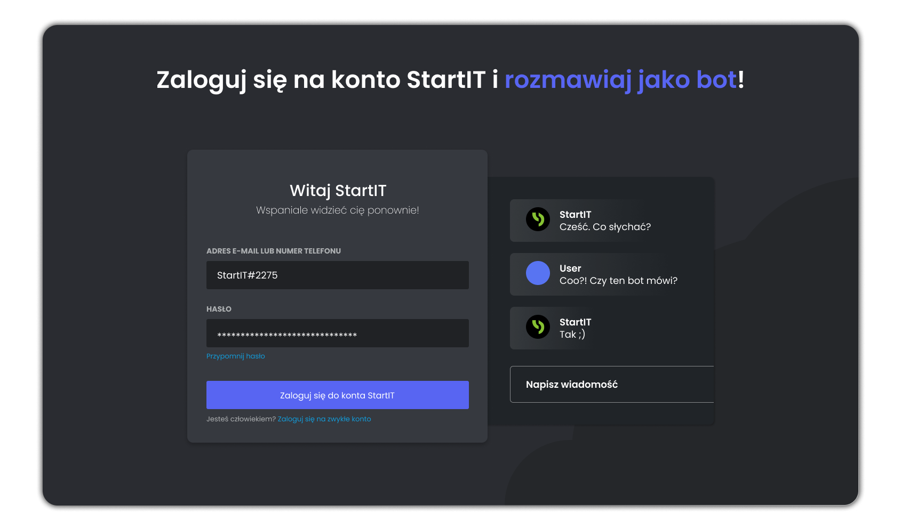

Funkcja dostępna tylko dla użytkowników StartIT Plus.

## Możliwość zakupu StartIT Plus na cudze serwery!

Od teraz możesz zakupić StartIT Plus na cudzy serwer! Właściciel zostanie powiadomiony, że została sprezentowana mu licencja.
Nie bój się, możesz w każdym momencie tę licencję zabrać i przenieść na swój serwer – Twoja licencja, Twoje zasady.

Poczytaj więcej o StartIT Plus: [https://startit.bot/plus](https://startit.bot/plus)

## Ulepszone konkursy

Ciągle pracujemy nad ulepszeniem Konkursów. W tym miesiącu wprowadziliśmy przycisk, który wyświetla listę osób biorących udział w konkursie.

## 270,000 serwerów

Dziękujemy za zaufanie! StartIT jest teraz na 270,000 serwerach. To dla nas ogromna liczba, a my będziemy dalej pracować nad ulepszaniem StartIT, aby był dla Was jeszcze lepszy.

Na tę okazję dodaliśmy nowego przyjaciela do naszego logo, który będzie z nami przez pare dni. Dajcie znać czy go widzicie!

Od nas to tyle na dziś, życzymy wspaniałego weekendu.

Konfiguracja bota: [https://startit.bot/](https://startit.bot/) \
Wesprzyj naszą pracę: [https://startit.bot/plus](https://startit.bot/plus) <3

